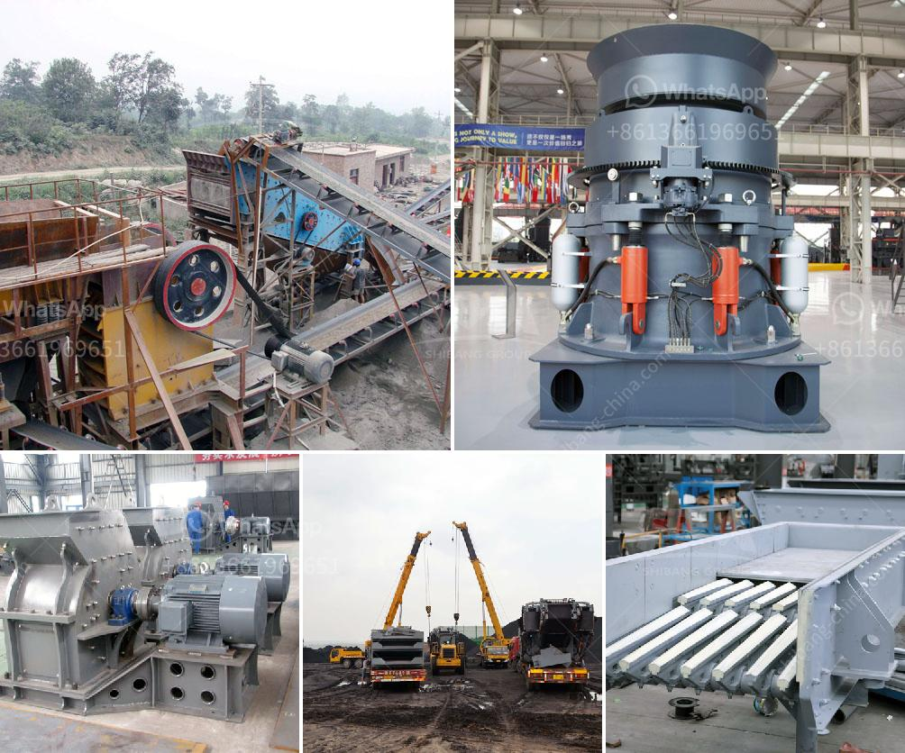

<h3>تجار في محطم الفحم وآلة طحن في الهند</h3>
في الهند ، تلعب الفحم دورًا حيويًا في الصناعة لأنها مصدر رئيسي للطاقة. وتُستخدم الآلات الحديثة لسحق وطحن الفحم بفعالية وتحويله إلى مسحوق الفحم الذي يُستخدم في الكثير من الصناعات من بينها صناعة الحديد والصلب والأسمدة والإسمنت.

تجار في محطم الفحم وآلة طحن يلعبون دورًا حاسمًا في هذه العملية. يتعاونون مع المناجم والمصانع لتوريد الفحم الخام وتحويله إلى مسحوق فعال وجاهز للاستخدام. يبحثون عن الجودة والكفاءة في التجهيز والأداء ، مع الحفاظ على تكاليف الإنتاج.

تجار الفحم يعملون على شراء الفحم من مناجم معتمدة وذات سمعة جيدة ، ويتولون تسليمه إلى محطات السحق والطحن. يهدفون إلى تحديد الجودة المطلوبة للفحم وفقًا لاحتياجات الصناعة والتنظيمات المحلية للجودة. يجب أن يكون الفحم قادرًا على إنتاج كمية قوية من الحرارة ويمكن طحنه بسهولة دون أن يؤدي ذلك إلى تلوث بيئي.

مع ظهور التكنولوجيا المتقدمة ، ظهر العديد من المصانع والوحدات التي تقدم آلات طحن الفحم عالية الجودة. يقوم تجار الفحم بتقييم العروض المختلفة واختيار الآلات التي تلبي احتياجاتهم بشكل أفضل. تضم تلك الآلات محطمات ، وطواحين الفحم ، وغرابيل مسحوق الفحم ومعدات أخرى تساعد في عملية التنقية والتصفية.

إلى جانب ذلك ، يعمل تجار الفحم أيضًا على تأمين الروابط المالية واللوجستية لنقل الفحم. يتعاونون مع شركات الشحن والنقل لنقل الفحم من المناجم إلى المحطات. يجب أن يتوفر لديهم العمال المهرة لتحميل وتفريغ ونقل الفحم بأمان ودقة.

علاوة على ذلك ، فإن تجار الفحم يتجهون نحو الابتكار والتحسين المستمر. تهدف إلى تحقيق أفضل نسبة تحويل الفحم إلى مسحوق ، وتقليل تكاليف الطحن ، وتحسين جودة المنتج النهائي. يعتمد النجاح الذي يحققونه على قدرتهم على الابتكار وتقديم حلول فعالة لصناعة الفحم.

في النهاية ، تجار الفحم وآلات طحن في الهند يلعبون دورًا حاسمًا في صناعة الفحم. من خلال شراء الفحم الخام وتحويله إلى مسحوق فعال ، يساهمون في إمداد الصناعة بالطاقة اللازمة ودعم نمو الاقتصاد بشكل عام.
<h3>Contact us</h3><ul><li><strong>Whatsapp:&nbsp;<a href="https://wa.me/8613661969651">+8613661969651</a></strong></li><li><a href="https://swt.shibang-china.com/?git&amp;zhl&amp;تجار في محطم الفحم وآلة طحن في الهند"><strong>Online Service(chat now)</strong></a></li></ul><h3>Related</h3><ul><li><a href='ضواغط الديزل للبيع في جنوب أفريقيا.md'>ضواغط الديزل للبيع في جنوب أفريقيا</a></li><li><a href='مصنع تكسير المحاجر الكامل في جنوب أفريقيا.md'>مصنع تكسير المحاجر الكامل في جنوب أفريقيا</a></li><li><a href='مصنع تكسير الحجارة المستعمل للبيع في إسبانيا.md'>مصنع تكسير الحجارة المستعمل للبيع في إسبانيا</a></li><li><a href='خط إنتاج خاص لتعدين مسحوق الكوارتز.md'>خط إنتاج خاص لتعدين مسحوق الكوارتز</a></li><li><a href='تكلفة سيور النقل.md'>تكلفة سيور النقل</a></li></ul>