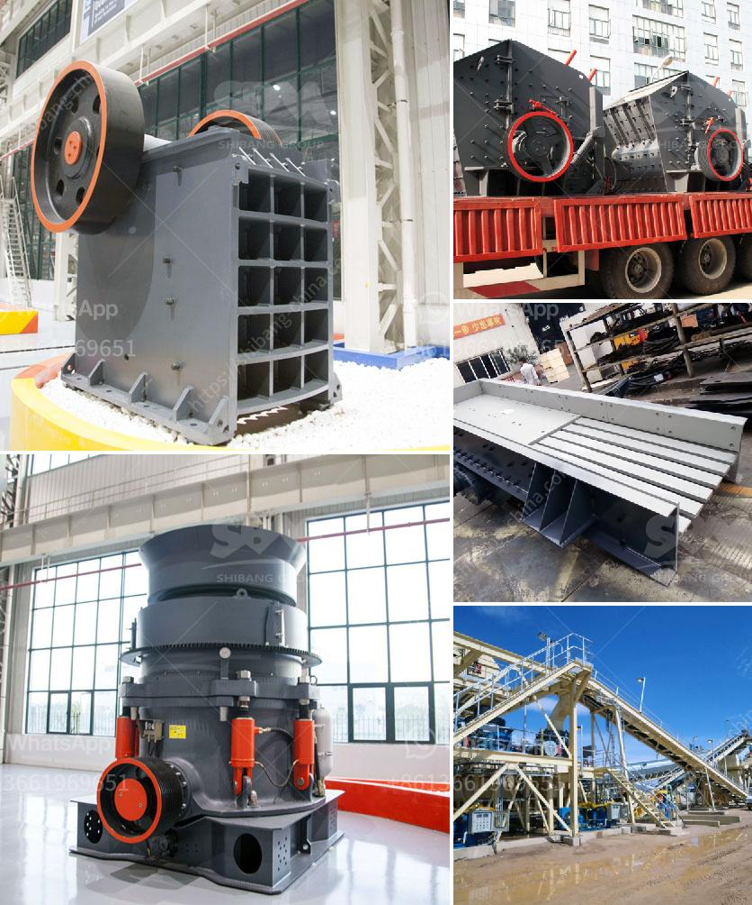

<h3>تجار كسارات الحجر الكوارتز</h3>
تجار كسارات الحجر الكوارتز: دورهم وأهميتهم في صناعة البناء

تعد تجار كسارات الحجر الكوارتز أحد أعمدة صناعة البناء والإنشاءات التي تعتمد على استخراج وتكسير المواد الخام لإنتاج مواد البناء اللازمة. الحجر الكوارتز هو أحد هذه المواد الخام التي يضطلع تجار الكسارات بصناعتها وتجهيزها، لتلبية احتياجات السوق وتلبية الطلب على المواد البنائية عالية الجودة.

تعتبر الكسارات مكونًا أساسيًا في صناعة البناء والإنشاءات، حيث يتم استخدامها في طحن وتكسير المواد الخام مثل الحصى والصخور الكوارتزية، وتخزينها ونقلها للمصانع اللازمة لتحويلها إلى مواد البناء النهائية. يقوم تجار الكسارات بتزويد السوق بالحصى والرمل والزلط والحجارة الجيرية والكوارتز، التي تستخدم في إنشاء المباني والطرق والأعمال الكبيرة الأخرى.

تعمل تجار كسارات الحجر الكوارتز على توفير مواد بناء عالية الجودة، حيث يتم اختبار الحصى والرمل وفقًا للمعايير الصناعية المحددة، لضمان جودتها ومقاومتها للأحمال والظروف المختلفة. كما يوفرون مجموعة متنوعة من الأحجام والأشكال لتلبية الاحتياجات الفردية للمشاريع المختلفة. يعتمد تجار الكسارات على تقنيات وآلات حديثة لتحسين جودة المنتجات وتحقيق أقصى استفادة من الموارد المعدنية.

تتطلب صناعة البناء الكوارتزية اتباع إجراءات السلامة والصحة المهنية المشددة، حيث يتعامل العمال مع المعدات الثقيلة والآلات التي قد تشكل خطرًا على حياتهم. يعتمد تجار الكسارات على توفير بيئة عمل آمنة وتوعية الموظفين بأفضل الممارسات للحفاظ على سلامتهم وصحتهم.

بالإضافة إلى أهميتهم في صناعة البناء، يساهم تجار كسارات الحجر الكوارتز في دفع عجلة الاقتصاد المحلي، حيث يوفرون فرص عمل للعديد من الأشخاص ويساهمون في تطوير المجتمعات من خلال دعم البنية التحتية والمشاريع الكبيرة.

في الختام، يعد تجار كسارات الحجر الكوارتز جزءًا لا يتجزأ من صناعة البناء والإنشاءات. يلبون احتياجات السوق بتوفير مواد بناء عالية الجودة، ويساهمون في تطوير الاقتصاد المحلي وتوفير فرص عمل للعديد من الأفراد. تجار الكسارات يلعبون دورًا أساسيًا في تلبية احتياجات البنية التحتية وتنمية المجتمعات، ومن المهم الاستثمار في تكنولوجيا حديثة وتدريب الموظفين للحفاظ على جودة المنتجات وتحقيق السلامة المهنية.
<h3>Contact us</h3><ul><li><strong>Whatsapp:&nbsp;<a href="https://wa.me/8613661969651">+8613661969651</a></strong></li><li><a href="https://swt.shibang-china.com/?git&amp;zhl&amp;تجار كسارات الحجر الكوارتز"><strong>Online Service(chat now)</strong></a></li></ul><h3>Related</h3><ul><li><a href='خدمات مصنع معالجة التعدين المحمول.md'>خدمات مصنع معالجة التعدين المحمول</a></li><li><a href='كسارة الحجر الجيري بيرو الجير.md'>كسارة الحجر الجيري بيرو الجير</a></li><li><a href='مصنع تكسير السلاغ في تاميل نادو.md'>مصنع تكسير السلاغ في تاميل نادو</a></li><li><a href='كسارة الفلدسبار بتأثير.md'>كسارة الفلدسبار بتأثير</a></li><li><a href='إعلانات الصحف لمصنع كسارة.md'>إعلانات الصحف لمصنع كسارة</a></li></ul>