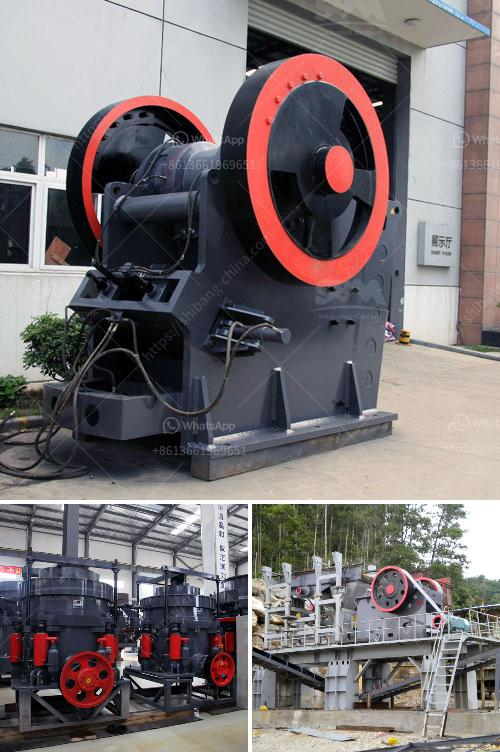

<h3>تجار كسارة الفك المحمولة في كينيا</h3>
تعتبر كينيا واحدة من الدول النامية في أفريقيا التي تشهد تطورًا سريعًا في القطاع الصناعي والبنية التحتية. وفي السنوات الأخيرة، شهدت البلاد نموًا هائلاً في مجال البناء والتشييد، مما أدى إلى زيادة الطلب على المواد الإنشائية.

تلبي كسارة الفك المحمولة احتياجات هذا السوق المتنامي بطريقة فعالة. تعد تلك الكسارة أداة متعددة الاستخدامات وقوية، تم تصميمها لكسر الصخور والأحجار الكبيرة إلى قطع صغيرة من الحجم، وتعتبر خيارًا مثاليًا للإنشاءات المحدودة أو المناطق النائية التي يصعب الوصول إليها.

أحد أهم الأشخاص في هذا القطاع هم تجار كسارة الفك المحمولة. إنهم يعملون كوسيط بين مشتريي المعدات والمستخدمين النهائيين، حيث يقومون بتوفير الكسارات وتسويقها وتحقيق المبيعات. يلعبون دورًا حاسمًا في تشجيع استخدام هذه الكسارات بشكل واسع في صناعة البناء بكينيا.

تجار كسارة الفك المحمولة يتعاونون مع مجموعة متنوعة من العملاء، بدءًا من الشركات الكبيرة في قطاع الانشاءات، وصولًا إلى الشركات الصغيرة والعمال الفرديين. وبفضل شبكاتهم الواسعة والمعرفة الفنية، يقدمون المشورة والمعلومات اللازمة للعملاء، مما يساعدهم على اتخاذ القرار الأمثل بشأن شراء الكسارة المحمولة.

بالإضافة إلى ذلك، يتعاون تجار كسارة الفك المحمولة مع الشركات المصنعة المرموقة، مما يساعدهم على توفير مجموعة متنوعة من المنتجات ذات الجودة العالية للعملاء. هذه المشاركة القوية في سلسلة الإمداد تمكنهم من الحفاظ على مخزون كافٍ من الكسارات وتوفير خدمات ما بعد البيع الممتازة للعملاء.

تعتبر كسارة الفك المحمولة خيارًا مثاليًا في صناعة البناء في كينيا بسبب عدة أسباب. لأولى، فإن تنقل هذه الكسارات بسيط ومرن، مما يتيح توفير تكاليف النقل والوقت. لثانيه، فإن الكسارة قوية ومتينة، وتمتاز بأداء عالٍ وقدرة على التكيف مع الظروف البيئية المختلفة.

باختصار، تجار كسارة الفك المحمولة في كينيا يقومون بدور حيوي في دفع تقدم صناعة البناء في البلاد. باستخدام شبكاتهم الواسعة وتوفير المعلومات والمنتجات عالية الجودة، يسهمون في تسريع عمليات البناء وتحسين الكفاءة العامة في القطاع.
<h3>Contact us</h3><ul><li><strong>Whatsapp:&nbsp;<a href="https://wa.me/8613661969651">+8613661969651</a></strong></li><li><a href="https://swt.shibang-china.com/?git&amp;zhl&amp;تجار كسارة الفك المحمولة في كينيا"><strong>Online Service(chat now)</strong></a></li></ul><h3>Related</h3><ul><li><a href='تدفق عملية مصنع البنتونايت.md'>تدفق عملية مصنع البنتونايت</a></li><li><a href='بائعي آلة المحجر المحمولة في نيجيريا.md'>بائعي آلة المحجر المحمولة في نيجيريا</a></li><li><a href='كسارة الصدم من نوع مانسبرجر.md'>كسارة الصدم من نوع مانسبرجر</a></li><li><a href='سعر مصنع كسارة محمولة في نيجيريا.md'>سعر مصنع كسارة محمولة في نيجيريا</a></li><li><a href='كسارة للذهب.md'>كسارة للذهب</a></li></ul>