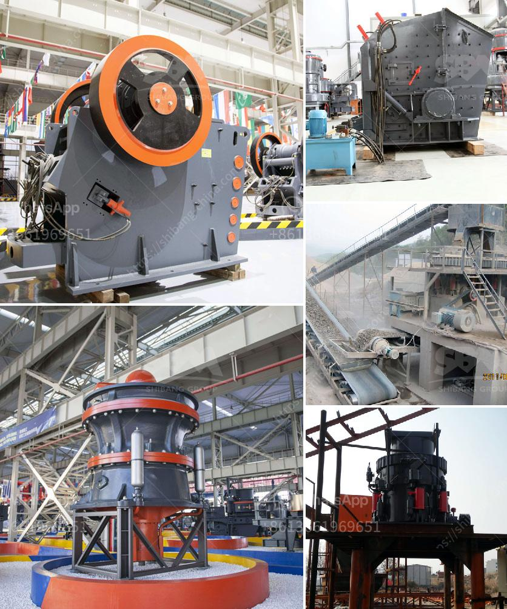

<h3>تجارة سحق الخرسانة للبيع</h3>
تعتبر تجارة سحق الخرسانة أحد الصناعات المزدهرة في الوقت الحالي، حيث يتم سحق الخرسانة المستخدمة أو المهملة لإعادة استخدامها في البناء والتشييد بدلاً من الاعتماد على إنتاج خرسانة جديدة. تعتبر هذه الصناعة ذات فوائد عديدة بيئيًا واقتصاديًا.

من الناحية البيئية، يساهم سحق الخرسانة في الحد من استخراج المواد الخام مثل الحصى والرمل والحجارة التي تستخدم في إنتاج الخرسانة التقليدية. وبالتالي، يقلل تجارة سحق الخرسانة من استنزاف الموارد الطبيعية وتلوث البيئة. بالإضافة إلى ذلك، يتم إعادة استخدام انبعاثات غازات الدفيئة التي تنتج عن هدم الخرسانة لتكون جزءًا من عملية سحق الخرسانة المستدامة.

من الناحية الاقتصادية، يعد سحق الخرسانة للبيع فرصة تجارية مربحة. حيث يتم استخدام الخرسانة المسحوقة في العديد من التطبيقات البنائية مثل ردم الأراضي وتعبيد الطرق وتصنيع البلاط والحواجز الأمانية. وكونها تعتبر بديلًا للمواد التقليدية، فإن سعر الخرسانة المستدامة يكون أقل من الخرسانة العادية، مما يساهم في توفير تكاليف البناء ويجعلها أكثر جاذبية للمقاولين والمستهلكين.

بالإضافة إلى ذلك، تعد تجارة سحق الخرسانة فرصة للعمالة وتوفير فرص العمل المحلية. فعملية سحق الخرسانة تتطلب معدات وتقنيات محددة، مما يعني إشراك شركات البناء والمقاولين المحليين لتوريد المعدات وإجراء عمليات السحق. وهذا بدوره يعزز نمو الاقتصاد المحلي ويسهم في خلق فرص العمل للعاملين في هذا القطاع.

وفي الختام، يمكن القول إن تجارة سحق الخرسانة للبيع تعد فرصة ممتازة للحفاظ على البيئة وتحقيق الاستدامة البيئية، بالإضافة إلى دعم النمو الاقتصادي وتوفير فرص العمل المحلية. يجب على الحكومات والشركات والمستهلكين أن يتبنوا هذه التقنية المستدامة كحلاً لتلبية احتياجات البناء والتشييد والاكتفاء بالموارد المستدامة المتاحة. بذلك سيكون لدينا مستقبل بيئي أكثر استدامة واقتصاد عابر للأزمنة.
<h3>Contact us</h3><ul><li><strong>Whatsapp:&nbsp;<a href="https://wa.me/8613661969651">+8613661969651</a></strong></li><li><a href="https://swt.shibang-china.com/?git&amp;zhl&amp;تجارة سحق الخرسانة للبيع"><strong>Online Service(chat now)</strong></a></li></ul><h3>Related</h3><ul><li><a href='الكسارة المحمولة ١٥٠ طن في الساعة.md'>الكسارة المحمولة ١٥٠ طن في الساعة</a></li><li><a href='تقرير الجدوى لاستفادة من خام النحاس.md'>تقرير الجدوى لاستفادة من خام النحاس</a></li><li><a href='كسارة الرأس الصغيرة للبيع في الصين.md'>كسارة الرأس الصغيرة للبيع في الصين</a></li><li><a href='محطم الحجر الجيري روتور.md'>محطم الحجر الجيري روتور</a></li><li><a href='كسارة الفك لتعدين الفحم.md'>كسارة الفك لتعدين الفحم</a></li></ul>