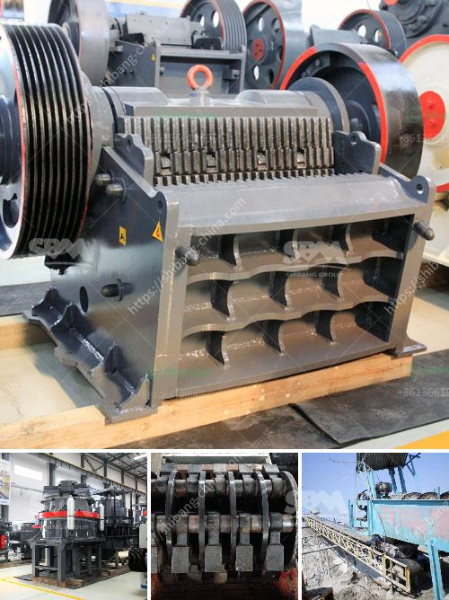

<h3>تجميع مصنع التكسير</h3>
يتعدد استخدام مصنع التكسير في العديد من الصناعات المختلفة. يتكون هذا المصنع من معدات متطورة تهدف إلى تكسير المواد الخام الصلبة إلى قطع صغيرة قابلة للاستخدام في عمليات الإنتاج المختلفة. وبفضل قدرته على تجميع المواد وتحويلها إلى قطع صغيرة، فإنه يلعب دورًا حاسمًا في تحويل الموارد الطبيعية إلى منتجات صالحة للبيع.

تتباين مصانع التكسير من حيث القدرة على التكسير. تتغير من الوحدات الصغيرة سعتها بين 200-400 طن في الساعة، إلى المصانع الأكبر التي يمكن أن تكسر حتى عدة آلاف من الأطنان في الساعة.

تعتبر صناعة التكسير مهمةً للعديد من الصناعات مثل صناعة الأسمنت والبناء وتصنيع الطرق وتوليد الطاقة والتعدين. فعلى سبيل المثال، يتم استخدام التكسير في صناعة الأسمنت لتكسير الخامات وتحويلها إلى صخور صغيرة، تسهل عملية الخلط مع الغراء والتي يتم فيها تسخين المادة وتحويلها إلى شكل صلب. كما يتم استخدام مصانع التكسير في صناعة البناء لتكسير الصخور والحجارة الكبيرة إلى قطع أصغر يمكن استخدامها في بناء المباني والطرق.

واحدة من أبرز الميزات التي يتمتع بها مصنع التكسير هي قدرته على تكسير المواد الصلبة إلى قطع صغيرة بطريقة فعالة وتفصيلية، مما يزيد من جودة المنتجات النهائية. كما أن استخدام مصانع التكسير يسهم في تقليل تكاليف الإنتاج وزيادة الإنتاجية، حيث يمكن تجهيز كميات كبيرة من المواد في وقت قصير. كما يساهم أيضًا في حماية البيئة، حيث يتم تقليل كمية النفايات وتحويل المواد إلى مواد قابلة للتدوير.

على الرغم من فوائد استخدام مصانع التكسير، يجب مراعاة بعض الاحتياطات والضوابط في عملية التشغيل. يجب توفير الصيانة الدورية للمعدات وفحصها بانتظام لضمان عملها السليم وسلامة العملاء والعاملين. كذلك، يجب اتخاذ إجراءات السلامة المناسبة لضمان عدم وقوع حوادث أو إصابات.

باختصار، يعد مصنع التكسير جزءًا أساسيًا في العديد من الصناعات المختلفة. يساهم في تحويل الموارد الطبيعية إلى منتجات صالحة للبيع ويسهم في زيادة الإنتاجية وتقليل التكاليف. وبالتزامن مع ذلك، يجب أخذ الاحتياطات اللازمة لضمان سلامة العمل والحفاظ على البيئة.
<h3>Contact us</h3><ul><li><strong>Whatsapp:&nbsp;<a href="https://wa.me/8613661969651">+8613661969651</a></strong></li><li><a href="https://swt.shibang-china.com/?git&amp;zhl&amp;تجميع مصنع التكسير"><strong>Online Service(chat now)</strong></a></li></ul><h3>Related</h3><ul><li><a href='صورة لمصنع معالجة رمل السيليكا.md'>صورة لمصنع معالجة رمل السيليكا</a></li><li><a href='كتالوج كسارة الفك بوزولانا.md'>كتالوج كسارة الفك بوزولانا</a></li><li><a href='تجهيز خام الحديد بي دي إف.md'>تجهيز خام الحديد بي دي إف</a></li><li><a href='مصنع تحسين أكسيد النحاس في الصين.md'>مصنع تحسين أكسيد النحاس في الصين</a></li><li><a href='مطرقة الذهب المستخدمة للبيع في زيمبابوي.md'>مطرقة الذهب المستخدمة للبيع في زيمبابوي</a></li></ul>