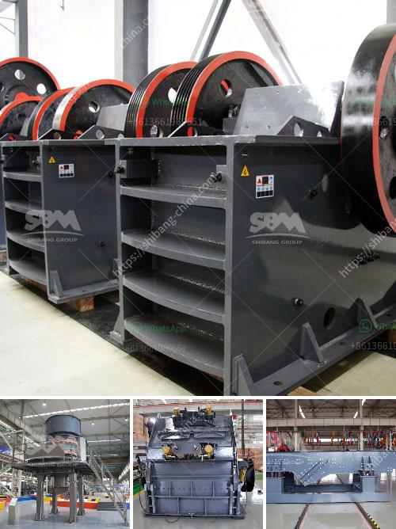

<h3>تجهيز الذهب بالزئبق الفضي في جنوب أفريقيا</h3>
تعدّ جنوب أفريقيا واحدة من أهم الدول في إنتاج الذهب في العالم، حيث تملك البلاد إحتياطياً ضخماً من المعدن الثمين في مناجمها. ومن المعروف أنّ تعدين الذهب يشمل عدة مراحل من أجل تجهيزه للاستخدام الصناعي أو الاستثماري. وأحد الطرق الشائعة لتجهيز الذهب هو استخدام الزئبق الفضي.

تعود أصول استخدام الزئبق في تجهيز الذهب إلى آلاف السنين، حيث كان يُستخدم من قِبَل الحضارات القديمة للحصول على الحُلّ من الذهب. وتستمر تقنية استخدام الزئبق في جنوب أفريقيا حتى اليوم على نطاق واسع. وتُعد كيمياء الذهب بالزئبق عملية فعالة في استخلاص الذهب من خام الذهب الغير نقي، فهي تعمل على فصل الذهب عن المعادن الأخرى بسبب قدرتها على تكوين مركبات مركبة مع الذهب.

يتم تنفيذ عملية تجهيز الذهب بالزئبق الفضي بواسطة ما يسمى الآلات الاهتزازية. حيث يتم سحق خام الذهب المستخرج من المنجم إلى حجم أصغر ومن ثم خلطه مع الزئبق الفضي. وفي هذه المرحلة، يتم إضافة كمية محددة من الزئبق الفضي إلى المزيج وتُعمل الآلة الاهتزازية على هز الخليط لفترة من الزمن وبواسطة ذلك يتدفق الزئبق الفضي بفعل الاهتزاز على المعادن الثقيلة مثل الذهب والفضة، وذلك بسبب كثافة المعادن الثقيلة مقارنةً بالمعادن الخفيفة.

بعد انتهاء عملية الاهتزاز، يُجمع المزيج في أطباق خاصة تُعرف بأطباق الزئبق. ويتم تسخين هذه الأطباق باستخدام بنادق حرارية بخارية أو بأية طريقة أخرى. في هذه المرحلة، يتبخر الزئبق الفضي تدريجياً بفعل الحرارة، ويترسب الذهب كمادة صلبة في الأطباق. ويتم تجميع هذه الكتل الصلبة للحصول على الذهب الخام النقي. وفي مرحلة الحصول على الذهب، يجب التأكد من تفريغ الزئبق الفضي المستخدم بالشكل الصحيح والتخلص منه بطرق بيئية وآمنة.

وعلى الرغم من كون استخدام الزئبق الفضي في تجهيز الذهب عملية فعالة إلا أنها تحمل مخاطر صحية وبيئية كبيرة نتيجة لسميّة الزئبق. ولذلك، تقوم بعض الحكومات بتنظيم استخدام الزئبق وتتطلع لتقديم تطبيقات وتقنيات تجهيز الذهب بديلة وأكثر أماناً وكفاءة من الزئبق.

لذا، يُعدّ تجهيز الذهب بالزئبق الفضي في جنوب أفريقيا إجراءً هاماً لاستخلاص الذهب وإعداده للاستخدام، ومع ذلك، ينبغي أخذ الاحتياطات اللازمة للتعامل بأمان مع هذه العملية ومركبات الزئبق الفضي. ومن الضروري العمل على تعزيز البحث والتطوير لاستكشاف نُظُم جديدة ومبتكرة لتجهيز الذهب بالطرق البديلة والأكثر صداقة للبيئة في المستقبل.
<h3>Contact us</h3><ul><li><strong>Whatsapp:&nbsp;<a href="https://wa.me/8613661969651">+8613661969651</a></strong></li><li><a href="https://swt.shibang-china.com/?git&amp;zhl&amp;تجهيز الذهب بالزئبق الفضي في جنوب أفريقيا"><strong>Online Service(chat now)</strong></a></li></ul><h3>Related</h3><ul><li><a href='أريد شراء كسارة البوزولان.md'>أريد شراء كسارة البوزولان</a></li><li><a href='تكاليف مطاحن الكرة.md'>تكاليف مطاحن الكرة</a></li><li><a href='طحن الفلدسبار بواسطة مطحنة الكرة في الفلبين.md'>طحن الفلدسبار بواسطة مطحنة الكرة في الفلبين</a></li><li><a href='رمل وحجر الكسارة في كينيا.md'>رمل وحجر الكسارة في كينيا</a></li><li><a href='سعر تشغيل المطحنة للطن في ماليزيا.md'>سعر تشغيل المطحنة للطن في ماليزيا</a></li></ul>