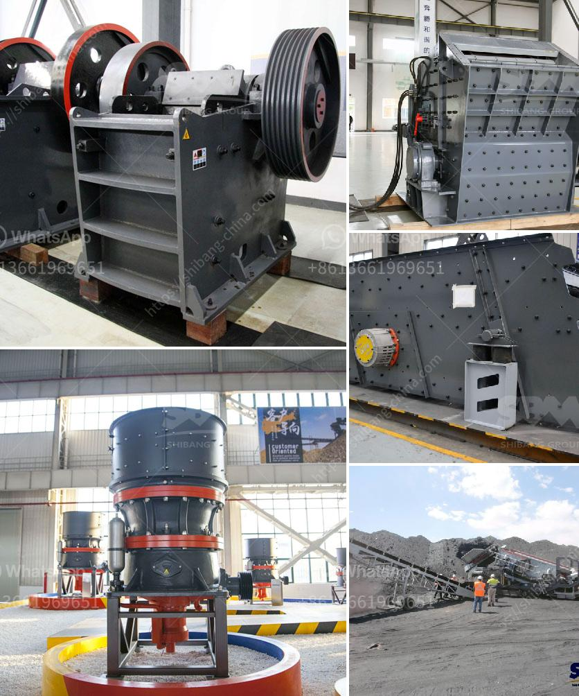

<h3>تجهيز خام الحديد بي دي إف</h3>
يُعدّ خام الحديد مادة خامية رئيسة في صناعة الحديد والصلب ويتكون أساساً من أكاسيد الحديد التي تحتوي على نسب مختلفة من خامات الحديد المختلفة مثل الهيماتيت والمغنتيت. ويتم تجهيز خام الحديد من أجل استخراج الحديد بشكل فعال. 

أحد أساليب تجهيز خام الحديد الشهيرة هو استخدام تقنية البي دي إف أو الـ Beneficiation باللغة الإنجليزية. يستخدم البي دي إف لتنقية الخام وزيادة تركيز الحديد فيه، وذلك يتطلب إجراء عدة عمليات مختلفة.

تشمل عملية تجهيز خام الحديد بواسطة البي دي إف عدة خطوات أساسية. الخطوة الأولى هي سحق الخام بواسطة الكسارات الصناعية إلى قطع صغيرة ومن ثم طحنها باستخدام المطاحن للحصول على مسحوق ناعم. ثم يتم تعدين الخام المطحون باستخدام تقنيات تعدين الجاذبية أو الفصل المغناطيسي لفصل الشوائب المختلفة عن خام الحديد.

بعد ذلك، يتم استخدام عملية الفصل بالتعويم لفصل كبريتيدات الحديد عن الخام. تتكون عملية التعويم من استخدام مواد كيميائية خاصة تعمل على منع الجزيئات الغريبة الأخرى من الاندماج مع خلايا الحديد المطلوبة. في هذه العملية، يتم ضخ الهواء في خلايا التعويم من خلال الحاكمات وبواسطة فقاعات الهواء المكونة، تطفو الجسيمات المرغوب فيها في السطح حيث يتم جمعها.

في الخطوة التالية، يتم إزالة الماء المحمل بالخلايا وتجفيف الخام المعد خلال عملية تعويم التخلص من كمية المياه الزائدة. وتتطلب هذه العملية تقنيات تثبيط الاأملاح بغرض تجفيف الخام بلطف. لذا، يمكن أن يُستخدَم بوكسيتات الألومنيوم (كمثبطاً) لتجفيف الخام.

أخيراً، يتم فرز الخام المجفف بواسطة المصانع الغربلة والفرز لفصل الجزيئات بحسب حجمها. يمكن أن يفصل الخام المجفف إلى عدة أحجام لتلبية احتياجات الصناعة. بعد ذلك، يمكن استخدام الحديد المنتج من عملية الفصل هذه لإنتاج الفولاذ أو الصلب.

بالاستناد إلى عملية البي دي إف، يمكن تجهيز خام الحديد بكفاءة عالية وبطرق صديقة للبيئة. وقد تم استخدام تقنيات البي دي إف لسنوات عديدة وهي ناجحة في تحسين جودة خام الحديد وزيادة تركيز الحديد فيها، مما يؤدي إلى زيادة أداء صناعة الحديد والصلب.
<h3>Contact us</h3><ul><li><strong>Whatsapp:&nbsp;<a href="https://wa.me/8613661969651">+8613661969651</a></strong></li><li><a href="https://swt.shibang-china.com/?git&amp;zhl&amp;تجهيز خام الحديد بي دي إف"><strong>Online Service(chat now)</strong></a></li></ul><h3>Related</h3><ul><li><a href='كسارات الحجر في كاليفورنيا.md'>كسارات الحجر في كاليفورنيا</a></li><li><a href='كسارات الحجر الجيري المستخدمة للبيع في تكساس.md'>كسارات الحجر الجيري المستخدمة للبيع في تكساس</a></li><li><a href='آلات كسارة الحجر الكوارتز.md'>آلات كسارة الحجر الكوارتز</a></li><li><a href='بيع محطة تكسير الحجارة.md'>بيع محطة تكسير الحجارة</a></li><li><a href='سعر كسارة الفحم القدرة.md'>سعر كسارة الفحم القدرة</a></li></ul>