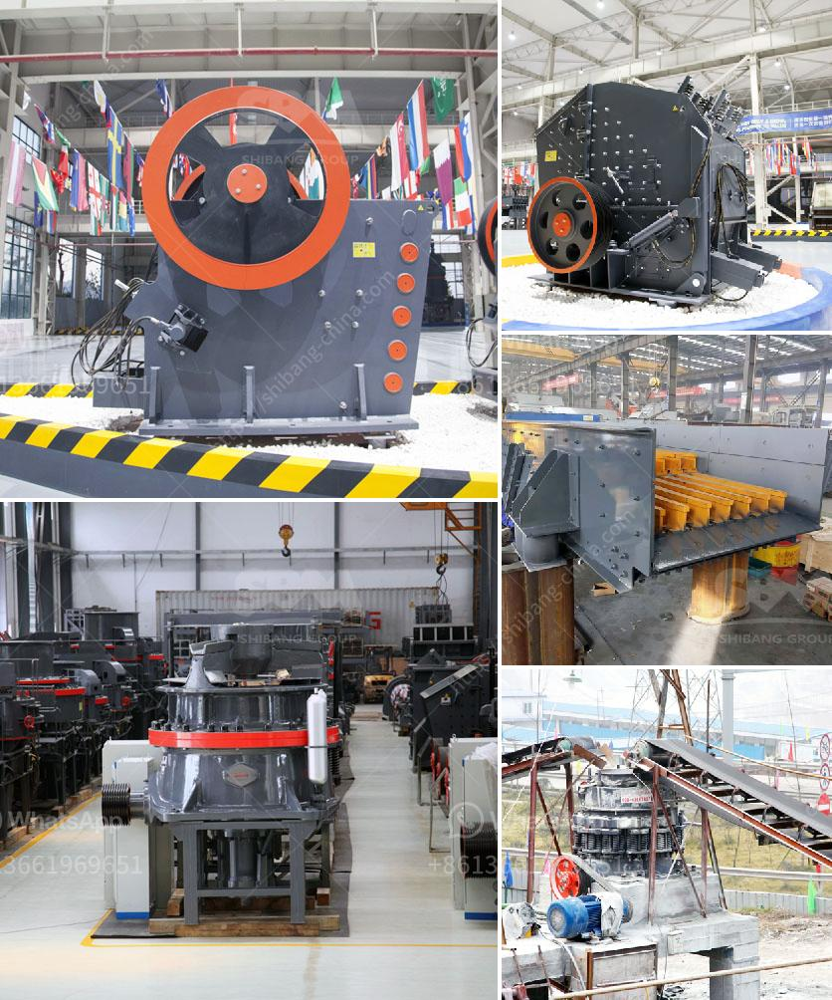

<h3>تجهيز مسحوق الكوارتز السيليكا</h3>
مسحوق الكوارتز السيليكا هو مادة ناعمة ونقية تنتج عن طحن الكوارتز الخام. يُستخدم هذا المسحوق في العديد من الصناعات، بما في ذلك الزجاج والسيراميك والصناعات الكيميائية والمواد العازلة. قبل استخدامه في هذه الصناعات، يجب تجهيز المسحوق للحصول على نقاء عالٍ وخصائص محسَّنة. يتطلب تجهيز مسحوق الكوارتز السيليكا العديد من الخطوات.

أولاً وقبل كل شيء، يتم جمع الكوارتز الخام وتنقيته لإزالة الشوائب المختلفة. يتم غسل الكوارتز باستخدام أحد المذيبات المناسبة لديها خاصية التخلص من الشوائب بشكل فعال. بعد غسل الكوارتز، يتم تجفيفه جيدًا باستخدام تقنيات الجفاف المناسبة مثل التجفيف بالهواء أو استخدام المجففات.

ثم يتم طحن الكوارتز الجاف للحصول على مسحوق ناعم. يتم استخدام مطاحن الكرة أو المطاحن الأخرى المناسبة لتحقيق هذه العملية. يُفضل تكسير الكوارتز على عدة مراحل مع استخدام شاشات متعددة للحصول على مسحوق ناعم وموحِّد.

بعد ذلك، يتم تصنيف مسحوق الكوارتز المطحون باستخدام شاشات وأذرع وحاويات. يتم فصل مسحوق الكوارتز بحسب حجم الجسيمات المطلوب. هذه الخطوة تساعد في الحصول على مسحوق متجانس ومناسب للاستخدام في الصناعات المختلفة.

أخيرًا، يتم معالجة المسحوق الناتج لتحسين خواصه. قد تتضمن هذه العملية معاملة المسحوق بتقنيات الغشاء لتقليل نسبة المياه السطحية، مما يحسن الأداء في العديد من التطبيقات. تُجرى أيضًا عمليات معالجة أخرى مثل الكربنة وتفتيت السطح لزيادة التفاعلية السطحية وخصائص الانتشار.

باختصار، تجمع مراحل تجهيز مسحوق الكوارتز السيليكا بين تنقية الخام وغسله وتجفيفه وطحنه وتصنيفه ومعالجته. هذه الخطوات تهدف إلى الحصول على مسحوق نقي، ناعم وذو خواص محسَّنة لاستخدامه في مجموعة واسعة من الصناعات.
<h3>Contact us</h3><ul><li><strong>Whatsapp:&nbsp;<a href="https://wa.me/8613661969651">+8613661969651</a></strong></li><li><a href="https://swt.shibang-china.com/?git&amp;zhl&amp;تجهيز مسحوق الكوارتز السيليكا"><strong>Online Service(chat now)</strong></a></li></ul><h3>Related</h3><ul><li><a href='كسارة الحجر الجيري المصنعة في باكستان.md'>كسارة الحجر الجيري المصنعة في باكستان</a></li><li><a href='حساب كسارة الفحم.md'>حساب كسارة الفحم</a></li><li><a href='كسارات حجر مستعملة للبيع في كينيا.md'>كسارات حجر مستعملة للبيع في كينيا</a></li><li><a href='سعر مصنع كسارة الحجر بسعة 200 طن في الساعة.md'>سعر مصنع كسارة الحجر بسعة 200 طن في الساعة</a></li><li><a href='كسارة حجر إيطالية.md'>كسارة حجر إيطالية</a></li></ul>