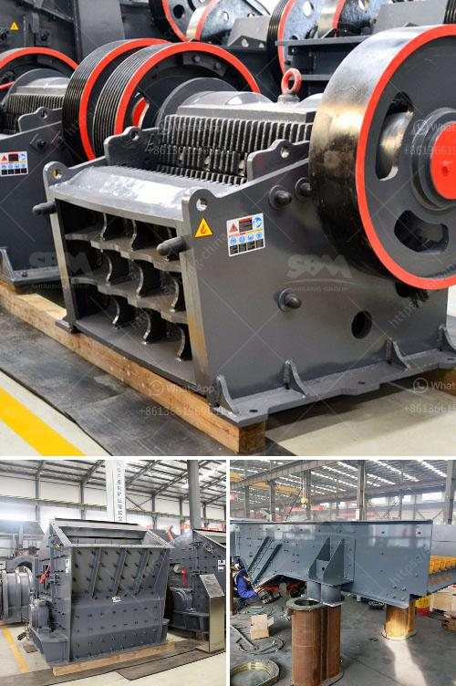

<h3>تجهيزات تعدين الفحم للبيع في ألمانيا</h3>
تعتبر تجهيزات تعدين الفحم من العوامل الرئيسية في صناعة التعدين في ألمانيا. حيث تعد ألمانيا واحدة من أكبر الدول المنتجة للفحم في العالم. وبالتالي فإن توفر تجهيزات تعدين الفحم ذات الجودة العالية والأداء الممتاز يعد أمرًا حيويًا لضمان استمرارية الإنتاج والتنافسية في هذه الصناعة.

تتوفر في السوق الألمانية العديد من شركات تعمل في مجال تصنيع وتوريد تجهيزات تعدين الفحم. تشمل هذه التجهيزات المعدات الثقيلة مثل الحفارات الكبيرة والشاحنات التفريغ الثقيلة والقواطع الآلية وغيرها من الآليات اللازمة لاستخراج الفحم من الأرض.

تعتبر التجهيزات التي تستخدم في تعدين الفحم في ألمانيا من الأحدث والأكثر تقدمًا في العالم، حيث تهدف إلى زيادة كفاءة العمليات وتقليل التكاليف وتحسين السلامة في مواقع التعدين. فمع تزايد الطلب على الفحم في العالم، يتعين على شركات التعدين الاستثمار في تحديث تجهيزاتها واعتماد التكنولوجيا الحديثة لتحقيق أقصى استفادة من عمليات التعدين.

تحرص الشركات المصنعة على تطوير تجهيزات تعدين الفحم بتصاميم متطورة ومبتكرة لتلبية احتياجات عملاءها في ألمانيا والعالم بناءً على معايير الجودة والأمان. فبفضل قدرتها على التعامل مع الظروف الصعبة في المواقع المنجمية، تعد تجهيزات تعدين الفحم قوية ومتينة وقادرة على تحمل الاستخدام الشاق لفترات طويلة.

في الختام، تمثل تجهيزات تعدين الفحم في ألمانيا مجموعة من المعدات العالية الجودة التي تساعد في تحقيق الإنتاجية وتعزيز السلامة في صناعة التعدين. تحافظ الشركات المصنعة على الابتكار والتطوير لتلبية احتياجات السوق وتوفير التجهيزات ذات الأداء العالي والكفاءة القصوى. تستخدم هذه التجهيزات في مواقع التعدين في ألمانيا وتصدر إلى العديد من الدول الأخرى حول العالم، ما يعكس القوة والتفوق التكنولوجي للصناعة التعدينية الألمانية.
<h3>Contact us</h3><ul><li><strong>Whatsapp:&nbsp;<a href="https://wa.me/8613661969651">+8613661969651</a></strong></li><li><a href="https://swt.shibang-china.com/?git&amp;zhl&amp;تجهيزات تعدين الفحم للبيع في ألمانيا"><strong>Online Service(chat now)</strong></a></li></ul><h3>Related</h3><ul><li><a href='سعر كسارة الهامر للطن الواحد في الساعة.md'>سعر كسارة الهامر للطن الواحد في الساعة</a></li><li><a href='سعة آلة الكسارة 5 أطنان في الساعة.md'>سعة آلة الكسارة 5 أطنان في الساعة</a></li><li><a href='مطحنة رطبة في الصين.md'>مطحنة رطبة في الصين</a></li><li><a href='آلة طحن الحجر الجيري المصنع.md'>آلة طحن الحجر الجيري المصنع</a></li><li><a href='قائمة شركات التعدين على الحجر الجيري في الصين.md'>قائمة شركات التعدين على الحجر الجيري في الصين</a></li></ul>