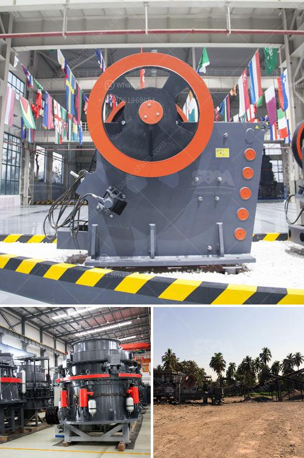

<h3>تحجيم مطاحن الكرة</h3>
تعتبر مطاحن الكرة واحدة من أهم الأجهزة المستخدمة في صناعة الطحن الرطب والجاف. تستخدم هذه المطاحن لطحن الخامات والمواد الأخرى إلى حجم صغير جدًا، مما يتيح استخدامها في العديد من الصناعات مثل التعدين وصناعة البناء وصناعة الكيماويات. يعتمد تحجيم المطاحن الكرة على الأبعاد وقطر الكرات الصلبة الموجودة داخل المطحنة. يمكن التحكم في حجم الكرات وبالتالي الجسيمات المطحونة عن طريق استخدام كرات بأحجام مختلفة.

تحجيم مطاحن الكرة يمكن أن يؤثر على الأداء العام لعملية الطحن. واحدة من الأسباب الرئيسية لاختيار حجم الكرة المناسب هي تحقيق الكفاءة القصوى في الطحن. عندما تكون كرات الطحن صغيرة، فإن المطحنة ستؤدي إلى سحق المواد إلى جزيئات أصغر، مما يسهل عملية استخلاص القطع الصغيرة من الخام. وعلاوة على ذلك، فإن الكرات الصغيرة توفر تأثيرات الاحتكاك والتساقط المناسبة لطحن المعادن.

من ناحية أخرى، تستخدم الكرات الكبيرة في المطاحن الكرة للحصول على نسبة استهلاك كرات أقل. قد تكون الكرات الكبيرة تستهلك طاقة أقل وتوفر نسبة أكبر من المنتج النهائي المطحون. حجم الكرات يجب أن يختار بعناية حسب الخصائص المادية للمواد التي يتم طحنها.

تحجيم مطاحن الكرة أيضًا يتأثر بقوة الجاذبية. بشكل عام، كلما كانت قوة الجاذبية أعلى، كلما تمكن المطحنة من تحمل الكرات الأكبر حجمًا. بالإضافة إلى ذلك، فإن ارتفاع سرعة الدوران للمطاحن يؤثر أيضًا على حجم الكرة المثلى. عندما تكون السرعة أعلى، يتطلب استخدام كرات صغيرة بالتالي يؤدي إلى حجم مطحون أصغر وأداء طحن أفضل.

في النهاية، يجب أن يحدد حجم الكرات المطلوب استخدامها في المطاحن الكرة وفقًا للغرض والمتطلبات الخاصة بكل عملية طحن. يجب أن تكون درجة صلابة الكرات المستخدمة متوافقة مع خصائص المواد المراد طحنها. التحكم في حجم الكرات هو عامل أساسي لتحقيق الكفاءة والجودة في عملية الطحن.
<h3>Contact us</h3><ul><li><strong>Whatsapp:&nbsp;<a href="https://wa.me/8613661969651">+8613661969651</a></strong></li><li><a href="https://swt.shibang-china.com/?git&amp;zhl&amp;تحجيم مطاحن الكرة"><strong>Online Service(chat now)</strong></a></li></ul><h3>Related</h3><ul><li><a href='شركة تصنيع مقياس ضغط النحاس.md'>شركة تصنيع مقياس ضغط النحاس</a></li><li><a href='موردي قطع غيار مطحنة الطحن.md'>موردي قطع غيار مطحنة الطحن</a></li><li><a href='المعدات المطلوبة لتعدين الذهب على نطاق واسع.md'>المعدات المطلوبة لتعدين الذهب على نطاق واسع</a></li><li><a href='البحث عن آلات معالجة الكاولين.md'>البحث عن آلات معالجة الكاولين</a></li><li><a href='مصنع كسارة الفك للبيع في أفريقيا.md'>مصنع كسارة الفك للبيع في أفريقيا</a></li></ul>