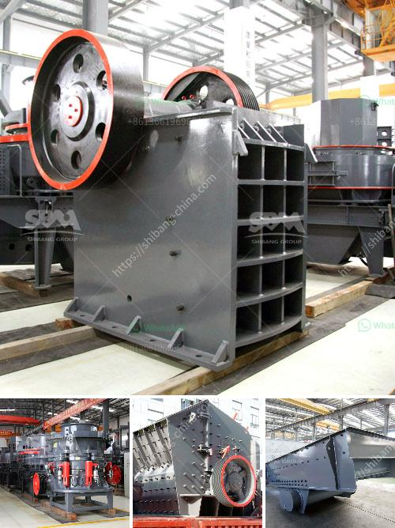

<h3>تحجيم هيدروليكي لمصنع كسارة رمل السيليكا</h3>
قد يصادف العديد من المصانع التحديات التي تتطلب منها تحسين عملياتها لتحقيق أداء أفضل. واحدة من هذه التحديات هي تحجيم هيدروليكي مصنع كسارة رمل السيليكا. يعد الرمل السيليكا أحد الموارد الأساسية التي تستخدم في العديد من الصناعات مثل الزجاج والسيراميك والصناعات الكيماوية. بالتالي ، يجب أن يكون لدينا مصنع فعال ومتكامل لتصنيع الرمال بجودة عالية وبتكلفة مناسبة.

تحجيم هيدروليكي المصنع يشير إلى تعديل العمليات المستخدمة لإنتاج الرمل السيليكا لتحقيق مستوى أفضل من الكفاءة والإنتاجية. يتألف التحجيم الهيدروليكي من مجموعة من الإجراءات التي تشمل تحسين تدفق المواد ، وتحسين جودة المنتج النهائي ، وتقليل الفاقد وتحسين كفاءة استخدام المواد الخام.

أحد الأساليب المستخدمة في تحجيم هيدروليكي المصنع هو تعديل التدفق الهيدروليكي. عن طريق تحديد الضغط المناسب للسائل المستخدم في العملية ، يمكن تحسين تدفق المواد والحد من التلوث والفاقد العام. يمكن استخدام نظام تحكم هيدروليكي متقدم لضبط ضغط السائل ومتابعة الأداء التشغيلي للمصنع بشكل مستمر.

تحسين جودة المنتج النهائي هو أيضًا جزء مهم من تحجيم هيدروليكي المصنع. يتم ضبط عدة عوامل مثل حجم الحبيبات والشكل والنقاء لضمان منتج نهائي مطابق للمواصفات المطلوبة. يتم تحقيق ذلك عن طريق تحديد درجة الغرق وسرعة التدفق الهيدروليكي بدقة.

تحجيم هيدروليكي المصنع يمكن أن يؤدي أيضًا إلى تقليل التكاليف وزيادة الكفاءة. من خلال تحليل كفاءة استخدام الموارد وتحسين المعدات المستخدمة ، يمكن تحقيق توفير في استهلاك الكهرباء والماء والوقود والمواد الخام. بالإضافة إلى ذلك ، يمكن تحسين سرعة الإنتاج والتسليم ، مما يساهم في تلبية الطلب الزائد.

يمكن القول بأن تحجيم هيدروليكي مصنع كسارة رمل السيليكا هو عملية أساسية لتحقيق أداء مثالي ورفع مستوى الإنتاجية في مجال تجهيز الموارد الطبيعية. بالاستفادة من تكنولوجيا التحكم الهيدروليكي المتقدمة وتحليل الأداء المستمر ، يمكن أن يؤدي تحجيم هيدروليكي المصنع إلى تحسين كبير في جودة المنتج وزيادة الكفاءة التشغيلية وتقليل التكاليف.
<h3>Contact us</h3><ul><li><strong>Whatsapp:&nbsp;<a href="https://wa.me/8613661969651">+8613661969651</a></strong></li><li><a href="https://swt.shibang-china.com/?git&amp;zhl&amp;تحجيم هيدروليكي لمصنع كسارة رمل السيليكا"><strong>Online Service(chat now)</strong></a></li></ul><h3>Related</h3><ul><li><a href='تحليل التكلفة للكسارات.md'>تحليل التكلفة للكسارات</a></li><li><a href='موردين كسارات الفك والمخروط في موكوباني.md'>موردين كسارات الفك والمخروط في موكوباني</a></li><li><a href='مصنع عملية التصنيع في جنوب أفريقيا.md'>مصنع عملية التصنيع في جنوب أفريقيا</a></li><li><a href='آلات تكسير الحجر في المملكة المتحدة.md'>آلات تكسير الحجر في المملكة المتحدة</a></li><li><a href='كسارة صغيرة للبيع في المحجر.md'>كسارة صغيرة للبيع في المحجر</a></li></ul>