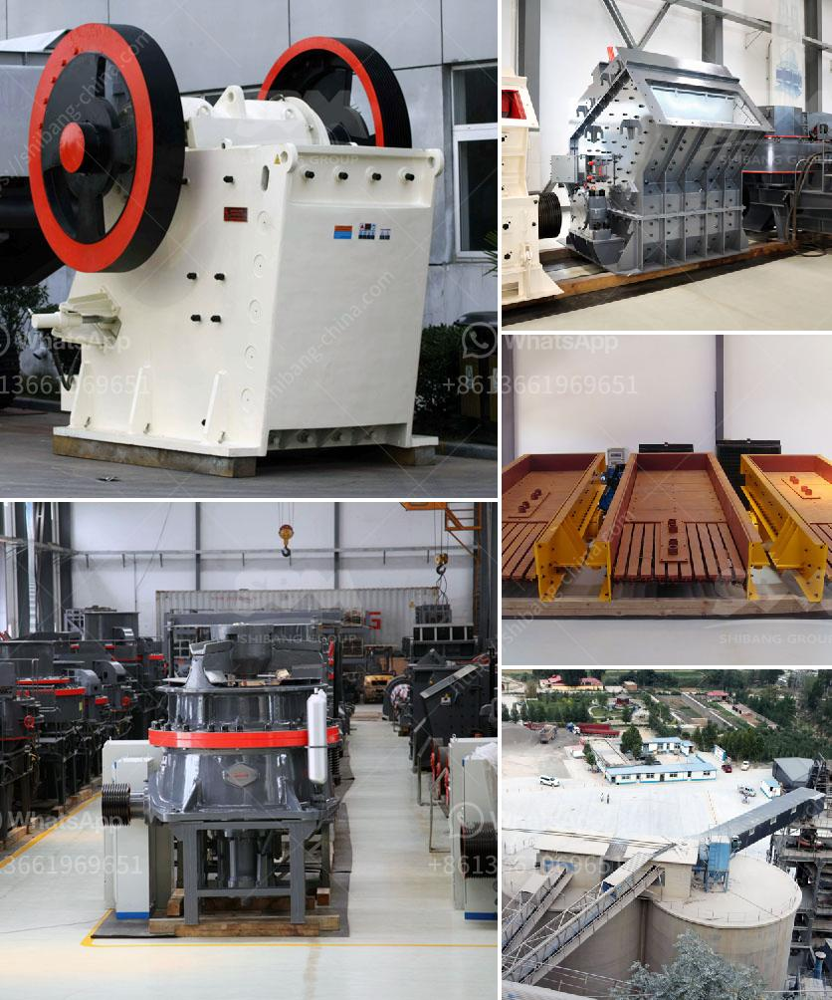

<h3>تحسين مصنع التكسير</h3>
يعتبر مصنع التكسير من المصانع الحيوية في صناعة الإنتاج. فهو المكان الذي يتم فيه سحق وطحن المواد الخام لإنتاج مواد نهائية عالية الجودة. ومن المهم جدًا تحسين عملية التكسير في المصنع لزيادة الإنتاجية وتقليل التكاليف.

أولاً، يجب التحقق من حالة المعدات المستخدمة في تكسير المواد الخام. يجب توفير المعدات الحديثة والفعالة التي تتمتع بقدرة كافية للتعامل مع الحمولة العالية وتلبية الاحتياجات. كما يتطلب الأمر تأكيد أن جميع الآليات تعمل بكفاءة عالية ولا تواجه أية مشاكل فنية. يمكن أيضًا استخدام تقنيات الصيانة الوقائية لضمان عمل مستمر وسلس للمعدات.

ثانيًا، ينبغي أيضًا مراجعة عملية التكسير نفسها لتحديد المجالات التي يمكن تحسينها. يمكن تنفيذ ذلك من خلال تحليل سجلات الإنتاج السابقة وتقييم البيانات المتوفرة. يجب إجراء دراسة عن التغيرات في جودة المنتج واستهلاك الطاقة والموارد والأداء العام للعملية. وبعد تحديد المشاكل، يمكن طرح الحلول اللازمة. على سبيل المثال، يمكن تحسين التحكم في عملية التكسير من خلال استخدام تقنيات التحكم الآلي المتقدمة.

كما يجب النظر في تحديث تقنية الكسارات المستخدمة. يُعَدُّ تحسين تصميم الكسارة وزيادة كفاءتها جزءًا مهمًا من تحسين عملية التكسير. يمكن أيضًا التفكير في استخدام تقنيات جديدة مثل التكسير بالضغط العالي لتحقيق مزيد من التحسين. يمكن استشارة الخبراء في مجال المعدات للحصول على المشورة المناسبة بشأن التقنيات الحديثة وكيفية تنفيذها في المصنع.

وأخيرًا، يجب توفير التدريب المناسب للعاملين في المصنع. فالعمالة الماهرة والمدربة تلعب دورًا حاسمًا في تحقيق الإنتاجية المثلى وجودة المنتج النهائي. يمكن التأكيد على توفير الدورات التدريبية اللازمة لموظفي المصنع وتوفير فرص التعلم المستمر.

باختصار، يجب تحسين مصنع التكسير من خلال الاستثمار في معدات حديثة وكفءة وتطبيق عمليات صيانة وقائية منتظمة. ينبغي أيضًا تحسين عملية التكسير نفسها وتحديث تقنية الكسارات المستخدمة. كما يجب تدريب العاملين على الكفاءة والمهارات اللازمة لتحقيق الإنتاجية المثلى. هذه الإجراءات مهمة لتحقيق تحسينات مستدامة وزيادة الربحية لمصنع التكسير.
<h3>Contact us</h3><ul><li><strong>Whatsapp:&nbsp;<a href="https://wa.me/8613661969651">+8613661969651</a></strong></li><li><a href="https://swt.shibang-china.com/?git&amp;zhl&amp;تحسين مصنع التكسير"><strong>Online Service(chat now)</strong></a></li></ul><h3>Related</h3><ul><li><a href='سعر الكسارة 30 طن.md'>سعر الكسارة 30 طن</a></li><li><a href='تقرير مشروع التعدين الكاولين المصغر.md'>تقرير مشروع التعدين الكاولين المصغر</a></li><li><a href='إعداد مصنع كسارة الحجر.md'>إعداد مصنع كسارة الحجر</a></li><li><a href='آلة تعدين النحاس.md'>آلة تعدين النحاس</a></li><li><a href='كسارة صخور محمولة صغيرة للسحق.md'>كسارة صخور محمولة صغيرة للسحق</a></li></ul>