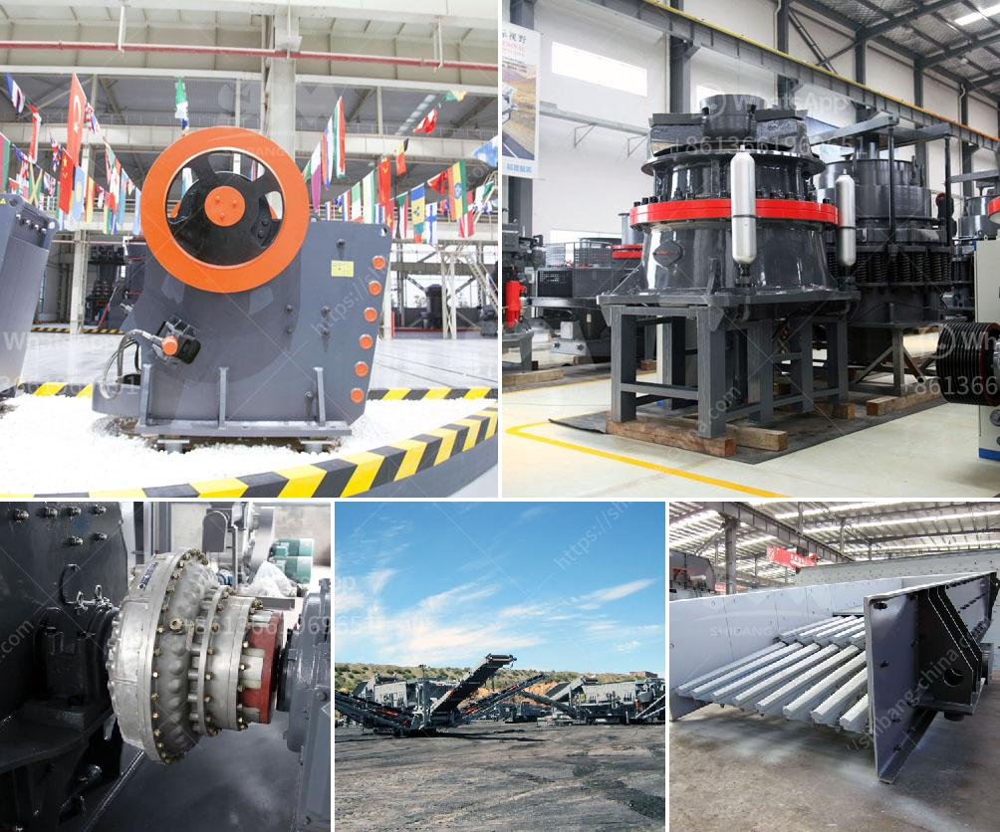

<h3>تحكم هيدروليكي في فك الكسارة</h3>
يعد تحكم هيدروليكي في فك الكسارة من التقنيات الحديثة التي تستخدم في عمليات تفكيك وتفتيت الصخور والمواد الصلبة الأخرى. يستخدم النظام الهيدروليكي لتحقيق قوة كبيرة لفك الكسارة وتفتيت المواد إلى قطع صغيرة قابلة للتخزين أو إعادة استخدامها.

إن تحكم هيدروليكي في فك الكسارة يعتمد على استخدام الزيت الهيدروليكي لتوليد القوة اللازمة للتحكم في فتح وإغلاق الفكين العلوي والسفلي للكسارة. يتم ضخ الزيت الهيدروليكي في أسطوانتين هيدروليكيتين تعمل بطريقة متزامنة لتحريك الفكين ، حيث يؤدي زيادة الضغط على الزيت إلى تحريك الفكين وفتحهما لتفكيك المواد.

يتم التحكم في نظام الهيدروليكي بواسطة مضخة هيدروليكية تستخلص الزيت من خزان الزيت وتضخه إلى مجموعة صمامات تحكم وجودة الزيت. يتم التحكم في نظام الهيدروليكي عن طريق صمامات التحكم التي تتحكم في تدفق الزيت إلى الأسطوانات الهيدروليكية للتحكم في حركة الفكين.

تعتبر تقنية التحكم الهيدروليكي في فك الكسارة مفيدة للعديد من الأسباب. أولاً وقبل كل شيء ، فإنها توفر قوة كبيرة ودقة في تحريك الفكين ، مما يتيح فك وتفتيت المواد الصلبة بسهولة وفعالية. بفضل التحكم الهيدروليكي ، يمكن ضبط قوة الضغط المستخدمة في التفكيك بدقة ، مما يؤدي إلى زيادة الكفاءة والإنتاجية في العملية.

بالإضافة إلى ذلك ، فإن نظام التحكم الهيدروليكي يتميز بسهولة الاستخدام والصيانة. يوفر هذا النظام مرونة كبيرة في تعديل قوة الفكين وسرعة تحركهما ، وهو ما يتيح للعمال ضبطها وفقًا لمتطلبات العمل المحددة. بالإضافة إلى ذلك ، يمكن اعتبار نظام التحكم الهيدروليكي أكثر موثوقية وأمانًا من الأنظمة التقليدية الأخرى.

في الختام ، يعد تحكم هيدروليكي في فك الكسارة تقنية حديثة وفعالة في مجال تفكيك وتفتيت المواد الصلبة. يوفر هذا النظام قوة كبيرة ودقة في التحكم ، وهو سهل الاستخدام والصيانة. يمكن القول إن تقنية التحكم الهيدروليكي تعزز الكفاءة والإنتاجية في عملية فك الكسارة وتسهم في تحسين عمليات التفتيت والتفكيك.
<h3>Contact us</h3><ul><li><strong>Whatsapp:&nbsp;<a href="https://wa.me/8613661969651">+8613661969651</a></strong></li><li><a href="https://swt.shibang-china.com/?git&amp;zhl&amp;تحكم هيدروليكي في فك الكسارة"><strong>Online Service(chat now)</strong></a></li></ul><h3>Related</h3><ul><li><a href='التحكم الهيدروليكي لكسارة الفك.md'>التحكم الهيدروليكي لكسارة الفك</a></li><li><a href='مطحنة الكرة التجارية للمبيعات.md'>مطحنة الكرة التجارية للمبيعات</a></li><li><a href='معدات كسارة المحجر المحمولة المستخدمة.md'>معدات كسارة المحجر المحمولة المستخدمة</a></li><li><a href='كسارة الحجر المصنوعة في إيطاليا.md'>كسارة الحجر المصنوعة في إيطاليا</a></li><li><a href='معدات طحن لمسحوق التلك.md'>معدات طحن لمسحوق التلك</a></li></ul>