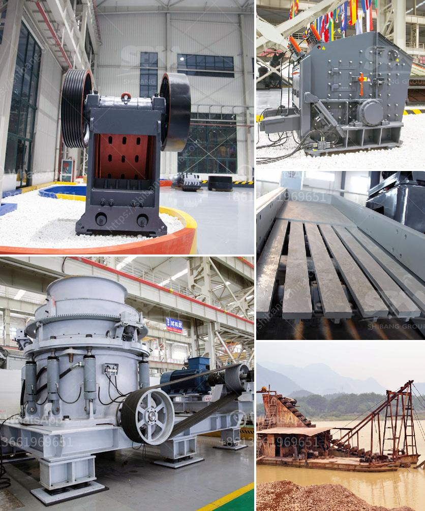

<h3>تحليل التكلفة للكسارات</h3>
تعتبر الكسارات من أهم وسائل التعدين والبناء التي تستخدم في عملية سحق الصخور والمواد الصلبة الأخرى. وبما أن هذه الكسارات تعتبر استثمارات كبيرة، فإنه من الضروري إجراء تحليل التكلفة للوقوف على مجموعة من العوامل التي تتحكم في الكلفة الإجمالية لتشغيلها.

أحد العوامل الرئيسية في تحليل التكلفة للكسارات هو تحديد التكلفة الثابتة والمتغيرة. التكلفة الثابتة تشمل تكاليف الاستثمار الأولية للشراء وتركيب الكسارة. تشمل هذه التكاليف تكلفة شراء المعدات والماكينات وتكاليف البناء وتأجير الأراضي، بالإضافة إلى تكاليف الموظفين والصيانة الأساسية.

أما التكلفة المتغيرة، فتشمل تكاليف الوقود والطاقة والمواد الاستهلاكية المستخدمة في تشغيل الكسارة. يجب مراقبة هذه التكاليف بدقة، حيث يمكن أن تشهد تذبذبات بسبب تقلب أسعار الوقود والطاقة.

بالإضافة إلى ذلك، يجب مراعاة تكاليف الصيانة والإصلاح. فالكسارات تتعرض للاستخدام الشاق وقد تتطلب صيانة وإصلاحات دورية للحفاظ على أمكانياتها العملية وتجنب تكاليف الإصلاحات الجائرة. يجب اعتبار هذه التكلفة كجزء من تكاليف التشغيل المستمرة للكسارة.

أيضًا، يجب وضع استراتيجية لتحقيق أعلى مستوى من الكفاءة والإنتاجية بأقل تكلفة. يمكن تحقيق ذلك من خلال تحسين العمليات وتعزيز التدريب والكفاءة للعاملين. فمثلاً، يمكن تحسين عملية تسليم المواد الخام إلى الكسارة بطريقة منظمة وفعالة لتحقيق أعلى كفاءة.

وتعتبر التصاميم الهندسية للكسارات وأنواع الصخور المعالجة من العوامل الأخرى التي تؤثر على التكلفة الإجمالية. فاختيار تصميم فعال ومناسب يسمح بتدفق سلس وسهولة في عملية السحق يمكن أن يقلل من تكاليف الطاقة ويزيد من الإنتاجية.

بصورة عامة، فإن تحليل التكلفة للكسارات يعزز الفهم الكامل للتكاليف المترتبة على تشغيلها وصيانتها. يساعد هذا التحليل على اتخاذ القرارات المالية الصحيحة وتحسين الكفاءة والإنتاجية. يمكن استخدام تحليل التكلفة للكسارات أيضًا للمقارنة بين العروض المتاحة في السوق والتحديد المبكر للتكاليف اللازمة لتشغيل نماذج محددة من الكسارات.

باختصار، فإن تحليل التكلفة للكسارات يعد أداة هامة للتخطيط المالي، حيث يساعد في تقدير التكاليف والعائد المتوقع من الاستثمار في الكسارات، ويمكن أن يساهم في زيادة الربحية وتحقيق أعلى مستوى من الكفاءة والإنتاجية.
<h3>Contact us</h3><ul><li><strong>Whatsapp:&nbsp;<a href="https://wa.me/8613661969651">+8613661969651</a></strong></li><li><a href="https://swt.shibang-china.com/?git&amp;zhl&amp;تحليل التكلفة للكسارات"><strong>Online Service(chat now)</strong></a></li></ul><h3>Related</h3><ul><li><a href='خط إنتاج مسحوق الجبس.md'>خط إنتاج مسحوق الجبس</a></li><li><a href='مطرقة إندونيسيا للبيع.md'>مطرقة إندونيسيا للبيع</a></li><li><a href='مصنعون لكسارات الصدم.md'>مصنعون لكسارات الصدم</a></li><li><a href='محطات غسيل الذهب المحمولة.md'>محطات غسيل الذهب المحمولة</a></li><li><a href='قائمة مصانع حبيبات خام الحديد في الهند.md'>قائمة مصانع حبيبات خام الحديد في الهند</a></li></ul>