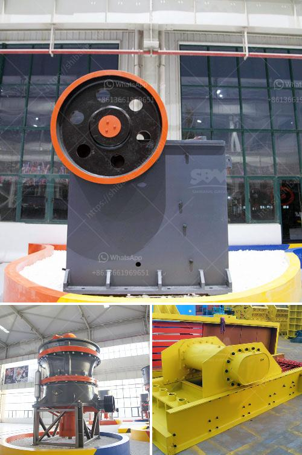

<h3>تحليل تكلفة سحق وفحص</h3>
تعتبر عمليات سحق وفحص المواد الصلبة من أهم العمليات اللازمة في صناعة التعدين والبناء والهندسة المدنية والصناعات الأخرى. تهدف هذه العمليات إلى تقليل حجم المواد الصلبة وجعلها أكثر تجانسًا وقابلة للاستخدام في الإنتاج. يعد تحليل تكلفة سحق وفحص أمرًا بالغ الأهمية لتحقيق الربحية وتحقيق التوازن بين التكلفة والجودة.

تتكون تكلفة سحق وفحص من عدة عوامل مختلفة. أولاً وقبل كل شيء، يجب تحديد أنواع المواد المراد سحقها وفحصها وكمية المواد المراد معالجتها. هذا يعتمد على العملية والاستخدام النهائي للمواد. على سبيل المثال، قد يتطلب سحق الصخور في صناعة التعدين كمية أكبر وعملية أكثر تعقيدًا مقارنةً بسحق الأحجار في صناعة البناء.

ثانياً، العامل الأساسي الآخر في تكلفة سحق وفحص هو طاقة وكفاءة المعدات المستخدمة في العملية. يتطلب الحصول على معدات عالية الجودة ومتقدمة تكنولوجيًا تكلفة أعلى، لكنها قد توفر توفيرًا في المدى الطويل بفضل كفاءتها العالية وقدرتها على التعامل مع المواد بطريقة أفضل. بالإضافة إلى ذلك، يجب أيضًا احتساب تكاليف الصيانة والإصلاح المستقبلية لهذه المعدات.

ثالثًا، يجب أخذ في الاعتبار تكاليف المواد الاستهلاكية المستخدمة في عملية السحق والفحص. قد تكون هذه المواد مثل الكرات المعدنية المستخدمة في مطاحن الكرة أو شاشات الترشيح المستخدمة في تجهيز الأغذية. يجب تحديد كمية المواد الاستهلاكية المطلوبة والتكلفة اللازمة لشرائها.

أخيرًا، يجب دراسة تكاليف العمالة والطاقة في عملية السحق والفحص. يتطلب التشغيل المستمر للمعدات الطاقة الكهربائية وقد يكون لديك عمال متخصصين يعملون في هذه العمليات.

في الختام، تحليل تكلفة سحق وفحص يتطلب دراسة شاملة ومتكاملة لجميع العوامل المذكورة أعلاه. يجب تحقيق التوازن بين التكلفة والجودة والكفاءة لتحقيق الربحية المرجوة. يعتبر اختيار المعدات المناسبة والتخطيط المثالي للعملية واختيار المواد الاستهلاكية المناسبة من الأمور الحاسمة في تحقيق هذا التوازن وضمان نجاح عملية السحق والفحص.
<h3>Contact us</h3><ul><li><strong>Whatsapp:&nbsp;<a href="https://wa.me/8613661969651">+8613661969651</a></strong></li><li><a href="https://swt.shibang-china.com/?git&amp;zhl&amp;تحليل تكلفة سحق وفحص"><strong>Online Service(chat now)</strong></a></li></ul><h3>Related</h3><ul><li><a href='مطحنة رايموند مستخدمة في إندونيسيا.md'>مطحنة رايموند مستخدمة في إندونيسيا</a></li><li><a href='مطحنة الكرة الثقيلة الوزن في الهند.md'>مطحنة الكرة الثقيلة الوزن في الهند</a></li><li><a href='الكسارة المحمولة ١٥٠ طن في الساعة.md'>الكسارة المحمولة ١٥٠ طن في الساعة</a></li><li><a href='آلات إنتاج الرمل سحق الطحن والفرز.md'>آلات إنتاج الرمل سحق الطحن والفرز</a></li><li><a href='مصانع قديمة للبيع، استخدمت مطاحن الكرات.md'>مصانع قديمة للبيع، استخدمت مطاحن الكرات</a></li></ul>