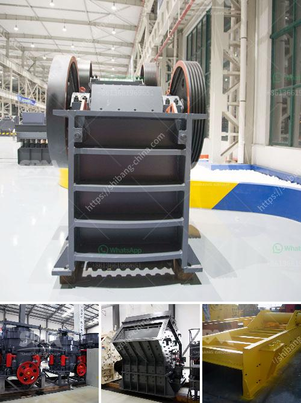

<h3>تخطيط مصنع الأسمنت الصغير بتنسيق PDF</h3>
يعد تخطيط مصنع الأسمنت الصغير من العوامل الحاسمة التي تؤثر في نجاح وكفاءة العمليات الإنتاجية لهذا القطاع الهام. يستخدم الأسمنت في العديد من التطبيقات البنائية، ولذلك فإن تشييد مصنع صغير لإنتاج الأسمنت يعتبر اختيارًا مثاليًا لتلبية الاحتياجات المحلية.

أحد الجوانب الرئيسية في تخطيط مصنع الأسمنت الصغير هو اختيار الموقع المثالي. يجب أن يتم وضع المصنع في موقع قريب من مصدر المواد الأولية، مثل صخور الجير والرماد المتطاير والخبث، وكذلك بالقرب من أسواق البيع المحلية للمنتجات النهائية. هذا الأمر يقلل من تكاليف النقل ويزيد من كفاءة الإنتاج.

بعد تحديد الموقع الأمثل، يجب تصميم هيكل المصنع بشكل مناسب. يجب أن يكون للمصنع مساحة كافية لاستيعاب المعدات اللازمة وتخزين المواد الخام والمنتجات النهائية. كما يجب أيضًا توفير مساحة للمكاتب وغرف الاجتماعات وغرف استراحة الموظفين، حيث يساهم هذا في تحسين بيئة العمل وزيادة الإنتاجية.

آلات الإنتاج والمعدات اللازمة لمصنع الأسمنت الصغير تختلف حسب الطاقة الإنتاجية المطلوبة والتكنولوجيا المستخدمة. يتم استخدام الكسارات والمطاحن وأجهزة التبريد وأجهزة التنقية لمعالجة المواد الخام وتحضيرها للعملية الإنتاجية. يجب اختيار المعدات ذات الجودة العالية والتي تتمتع بالكفاءة العالية لضمان جودة المنتج النهائي.

لا يمكن نسيان ضرورة وجود نظام مراقبة ومتابعة فعال في المصنع. يساعد النظام في مراقبة الحالة العامة للمعدات وإجراء الصيانة الوقائية عند الحاجة. كما يجب اتباع معايير السلامة والجودة العالمية، لضمان سلامة العاملين وسلامة المنتجات التي يتم تسويقها.

في النهاية، يعتبر تخطيط مصنع الأسمنت الصغير عملية حساسة تتطلب توجيهًا محكمًا ودراسة مستفيضة. يجب أن يستند التخطيط على التحليل الاقتصادي والمالي لضمان الاستدامة والربحية. إذا تم تخطيط المصنع بشكل صحيح وتم تنفيذه بدقة، فإنه يمكن أن يكون مصدرًا مربحًا ويساهم في تلبية الطلب المحلي على الأسمنت.
<h3>Contact us</h3><ul><li><strong>Whatsapp:&nbsp;<a href="https://wa.me/8613661969651">+8613661969651</a></strong></li><li><a href="https://swt.shibang-china.com/?git&amp;zhl&amp;تخطيط مصنع الأسمنت الصغير بتنسيق PDF"><strong>Online Service(chat now)</strong></a></li></ul><h3>Related</h3><ul><li><a href='مواصفات كسارة الفك 250x400.md'>مواصفات كسارة الفك 250x400</a></li><li><a href='آلة مطحنة المطارق.md'>آلة مطحنة المطارق</a></li><li><a href='آلة صنع مسحوق الدولوميت لخط الإنتاج.md'>آلة صنع مسحوق الدولوميت لخط الإنتاج</a></li><li><a href='شركة تصنيع مطاحن المطرقة في ماليزيا.md'>شركة تصنيع مطاحن المطرقة في ماليزيا</a></li><li><a href='استفسار حول كسارة الصدم.md'>استفسار حول كسارة الصدم</a></li></ul>