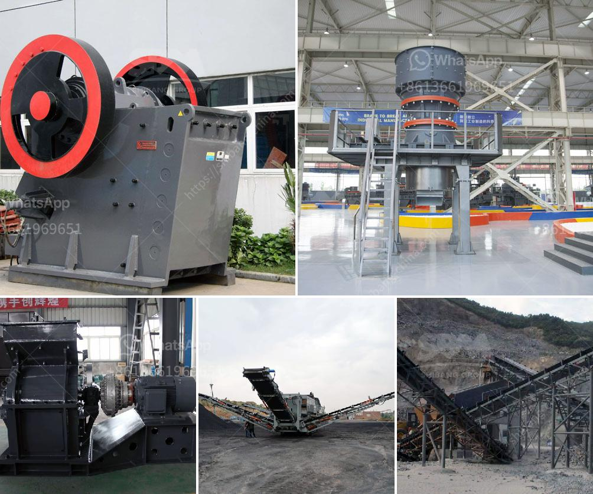

<h3>تخطيط منشأة تعدين الماس</h3>
تعدين الماس هو عملية استخراج الألماس من باطن الأرض. وتتطلب هذه العملية مكانًا مثاليًا لمنشأة التعدين التي يجب توفيرها لتحقيق أقصى قدر من الكفاءة والنجاح. تحتاج منشأة تعدين الماس إلى تخطيط متقن ومدروس لضمان تحقيق أقصى قدر من الإنتاجية وسلامة العمال وحماية البيئة.

أولاً وقبل كل شيء ، يجب تحديد موقع المنشأة بعناية. يجب أن يكون الموقع قريبًا من المناجم الماسية المتوفرة والترسبات الطبيعية للألماس. يتأثر موقع المنشأة أيضًا بعوامل أخرى مثل قربه من المصادر المائية والبنية التحتية والطرق الرئيسية لسهولة النقل.

بعد تحديد الموقع ، يجب تصميم المنشأة بطريقة تلبي متطلبات تعدين الماس الحديثة. يتضمن ذلك إقامة مباني المنشأة مثل المكاتب ، وورش العمل ، والمساكن للعمال. يجب أيضًا تخطيط مساحة كافية لتخزين المعدات والآلات المستخدمة في عمليات التعدين.

السلامة والحماية هي جوانب حيوية يجب مراعاتها أيضاً. يجب توفير تدريب مناسب للعمال للتعامل مع المواد الخطرة وتقنيات السلامة العامة. يجب أن تكون هناك إجراءات سلامة صارمة تحد من حدوث حوادث وتوفير المعدات الواقية اللازمة مثل القفازات والأقنعة والخوذ.

توفير البيئة الملائمة لعملية التعدين أمر أساسي. يجب تقييم التأثير البيئي للمنشأة واتخاذ التدابير اللازمة للحد من أي تأثير سلبي محتمل على البيئة المحيطة. يتطلب ذلك التعاون مع الجهات البيئية واستخدام تقنيات صديقة للبيئة في عملية التعدين مثل استخدام معدات كهربائية وإعادة التدوير وإعادة تصنيع المياه.

في الختام ، يجب أن يكون تخطيط منشأة تعدين الماس متقنًا وشاملاً ، يراعي الجوانب الهامة مثل الموقع والتصميم والسلامة والبيئة. يتطلب ذلك العمل المشترك بين المهندسين المعماريين والمهندسين الميكانيكيين والمهندسين البيئيين وغيرهم من الخبراء لتحقيق منشأة تعدين ماسية فعالة ومستدامة.
<h3>Contact us</h3><ul><li><strong>Whatsapp:&nbsp;<a href="https://wa.me/8613661969651">+8613661969651</a></strong></li><li><a href="https://swt.shibang-china.com/?git&amp;zhl&amp;تخطيط منشأة تعدين الماس"><strong>Online Service(chat now)</strong></a></li></ul><h3>Related</h3><ul><li><a href='سعر كسارة الطين.md'>سعر كسارة الطين</a></li><li><a href='خط تكسير الحجر.md'>خط تكسير الحجر</a></li><li><a href='قائمة معدات تعدين الذهب.md'>قائمة معدات تعدين الذهب</a></li><li><a href='موزعون للأحزمة والناقلات في إندونيسيا.md'>موزعون للأحزمة والناقلات في إندونيسيا</a></li><li><a href='معدات جص صنع الجدار الخرساني في ألمانيا.md'>معدات جص صنع الجدار الخرساني في ألمانيا</a></li></ul>