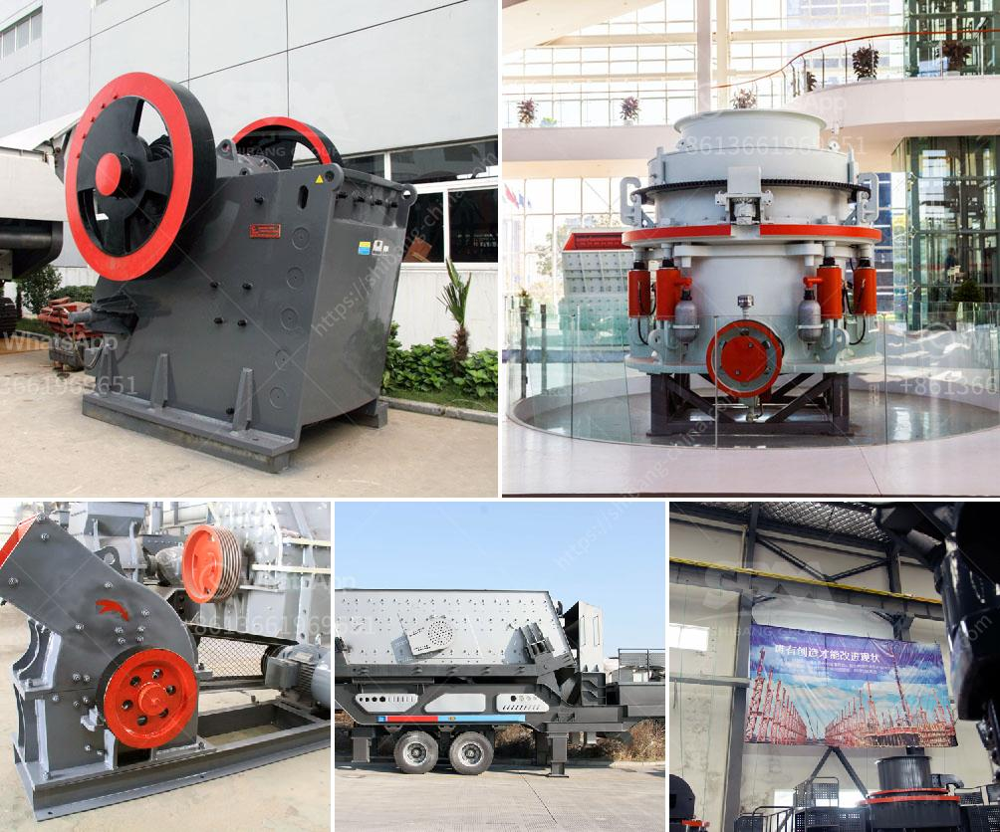

<h3>تدريب مطحنة ريموند</h3>
تُعتبر مطاحن ريموند أدوات أساسية في صناعة الطحن. وتستخدم لطحن التعدين والمواد الخام والمواد الكيميائية والبناء والمعادن وغيرها من المواد. وتحتاج هذه المطاحن إلى تدريب ملائم للحصول على أعلى مستوى من الأداء والاستفادة القصوى منها.

أولاً وقبل الشروع في تشغيل المطحنة، يجب التأكد من أن جميع المكونات والأجزاء مُركبة بشكل صحيح وفقًا للتعليمات الموجودة في دليل المستخدم. يجب التحقق من وجود أي أعطال أو أضرار واضحة والإبلاغ عنها قبل تشغيل المطحنة لتجنب حصول مشاكل أكثر خطورة فيما بعد.

بعد التأكد من سلامة الجهاز، يجب أن يتم تدريب العاملين على استخدام المطحنة بأمان. يجب على العاملين إجراء تدريب مكثف حول القواعد الأساسية للسلامة واستخدام المعدات الواقية بشكل صحيح، مثل استخدام الكمامة والقفازات عند العمل مع المواد الكيميائية الخطرة. يجب أيضًا التدريب على تشغيل وإيقاف المطحنة بطريقة صحيحة وكيفية التعامل مع المواد الخام والتحكم في جودة الطحن.

علاوة على ذلك، يجب على العاملين أن يتعلموا كيفية صيانة المطحنة بشكل منتظم. يجب الفحص الدوري لإجراء الصيانة الوقائية للمطحنة وتنظيفها بانتظام للحفاظ على أدائها الأمثل وتجنب حدوث عطل مفاجئ. يجب أيضًا التدريب على تبديل القطع المهمة ذات الاستهلاك العالي، مثل الأسطوانة والحلقة المتداخلة، والتأكد من استبدالها في الوقت المناسب لمنع تدهور جودة الطحن.

أخيرًا، يهم أن يلتزم العاملون بتوجيهات الشركة المصنعة لتدريب مطحنة ريموند. يجب عليهم تنفيذ الإجراءات والتعليمات اللازمة لتشغيل وصيانة المطحنة بشكل صحيح. قد تؤدي تجاهل هذه التعليمات إلى فقدان الضمان وخسارة الأموال. وبالتالي، يجب على العاملين الاستفادة القصوى من التدريب المقدم لضمان عمل المطحنة بكفاءة عالية وبأقصى استفادة ممكنة.

في النهاية، تدريب مطحنة ريموند يُعتبر أمرًا هامًا لضمان تشغيلها بشكل سليم وآمن وفقًا للمعايير الصحية والبيئية. لذا، ينبغي على العاملين الاستفادة من تلك التدريبات وتطبيق المهارات المكتسبة لتحقيق أعلى مستوى من الأداء وجودة الطحن.
<h3>Contact us</h3><ul><li><strong>Whatsapp:&nbsp;<a href="https://wa.me/8613661969651">+8613661969651</a></strong></li><li><a href="https://swt.shibang-china.com/?git&amp;zhl&amp;تدريب مطحنة ريموند"><strong>Online Service(chat now)</strong></a></li></ul><h3>Related</h3><ul><li><a href='كسارة لفة مسننة جاجيد.md'>كسارة لفة مسننة جاجيد</a></li><li><a href='آلة غسيل الرمال.md'>آلة غسيل الرمال</a></li><li><a href='مطحنة كبيرة القدرة في ماليزيا.md'>مطحنة كبيرة القدرة في ماليزيا</a></li><li><a href='تكسير الحجر المصنوع في ألمانيا.md'>تكسير الحجر المصنوع في ألمانيا</a></li><li><a href='سعر كسارة الهامر العلامة التجارية.md'>سعر كسارة الهامر العلامة التجارية</a></li></ul>