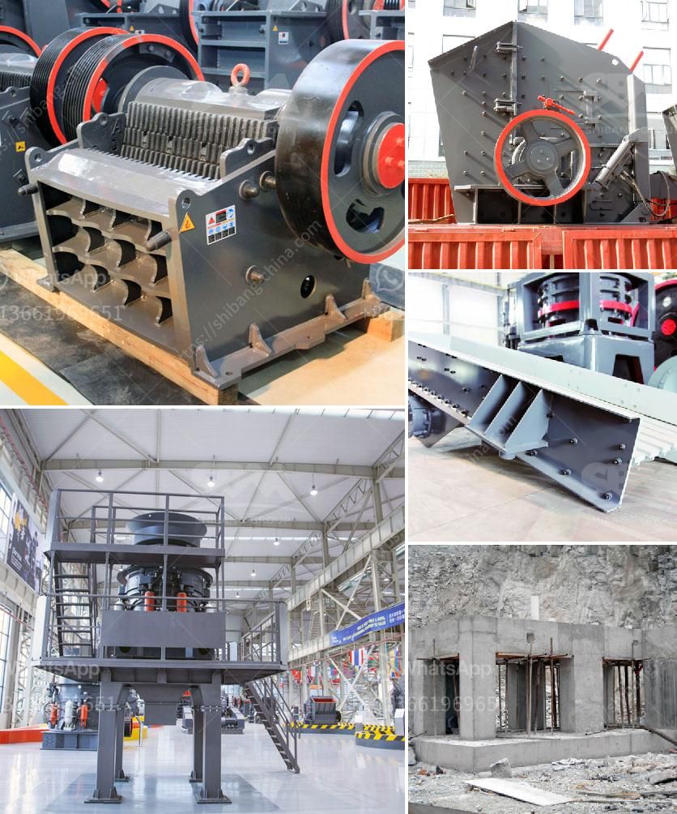

<h3>تدفق عملية مصنع البنتونايت</h3>
تعتبر صناعة البنتونايت من الصناعات الهامة والمتنامية في العالم، حيث يتم استخدامها في العديد من التطبيقات مثل التنقيب عن النفط والغاز، وتصنيع مواد البناء، والعناية بالبشرة والشعر، وصناعة الأغذية، والعديد من التطبيقات الأخرى. في هذه المقالة، سنتناول مقدمة عن تدفق عملية مصنع البنتونايت.

تتكون عملية مصنع البنتونايت من عدة مراحل، تبدأ بتعدين خام البنتونايت من المناجم، يتم تكسير الخام وطحنه إلى حجم صغير، ثم يتم تخليصه من الشوائب والحقول الأخرى عن طريق استخدام الفصل الجاذبية المختلفة للمواد. بعد ذلك، يتم تجفيف البنتونايت بواسطة أفران الجفاف للحصول على رطوبة قليلة في المواد.

بعد تجفيف البنتونايت، تتم عملية التلبيد، حيث يتم إضافة مواد تلبيدية لربط الجزيئات معًا وتحسين قوة التحمل والمرونة للمنتج النهائي. يتم خلط المواد المضافة مع البنتونايت بشكل جيد للحصول على توزيع متجانس، ومن ثم يعبأ المنتج النهائي في حاويات صغيرة أو تعبأ في أكياس كبيرة للتخزين والتصدير.

يجب أن تتم هذه العملية في بيئة نظيفة وصحية، حيث يتم التحكم في درجة الحرارة والرطوبة والتهوية لتوفير ظروف عمل مثالية لعملية الإنتاج. يتم أيضًا فحص المنتج النهائي بدقة للتأكد من جودته وعدم وجود أي عيوب.

علاوة على ذلك، يجب أن يتم مراقبة وإدارة النفايات والمخلفات الناجمة عن هذه العملية بشكل جيد. يتم التخلص من المخلفات الصلبة والسائلة بطرق صديقة للبيئة ومستدامة لضمان عدم تلوث البيئة والمحافظة على النظام البيئي المحيط.

في الختام، تتطلب عملية مصنع البنتونايت تدفقًا متكاملاً لعدة مراحل لتحقيق منتج نهائي ذو جودة عالية. يتطلب الأمر مراعاة قواعد صحة وسلامة العمال وحماية البيئة والتحكم في الجودة وإعداد المنتج للتوزيع والتصدير. تمثل صناعة البنتونايت فرصة رائعة للاستثمار وتعزيز التنمية المستدامة.
<h3>Contact us</h3><ul><li><strong>Whatsapp:&nbsp;<a href="https://wa.me/8613661969651">+8613661969651</a></strong></li><li><a href="https://swt.shibang-china.com/?git&amp;zhl&amp;تدفق عملية مصنع البنتونايت"><strong>Online Service(chat now)</strong></a></li></ul><h3>Related</h3><ul><li><a href='حجم كسارة الفك.md'>حجم كسارة الفك</a></li><li><a href='المعدات المطلوبة لتعدين الفحم.md'>المعدات المطلوبة لتعدين الفحم</a></li><li><a href='مصنع كبير للكسارة بسعة ١٠٠٠ حجر.md'>مصنع كبير للكسارة بسعة ١٠٠٠ حجر</a></li><li><a href='كسارة مطرقية متعددة.md'>كسارة مطرقية متعددة</a></li><li><a href='كسارة فكية صغيرة في المملكة المتحدة.md'>كسارة فكية صغيرة في المملكة المتحدة</a></li></ul>