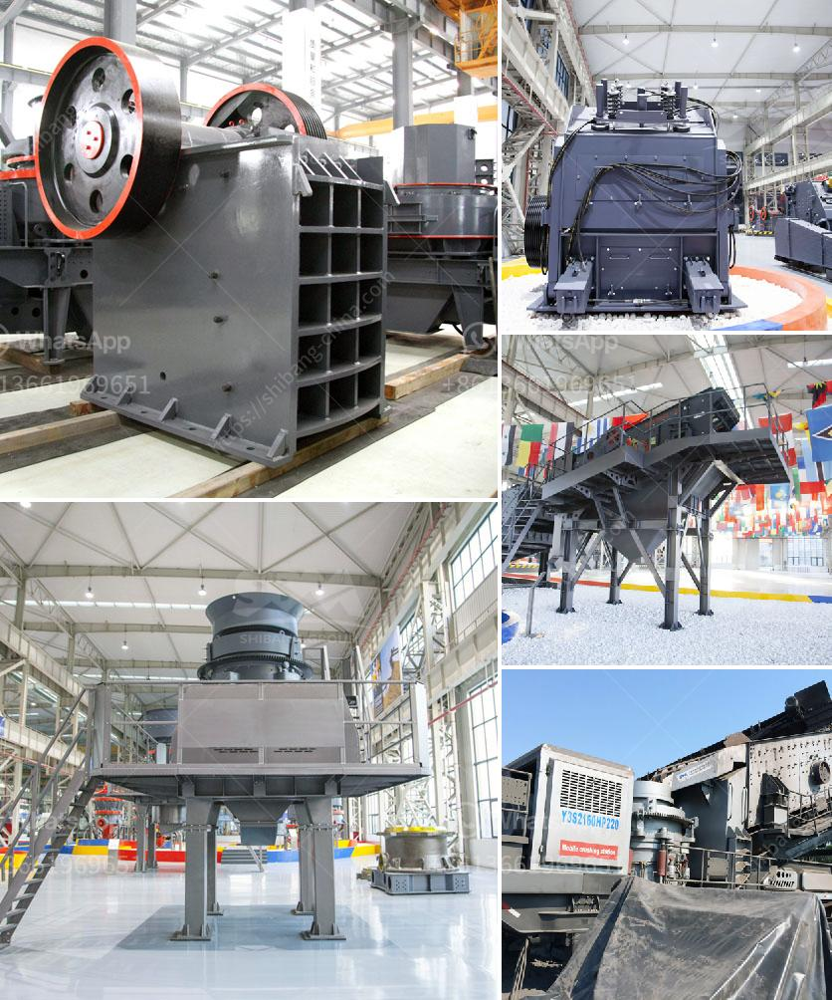

<h3>تدفق معالجة البنتونيت</h3>
يُعد البنتونيت معدناً طبيعياً معروفاً بقدرته العالية على الامتصاص والانتفاخ. ويتم استخدامه في عدة صناعات منها صناعة النفط والغاز وصناعة الطلاء والمستحضرات الدوائية والمستحضرات الجلدية، وهو يعد مكوناً أساسياً في العديد من المنتجات.

يبدأ عملية تدفق معالجة البنتونيت بمراحل مختلفة. الخطوة الأولى تتطلب استخراج البنتونيت الخام من المواقع الطبيعية حيث يتم نقل المادة الخام إلى المصانع للمعالجة. بالنسبة للبنتونيت، يفضل استخدام مصادر طبيعية للمادة الخام، مثل مناجم البنتونيت في الولايات المتحدة الأمريكية وروسيا والصين والهند.

بعد استخراج البنتونيت، تتم معالجتها للتخلص من الشوائب والمواد الأخرى غير المرغوب فيها. يتم فحص البنتونيت بدقة باستخدام تقنيات معملية متقدمة لضمان جودة المنتج النهائي.

ثم يتم مطحنة البنتونيت النقي وتجفيفه لإزالة الرطوبة. تتفاوت طرق التجفيف باختلاف الاحتياجات والمتطلبات. يمكن استخدام الفرن الدوار أو الهواء الساخن للتجفيف.

بعد ذلك، يتم حفظ البنتونيت المعالج في تخزين مؤقت قبل تعبئته للتسويق والتوزيع. إن التخزين المؤقت يسمح بمراقبة الجودة النهائية للمنتج قبل وضعه في حزم.

تقوم الشركات المصنعة للبنتونيت بتسويق المنتج بشكل عام في أكياس أو حاويات سائبة وفقاً لاحتياجات الزبون. يتم وضع إرشادات طريقة الاستخدام والسلامة على العبوات لضمان استخدام آمن وفعال للبنتونيت.

قد تختلف عملية تدفق معالجة البنتونيت بين الشركات وفقاً للطرق التي تستخدمها كل شركة واحتياجات الزبون. ومع ذلك، تبقى الخطوات الرئيسية كما سبق ذكرها متشابهة في جميع عمليات معالجة البنتونيت.

بالاختصار، فإن تدفق معالجة البنتونيت يشمل استخراج البنتونيت، تنقيته، تجفيفه، تخزينه، تغليفه وتسويقه للزبائن. يهدف هذا العملية إلى تقديم بنتونيت عالي الجودة لمجموعة واسعة من الصناعات المختلفة.
<h3>Contact us</h3><ul><li><strong>Whatsapp:&nbsp;<a href="https://wa.me/8613661969651">+8613661969651</a></strong></li><li><a href="https://swt.shibang-china.com/?git&amp;zhl&amp;تدفق معالجة البنتونيت"><strong>Online Service(chat now)</strong></a></li></ul><h3>Related</h3><ul><li><a href='معدات إعادة تدوير الجبس للبيع.md'>معدات إعادة تدوير الجبس للبيع</a></li><li><a href='تصنيع مكره مطحنة الكرة.md'>تصنيع مكره مطحنة الكرة</a></li><li><a href='أعمال التعدين والاستغلال في جنوب أفريقيا.md'>أعمال التعدين والاستغلال في جنوب أفريقيا</a></li><li><a href='آلة صنع الرمل في جنوب أفريقيا.md'>آلة صنع الرمل في جنوب أفريقيا</a></li><li><a href='مصنع كسارة الصخور الذهبية المحمولة.md'>مصنع كسارة الصخور الذهبية المحمولة</a></li></ul>