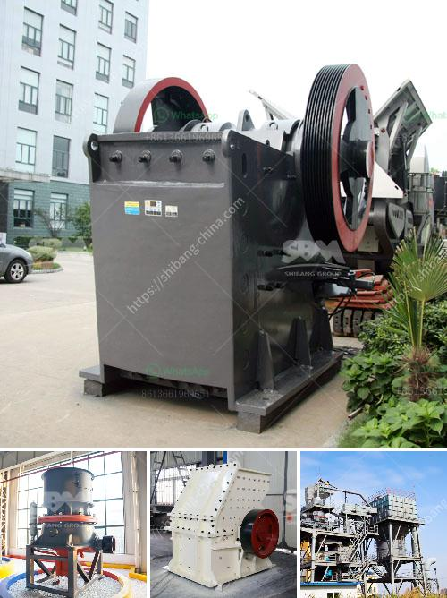

<h3>تدوير نفايات البناء</h3>
تعد نفايات البناء من أحد أكثر أنواع النفايات انتشارًا في جميع أنحاء العالم، وتشكل تحديًا كبيرًا للبيئة والمجتمع. ولحسن الحظ، هناك جهود عالمية تهدف إلى تدوير هذه النفايات واستخدامها في العمليات البنائية.

يعتبر تدوير نفايات البناء أمرًا هامًا من منظور الحفاظ على البيئة والاستدامة. فبدلاً من التخلص من هذه النفايات في المواقع النفايات، يمكن إعادة استخدامها في المشروعات البنائية المستقبلية. فمن خلال إعادة تدوير الخرسانة والألواح الخشبية والطوب والزجاج والمعادن والأرضيات والمواد العازلة والكثير من الأشياء الأخرى، يتم تحويل النفايات إلى مواد بنائية قابلة للإعادة الاستخدام.

توجد العديد من الفوائد المرتبطة بتدوير نفايات البناء. أولاً وقبل كل شيء، فإنه يقلل من استخدام الموارد الطبيعية والطاقة في إنتاج المواد الجديدة؛ حيث أن تدوير النفايات يتطلب كمية أقل من الطاقة مقارنة بإنتاج مواد جديدة. كما يقلل تدوير النفايات من تكاليف الهدم والتخلص من النفايات ويحسن كفاءة استخدام الموارد.

ومن الجوانب البيئية، يساهم تدوير نفايات البناء في تقليل انبعاثات ثاني أكسيد الكربون وتلوث الهواء والأرض والمياه. فبدلاً من رمي النفايات في المواقع النفايات، تستخدم المواد المعاد تدويرها لتقليل تلوث البيئة والتأثير على الحياة البرية والنظم البيئية.

علاوة على ذلك، يؤدي تدوير نفايات البناء إلى توفير فرص عمل جديدة في إعادة تدوير النفايات وإنتاج المواد البنائية المعاد تدويرها. ويعمل ذلك على تعزيز اقتصاديات المناطق وتحسين الاستدامة الاجتماعية.

في الختام، يجب أن ندرك أن تدوير نفايات البناء يعد خطوة ضرورية للحد من التأثيرات البيئية السلبية الناتجة عن عمليات الهدم والبناء. إن توجيه الجهود نحو إعادة استخدام وتدوير النفايات يعزز الاستدامة والمسؤولية الاجتماعية للشركات والمجتمعات. ومن المهم أن نتعاون جميعًا من أجل تحقيق مستقبل أفضل وأكثر استدامة من خلال تدوير نفايات البناء والنص على مشاريع بناء صديقة للبيئة.
<h3>Contact us</h3><ul><li><strong>Whatsapp:&nbsp;<a href="https://wa.me/8613661969651">+8613661969651</a></strong></li><li><a href="https://swt.shibang-china.com/?git&amp;zhl&amp;تدوير نفايات البناء"><strong>Online Service(chat now)</strong></a></li></ul><h3>Related</h3><ul><li><a href='آلة طحن الكرة في الهند.md'>آلة طحن الكرة في الهند</a></li><li><a href='التكلفة المقدرة لإنشاء مصنع أسمنت في الهند.md'>التكلفة المقدرة لإنشاء مصنع أسمنت في الهند</a></li><li><a href='مصنع معالجة خام الكروم في الصين.md'>مصنع معالجة خام الكروم في الصين</a></li><li><a href='قائمة الشركات المحاجر في نيجيريا.md'>قائمة الشركات المحاجر في نيجيريا</a></li><li><a href='حساب تصميم مطحنة الكرة.md'>حساب تصميم مطحنة الكرة</a></li></ul>