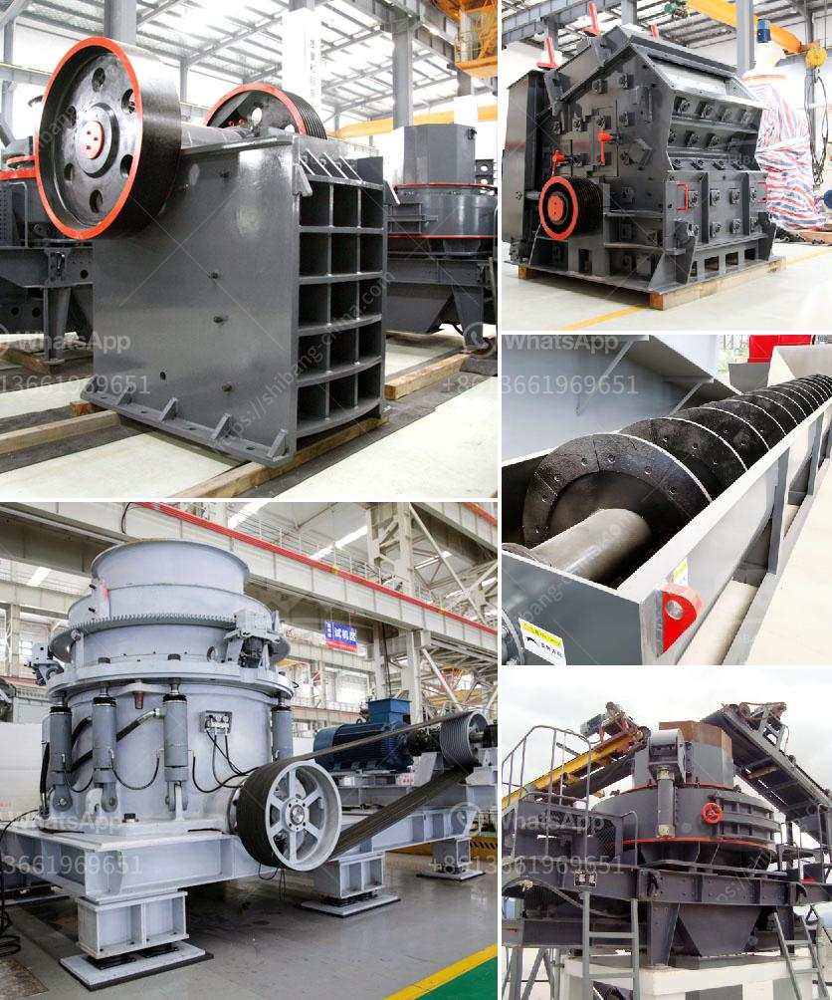

<h3>تركيب مصنع صنع الرمل الاصطناعي</h3>
يُعتبر الرمل الاصطناعي منتجًا مهمًا في صناعة البناء والمواد الانشائية. ولاسيما في المناطق التي يكون فيها الرمال الطبيعية غير متاحة بكميات كافية أو تحتوي على تشكيلة غير مرغوب فيها من الشوائب. لهذا السبب، يتم اقتناء ماكينات مصانع صنع الرمل الاصطناعي لتلبية احتياجات السوق المحلية والعالمية.

عملية تركيب مصنع صنع الرمل الاصطناعي تتضمن عدة خطوات رئيسية. أولاً، يتم جمع الركام الصخري القابل للتكسير من محاجر الصخور الطبيعية. ثم يتم تكسير هذا الصخر بواسطة كسارات، حيث يتم طحنه إلى جسيمات صغيرة. ومن ثم يتم فصل الشوائب بواسطة غسل الركام وغربلته. بعد ذلك، يتم تجفيف وفرز الركام المنتج وفقًا للأحجام المطلوبة لإنتاج الرمل الاصطناعي.

تتطلب عملية صنع الرمل أيضًا وجود آلات خاصة مثل الكسارات الفكية والكسارات المخروطية والكسارات الصدمية. هذه الكسارات تعمل على طحن الصخور بطرق ميكانيكية معينة للحصول على رمل ناعم وقوي. كما يجب وجود معدات لغسل وغربلة الركام وفرزه وتجفيفه بشكل فعال.

بالإضافة إلى ذلك، تتطلب عملية تركيب المصنع الاهتمام بالبيئة والسلامة. يجب تحديد موقع المصنع بعناية لتقليل تأثيره البيئي وتحسين استدامته. ينبغي وضع إجراءات السلامة وتوفير التدريب المناسب للعاملين في المصنع من أجل ضمان العمل الآمن والصحي.

بالنظر إلى التقدم التكنولوجي في هذا المجال، فإن مصانع صنع الرمل الاصطناعي تعتبر حلاً اقتصاديًا وفعالًا لتلبية الطلب المتزايد على الرمال في صناعة البناء. بالإضافة إلى ذلك، توفر المصانع المحلية للدول المنتجة استقلالية أكبر في تلبية احتياجاتها وتقليل الاعتماد على الواردات.

في الختام، يعد تركيب مصنع صنع الرمل الاصطناعي خطوة حاسمة في تلبية احتياجات سوق البناء المحلية. من خلال استخدام تقنيات حديثة وآلات متطورة، يتمكن المصنع من إنتاج رمل عالي الجودة والقوة والنعومة. كما أنه يلعب دورًا مهمًا في تعزيز التنمية المستدامة والاقتصاد المحلي بتقليل اعتماد الدولة على الاستيراد وتوفير فرص عمل للعاملين.
<h3>Contact us</h3><ul><li><strong>Whatsapp:&nbsp;<a href="https://wa.me/8613661969651">+8613661969651</a></strong></li><li><a href="https://swt.shibang-china.com/?git&amp;zhl&amp;تركيب مصنع صنع الرمل الاصطناعي"><strong>Online Service(chat now)</strong></a></li></ul><h3>Related</h3><ul><li><a href='مطحنة السيليكا المطحونة للبيع.md'>مطحنة السيليكا المطحونة للبيع</a></li><li><a href='عملية تعدين الذهب.md'>عملية تعدين الذهب</a></li><li><a href='كيفية تحديد سعة سير الناقل.md'>كيفية تحديد سعة سير الناقل</a></li><li><a href='سعر الأسطوانات للمطاحن الصناعية.md'>سعر الأسطوانات للمطاحن الصناعية</a></li><li><a href='آلات إنتاج الكالسيوم.md'>آلات إنتاج الكالسيوم</a></li></ul>