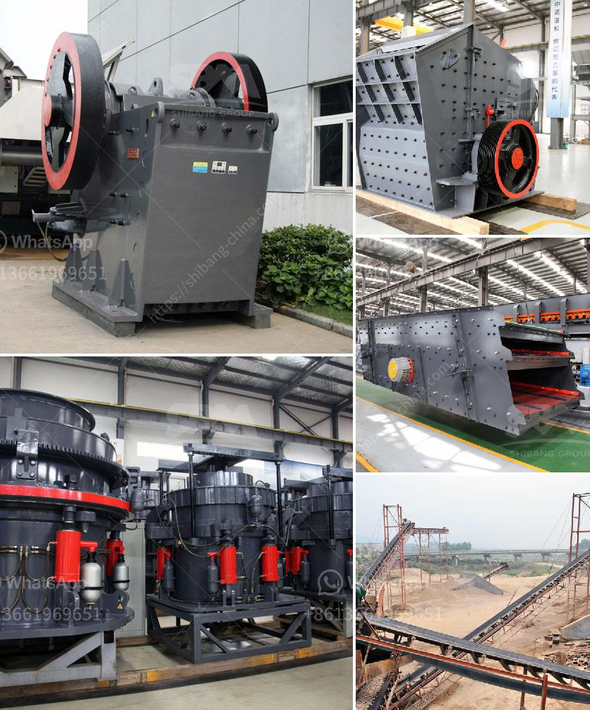

<h3>تركيبة مواد كسارة الفحم</h3>
تعتبر كسارة الفحم أحد الأدوات الهامة في صناعة التعدين والبناء. وتستخدم على نطاق واسع في عملية سحق وطحن المواد الخام وفصل المواد المستخدمة في توليد الطاقة. تحتوي تركيبة مواد كسارة الفحم على مجموعة متنوعة من المواد التي تضمن الأداء الفعال للكسارة وتحسين كفاءة عملية سحق الفحم.

تتكون تركيبة مواد كسارة الفحم من مجموعة من الأجزاء الأساسية، ومنها:

1- الجسم الرئيسي: يتم صنع الجسم الرئيسي لكسارة الفحم من الفولاذ عالي الجودة، ويعمل كتيار للفحم المسحوق وغيرها من المواد المستخدمة في عملية التعدين والبناء. كما أن الجسم الرئيسي يحتوي على غربال لفصل الحصى والأوساخ عن الفحم المسحوق قبل دخوله إلى غرفة السحق.

2- الهيكل الهيدروليكي: يستخدم الهيكل الهيدروليكي لتأمين قدرة عالية السحق ولتثبيت الجسم الرئيسي على الأرضية. يحتوي الهيكل الهيدروليكي على أنابيب هيدروليكية وأنابيب مقبس التكيف وصمامات لضمان تحكم فعال في الضغط والسرعة أثناء عملية السحق.

3- المطرقة: تعمل المطرقة على سحق الفحم المسحوق وتحطيمه إلى أجزاء صغيرة قابلة للتصرف. تستخدم المطارق المصنوعة من الحديد الزهر عالي الجودة لضمان تحملها لدرجة حرارة وضغط العملية.

4- شبكة الشاشة: تستخدم شبكة الشاشة لفرز الفحم المسحوق إلى أجزاء مختلفة حسب الحجم المطلوب. تصنع شبكة الشاشة من الفولاذ المقوى ذي الشبكة الدقيقة لضمان كفاءة فرز عالية وعدم وجود أي فراغات غير مرغوب فيها.

5- المحرك الكهربائي: يستخدم المحرك الكهربائي لتوفير الطاقة اللازمة لعملية السحق والطحن. يجب اختيار محرك كهربائي قوي وفعال لضمان كفاءة عملية السحق وتشغيل مستمر دون توقف.

تعتبر تركيبة مواد كسارة الفحم عنصراً أساسياً لتحقيق أداء ممتاز وكفاءة عالية في عملية سحق الفحم المسحوق. يجب اختيار المواد المناسبة التي تتحمل درجات الحرارة العالية والضغوط الكبيرة الناتجة عن عملية السحق. كما يجب الاهتمام بتوازن التركيبة بحيث تعمل تلك المواد مع بعضها البعض لضمان عملية سحق فعالة ومستدامة للفحم المسحوق.
<h3>Contact us</h3><ul><li><strong>Whatsapp:&nbsp;<a href="https://wa.me/8613661969651">+8613661969651</a></strong></li><li><a href="https://swt.shibang-china.com/?git&amp;zhl&amp;تركيبة مواد كسارة الفحم"><strong>Online Service(chat now)</strong></a></li></ul><h3>Related</h3><ul><li><a href='أسعار كسارات الفك في جنوب أفريقيا.md'>أسعار كسارات الفك في جنوب أفريقيا</a></li><li><a href='عملية تلبيس خام المنغنيز.md'>عملية تلبيس خام المنغنيز</a></li><li><a href='سعر مصنع كسارة الحجر في ألمانيا.md'>سعر مصنع كسارة الحجر في ألمانيا</a></li><li><a href='مورد لكسارة.md'>مورد لكسارة</a></li><li><a href='آلة سحق الحجر المحمولة.md'>آلة سحق الحجر المحمولة</a></li></ul>