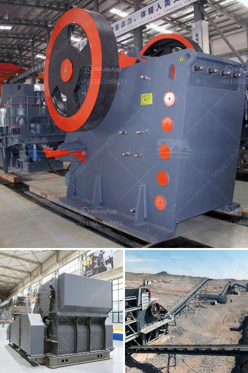

<h3>تستخدم لمطحنة رايموند</h3>
تستخدم مطحنة رايموند على نطاق واسع في العديد من الصناعات المختلفة حول العالم. يتم استخدام هذا الجهاز في الغالب لطحن المواد الخام إلى جسيمات صغيرة جداً، وتحويلها إلى مساحيق ناعمة تستخدم في الإنتاج الصناعي.

تصميم مطحنة رايموند الفريد يسمح بطحن المواد الصلبة بكفاءة عالية. تتكون المطحنة من ثلاثة أسطوانات كبيرة تدور بسرعة عالية. يتم إدخال المواد الخام عبر فتحة غطاء الطحن وتندفع من خلال الأنابيب إلى الأسطوانات.

عندما تدخل المواد المستخدمة في عملية الطحن، يتم سحقها وطحنها بواسطة كرات الطحن الموجودة داخل المطحنة. تعتمد كرات الطحن على قوة الاحتكاك والضغط لتفتت المواد الخام إلى جسيمات أصغر. ينتج عن هذه العملية مسحوق ناعم يمكن استخدامه في عمليات الإنتاج المختلفة.

تستخدم مطحنة رايموند في الصناعات مثل صناعة الإسمنت والمعادن والكيماويات ومواد البناء والزجاج والسيراميك والطلاء. يمكن استخدامها لطحن العديد من المواد الخام، بما في ذلك الحجارة الجيرية والدولوميت والفلسبار والباريت والموليبدينوم وغيرها من المعادن.

تتميز مطحنة رايموند بالعديد من الفوائد، بما في ذلك كفاءة عالية في الطحن، وسهولة الصيانة، وسرعة التشغيل. بالإضافة إلى ذلك، فإنها توفر دقة في الطحن وتحكمًا دقيقًا في حجم الجسيمات المطحونة.

باستخدام مطحنة رايموند، يمكن للشركات تقليل تكاليف الإنتاج وزيادة كفاءة العمليات. كما يتيح لهم الوصول إلى منتجات ذات جودة عالية وتحقيق توازن بيئي عن طريق الحد من تكوين الغبار وتلوث الهواء.

باختصار، فإن مطحنة رايموند هي أداة حيوية في الصناعات المختلفة حول العالم. يمكن استخدامها لطحن المواد الخام وتحويلها إلى مساحيق ناعمة، مما يزيد من كفاءة العمليات ويقلل من تكاليف الإنتاج. تعتبر مطحنة رايموند حلاً فعالًا وموثوقًا للشركات التي تسعى لتحقيق أقصى استفادة من المواد الخام وتحقيق جودة عالية في منتجاتها.
<h3>Contact us</h3><ul><li><strong>Whatsapp:&nbsp;<a href="https://wa.me/8613661969651">+8613661969651</a></strong></li><li><a href="https://swt.shibang-china.com/?git&amp;zhl&amp;تستخدم لمطحنة رايموند"><strong>Online Service(chat now)</strong></a></li></ul><h3>Related</h3><ul><li><a href='وحدة طحن الصين.md'>وحدة طحن الصين</a></li><li><a href='أسعار مطحنة الطوابع في الصين.md'>أسعار مطحنة الطوابع في الصين</a></li><li><a href='كم عدد شركات تصنيع كسارات الفك في الهند.md'>كم عدد شركات تصنيع كسارات الفك في الهند</a></li><li><a href='كيفية صنع آلة كسارة خام الحديد.md'>كيفية صنع آلة كسارة خام الحديد</a></li><li><a href='حساب سعة كسارة الأسطوانة.md'>حساب سعة كسارة الأسطوانة</a></li></ul>