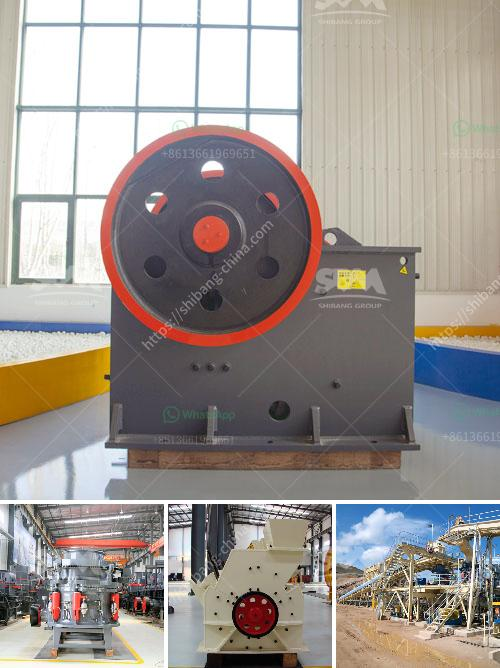

<h3>تسعير حزام الناقل في ماليزيا</h3>
تُعد ماليزيا واحدة من الدول النامية الناجحة في جنوب شرق آسيا، حيث تعتبر من بين الوجهات الرئيسية للشركات الصناعية في المنطقة. يلعب حزام النقل دورًا حيويًا في تلبية احتياجات الصناعة في ماليزيا، حيث يُستخدم لنقل المواد والسلع بين المناطق والمصانع المختلفة.

تعتبر متطلبات تسعير حزام النقل في ماليزيا معقدة وتتأثر بعوامل عدة، مثل المواد المستخدمة في صناعة الحزام وصعوبة استخراجها وتوافرها في السوق، وكذلك تكلفة المعدات والتكنولوجيا المستخدمة في تصنيع الحزام.

بشكل عام، يمكن القول أن أسعار حزام النقل في ماليزيا تتراوح بين 200 إلى 400 رنجت ماليزي. ومع ذلك، ينبغي أن نلاحظ أن هذه الأسعار تتغير باستمرار وفقًا للعوامل المحلية والعالمية.

يعتبر الطلب على حزام النقل في ماليزيا أحد العوامل الرئيسية التي تؤثر على تسعيره. فعلى سبيل المثال، إذا كان هناك طلب كبير على حزام معين وتفوق العرض المتاح، فمن المرجح أن ترتفع الأسعار. وعلى العكس من ذلك، إذا كانت هناك توترات في الطلب، فمن الممكن أن تنخفض الأسعار.

كما أن تكنولوجيا تصنيع الحزام ومعداته تؤثر أيضًا على تكلفته. قد يكون تصنيع أنواع محددة من الحزام أكثر تعقيدًا وتكلفة بسبب التقنيات المطلوبة لإنتاجها.

بعض العوامل الأخرى التي تؤثر على تسعير حزام النقل في ماليزيا تشمل تكاليف النقل والتوزيع وتكاليف المواد الخام ومخاطر السوق. كل هذه العوامل يجب أن تؤخذ في الاعتبار عند تحديد سعر حزام النقل في السوق.

سواء كنت تعمل في مجال الصناعة أو كان لديك اهتمام في شراء حزام النقل، فإن فهم عوامل التسعير هو أمر ضروري. يجب أن تأخذ في الاعتبار جودة الحزام والخدمة المقدمة من الشركات المصنعة قبل اتخاذ قرار شراءه.

في النهاية، يعد حزام النقل من العناصر الرئيسية في صناعة الشحن والنقل. ولذلك، فإن تسعير حزام النقل في ماليزيا يعتبر أمرًا حساسًا ويتأثر بعوامل عدة. يجب دراسة هذه العوامل بعناية قبل اتخاذ قرار شراء حزام النقل، سواء كنت شركة تصنيع أو مستهلك عادي.
<h3>Contact us</h3><ul><li><strong>Whatsapp:&nbsp;<a href="https://wa.me/8613661969651">+8613661969651</a></strong></li><li><a href="https://swt.shibang-china.com/?git&amp;zhl&amp;تسعير حزام الناقل في ماليزيا"><strong>Online Service(chat now)</strong></a></li></ul><h3>Related</h3><ul><li><a href='مصانع غسيل الفحم المستخدمة للبيع في الهند.md'>مصانع غسيل الفحم المستخدمة للبيع في الهند</a></li><li><a href='شركات تصنيع مصانع المحاجر في المملكة المتحدة.md'>شركات تصنيع مصانع المحاجر في المملكة المتحدة</a></li><li><a href='مصنع إعادة تدوير الخرسانة للبيع.md'>مصنع إعادة تدوير الخرسانة للبيع</a></li><li><a href='شركات المحاجر في بوكواس وأماسامان.md'>شركات المحاجر في بوكواس وأماسامان</a></li><li><a href='مشروع حجر الزلط في إثيوبيا.md'>مشروع حجر الزلط في إثيوبيا</a></li></ul>