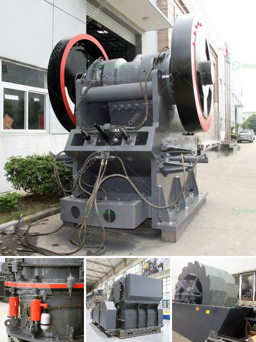

<h3>تصميم آلة تكسير الحجر</h3>
تعتبر آلة تكسير الحجر من الآلات الحديثة التي تستخدم في صناعة البناء والتعدين لتحطيم الحجارة الكبيرة إلى قطع أصغر يمكن استخدامها في عمليات البناء المختلفة. يتطلب تصميم هذه الآلة مجموعة من الأسس التقنية والميكانيكية للحفاظ على قوة وكفاءة العملية.

أولاً وقبل كل شيء، يجب أن يتم تصميم آلة تكسير الحجر بناءًا على المتطلبات الفنية والعملية للعمل الذي ستستخدم فيه. يجب أن تكون جهازًا قويًا ومتينًا قادرًا على تحمل الاستخدام المستمر والضغوط المرتفعة. يتطلب ذلك استخدام مواد قوية مثل الحديد المصبوب عالي الجودة والفولاذ المقاوم للصدأ في تشكيل الهيكل الرئيسي للآلة.

بالإضافة إلى ذلك، يجب أن تتميز آلة تكسير الحجر بماكينة تشغيلية سهلة الاستخدام والصيانة. يجب أن تشمل على واجهة مستخدم بسيطة وواضحة تسمح للعاملين بالتحكم في العملية بسهولة ودقة. يجب أن يكون للآلة أيضًا أجزاء تحتاج إلى صيانة منتظمة وغيارات بسيطة لتجنب التوقفات غير المبررة في الإنتاج.

عند التصميم، يجب أخذ في الاعتبار أيضًا عوامل السلامة. يجب تصميم آلة تكسير الحجر بحيث تتوافق مع معايير السلامة المهنية والتشريعات المحلية والدولية. يجب أن تكون الآلة مجهزة بأنظمة حماية مثل أقفال السلامة وحواجز الحماية لتقليل خطر الإصابات أثناء عملية التشغيل.

علاوة على ذلك، يجب أن تكون آلة تكسير الحجر قادرة على تحقيق أعلى كفاءة في الأداء. يجب تصميم الآلة بحيث تحقق اهتزازًا أقل وضجيجًا أقل لتقليل المتاعب وضغط الضوضاء على العمال والبيئة. يجب أيضاً أن تكون الآلة قابلة للتحكم في السرعة والقوة لتتناسب مع الحجر المراد تكسيره والعملية المراد تنفيذها.

في النهاية، تتطلب تصميم آلة تكسير الحجر اهتمامًا بجميع التفاصيل الفنية والميكانيكية لضمان أفضل أداء ومرونة في الاستخدام. يجب أن يتم تحقيق التوازن المثالي بين الأداء والكفاءة والسلامة وسهولة الاستخدام في هذه الآلة، وذلك من خلال استخدام تقنيات التصميم والهندسة الحديثة والابتكارات في هذا المجال.
<h3>Contact us</h3><ul><li><strong>Whatsapp:&nbsp;<a href="https://wa.me/8613661969651">+8613661969651</a></strong></li><li><a href="https://swt.shibang-china.com/?git&amp;zhl&amp;تصميم آلة تكسير الحجر"><strong>Online Service(chat now)</strong></a></li></ul><h3>Related</h3><ul><li><a href='مصنع الأسمنت من الصهر 100 طن.md'>مصنع الأسمنت من الصهر 100 طن</a></li><li><a href='شركات تصنيع مصانع المحاجر في المملكة المتحدة.md'>شركات تصنيع مصانع المحاجر في المملكة المتحدة</a></li><li><a href='تصنيع آلات السحق في بوليفيا.md'>تصنيع آلات السحق في بوليفيا</a></li><li><a href='مصنع خام الكروم الكامل.md'>مصنع خام الكروم الكامل</a></li><li><a href='مصنع تكسير الحجر الجيري في الهند.md'>مصنع تكسير الحجر الجيري في الهند</a></li></ul>