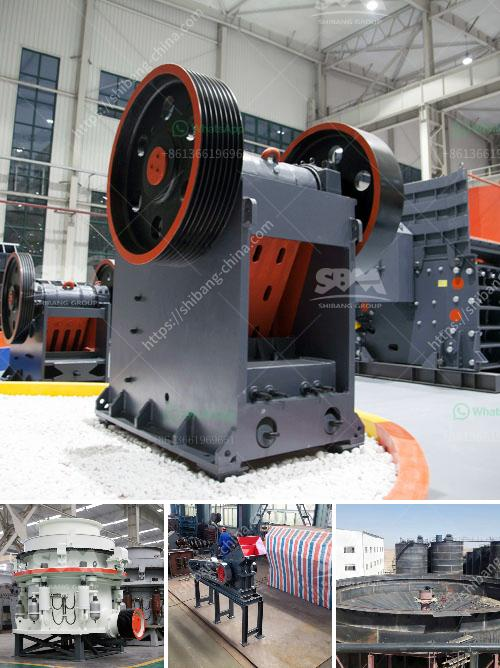

<h3>تصميم آلة سحق الجبس بتنسيق PDF</h3>
تعتبر آلة سحق الجبس أداة مهمة في عملية تحويل الجبس الخام إلى منتج نهائي قابل للاستخدام في العديد من التطبيقات المختلفة. تصميم هذه الآلة يعتمد على عدة عوامل مهمة لضمان أداءها الفعال وفقًا لاحتياجات الصناعة ومتطلبات إنتاجية عالية.

أولاً وقبل كل شيء، يجب أن يتم تحديد سعة الإنتاج المطلوبة للمصنع. ذلك يشمل تحديد الكمية المطلوبة من الجبس المحول والحجم النهائي للمنتج المطلوب. يتطلب تحقيق سعة إنتاج عالية آلة قوية ومتينة قادرة على تحمل الإجهاد الكبير وتعامل مع مختلف أنواع الجبس.

بعد تحديد سعة الإنتاج، يجب التحقق من تصميم سلامة الآلة. يجب أن تتوفر الآلة على جميع الإجراءات الأمنية اللازمة لحماية المشغلين من الحوادث المحتملة أثناء التشغيل. هذا يشمل وجود أبواب طوارئ، وتحكم أوتوماتيكي في الإيقاف، وشاشات حماية للمشغلين، والعديد من الإجراءات الأخرى التي تعتمد على طبيعة الآلة ونوعية الجبس المعالج.

كما يجب أن يتم اختيار نوعية المواد المستخدمة في تصنيع الآلة بعناية. يجب أن تكون جميع المكونات قوية ومستدامة لضمان أداء فعال وتجنب التلف المستقبلي للآلة. تتوفر العديد من أنواع الآلات المصممة خصيصًا لسحق الجبس، بما في ذلك آلات الفك، وآلات الصدم، وآلات الأسطوانة. يجب اختيار النوع الأنسب بناءً على الاحتياجات والمتطلبات المحددة لعملية التحول.

عند تصميم آلة سحق الجبس، يجب أيضًا الانتباه إلى الصيانة والتنظيف. يجب أن تكون الآلة سهلة التشغيل وخالية من المشاكل الفنية التي يمكن أن تعيق سير عملية الإنتاج. يجب أن يتم توفير مساحة كافية للوصول إلى جميع أجزاء الآلة وتسهيل عملية التنظيف والصيانة الدورية.

باختصار، تصميم آلة سحق الجبس يعتمد على سعة الإنتاج المطلوبة، والسلامة، ونوعية المواد المستخدمة، والصيانة والتنظيف. يجب أن تتوفر جميع هذه العوامل لتحقيق أفضل أداء للآلة وضمان الفعالية والكفاءة في عملية تحويل الجبس.
<h3>Contact us</h3><ul><li><strong>Whatsapp:&nbsp;<a href="https://wa.me/8613661969651">+8613661969651</a></strong></li><li><a href="https://swt.shibang-china.com/?git&amp;zhl&amp;تصميم آلة سحق الجبس بتنسيق PDF"><strong>Online Service(chat now)</strong></a></li></ul><h3>Related</h3><ul><li><a href='مطحنة الكرة مطرقة مطحنة مطحنة أسطوانية آلة.md'>مطحنة الكرة مطرقة مطحنة مطحنة أسطوانية آلة</a></li><li><a href='مطحنة كرة مطحنة مطرقة.md'>مطحنة كرة مطحنة مطرقة</a></li><li><a href='مطحنة الكرة مواد الاسمنت والطاقة.md'>مطحنة الكرة مواد الاسمنت والطاقة</a></li><li><a href='إجمالي الطاقة لكسارة الفك 500 طن في الساعة.md'>إجمالي الطاقة لكسارة الفك 500 طن في الساعة</a></li><li><a href='معدات تعدين مستخدمة.md'>معدات تعدين مستخدمة</a></li></ul>