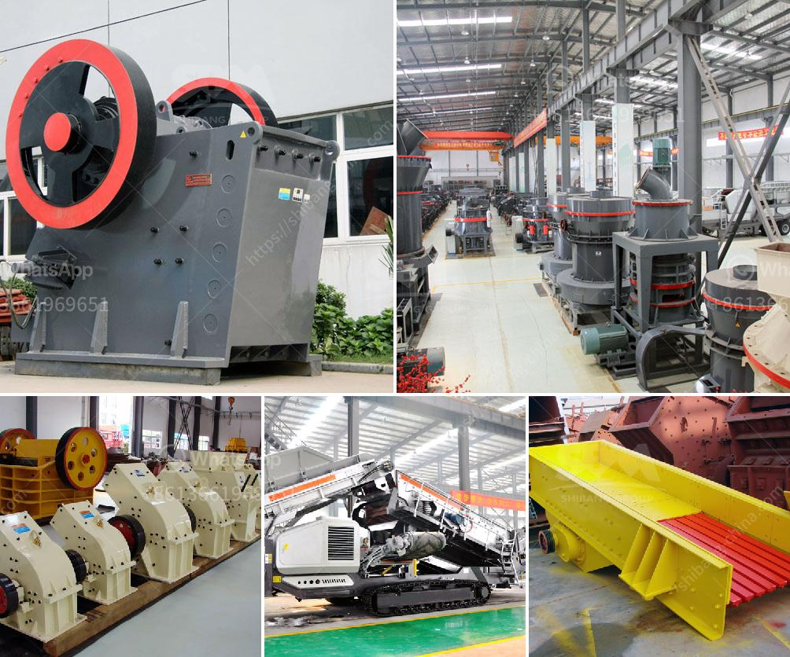

<h3>تصميم آلة كسارة الحجر مخطط تدفق التجميع</h3>
تعتبر آلة كسارة الحجر أحد الآليات الرئيسية في صناعة التعدين والبناء، حيث تستخدم لسحق الحجارة وتحويلها إلى قطع صغيرة تستخدم في عمليات البناء والتشييد. تهدف آلة كسارة الحجر إلى تحويل الحجر الكبير إلى قطع صغيرة من أجل تسهيل عملية التخزين والتعامل معها.

يتكون تصميم آلة كسارة الحجر من عدة أجزاء رئيسية، بدءًا من المغذي الاهتزازي الذي يقوم بتغذية الحجارة إلى الكسارة، ثم المحرك الذي يقوم بتشغيل الكسارة لسحق الحجارة، وحزام النقل الذي ينقل الحجارة الصغيرة من الكسارة إلى الحاوية. يتم تحكم هذه العملية بواسطة وحدة التحكم الرئيسية.

بشكل عام، يتم تصميم مخطط تدفق التجميع لآلة كسارة الحجر بطريقة مدروسة لضمان سهولة الاستخدام وتوفير الوقت والجهد. يجب أن يتم وضع خطة جيدة لمسار الحجارة من المغذي إلى الكسارة ومن ثم إلى الحاوية، بحيث يمكن أن تتحرك الحجارة بسلاسة وبدون أي عوائق.

يجب أيضًا أن يتم توفير المزيد من الآليات والأجهزة المساعدة لضمان عملية التجميع السلسة والفعالة. على سبيل المثال، يمكن استخدام الشاشات الاهتزازية لفصل الحجارة من تربة أو أتربة أخرى قد تكون غير مرغوب فيها، بالإضافة إلى الكسارة الثانوية لسحق الحجارة إلى أحجام أصغر قبل نقلها إلى الحاوية.

تحظى آلة كسارة الحجر بشعبية كبيرة في قطاعات البناء والتعدين بسبب فعاليتها وقدرتها على تحويل الحجارة الكبيرة إلى قطع صغيرة، مما يزيد من كفاءة العمل ويقلل من الوقت والمجهود المطلوب في عملية التعامل مع الحجارة.

باستخدام تصميم مخطط تدفق التجميع الصحيح، يمكن للآلة كسارة الحجر أن تكون أداة قوية وفعالة في عمليات البناء والتعدين. بالتأكيد، يجب أخذ العديد من العوامل في الاعتبار عند اختيار وتصميم آلة كسارة الحجر لضمان الحصول على أفضل أداء ونتائج ممكنة في العمل.

في الختام، يمكن القول إن تصميم آلة كسارة الحجر مع مخطط تدفق التجميع الصحيح يمكن أن يلعب دورًا حاسمًا في صناعة التعدين والبناء بسبب فعاليتها وكفاءتها. يُنصح بالتعاون مع خبراء تصميم آلات الكسارة المختصين للحصول على أفضل نتائج في الأداء والاستخدام.
<h3>Contact us</h3><ul><li><strong>Whatsapp:&nbsp;<a href="https://wa.me/8613661969651">+8613661969651</a></strong></li><li><a href="https://swt.shibang-china.com/?git&amp;zhl&amp;تصميم آلة كسارة الحجر مخطط تدفق التجميع"><strong>Online Service(chat now)</strong></a></li></ul><h3>Related</h3><ul><li><a href='آلات كسارة المحجر في إيطاليا.md'>آلات كسارة المحجر في إيطاليا</a></li><li><a href='مطحنة هامر للحجر الجيري في جنوب أفريقيا.md'>مطحنة هامر للحجر الجيري في جنوب أفريقيا</a></li><li><a href='أنواع كسارة الحصى.md'>أنواع كسارة الحصى</a></li><li><a href='مطحنة استرداد الذهب المحمولة للبيع.md'>مطحنة استرداد الذهب المحمولة للبيع</a></li><li><a href='خط إنتاج الجرانيت.md'>خط إنتاج الجرانيت</a></li></ul>