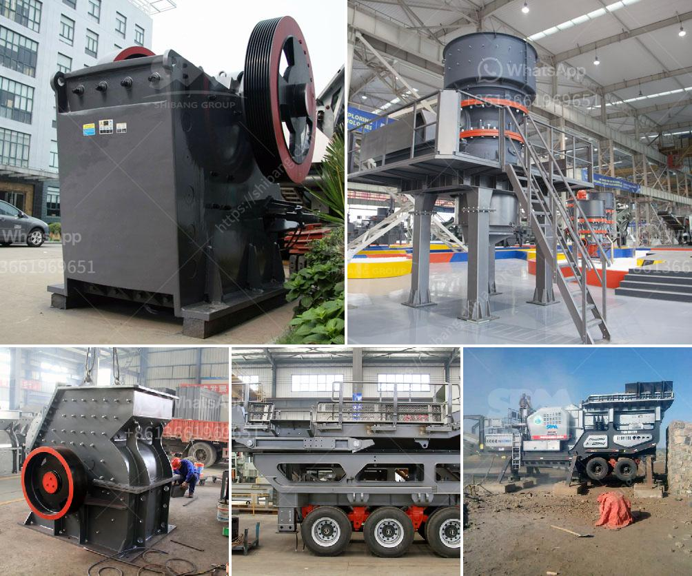

<h3>تصميم أحزمة الناقلين</h3>
تعتبر أحزمة الناقلين أحد العناصر الأساسية في التصنيع وصناعة الغذاء والتعدين والتعبئة والتغليف والنقل والعديد من الصناعات الأخرى. فهي تستخدم لنقل المواد من موقع إلى آخر بكفاءة وسهولة. ولتصميم أحزمة الناقلين، يتم اعتماد عدة عوامل تؤثر في أدائها وفعاليتها.

أولاً، يجب أن يتم تصميم الحزام بمواد متينة تتحمل الضغط والقوة التي تتعرض لها أثناء نقل المواد الثقيلة. فعادةً ما يتم استخدام مواد مثل المطاط أو الجلود المتينة المغلفة بالقماش القوي لتصنيع الأحزمة.

ثانيًا، يجب أن يتم تصميم الأحزمة بعرض وطول مناسب لنقل المواد المختلفة. فعرض الحزام يحدد كمية المواد التي يمكن نقلها في وقت واحد، والطول يحدد المسافة التي يمكن نقل المواد عبرها. ولذلك، يجب أن يتم اختيار الحجم المطلوب لتلبية احتياجات الصناعة المحددة.

ثالثًا، يجب النظر في تصميم أحزمة الناقلين من حيث العناية والصيانة. يجب أن تكون الأحزمة سهلة التنظيف والتشحيم والفحص الدوري للتأكد من حالتها وسلامتها. يمكن استخدام مواد مرنة ومانعة للتأكسد في تصنيع الأحزمة لضمان تحملها لفترة طويلة من الزمن دون تلف.

رابعاً، يجب النظر في سرعة وقوة تشغيل الأحزمة. يجب أن تكون الأحزمة قادرة على العمل بكفاءة في ظل ظروف العمل المختلفة مثل درجة الحرارة العالية أو الرطوبة العالية. يجب اختبار الأحزمة قبل استخدامها للتأكد من أنها تستجيب بشكل جيد لمتطلبات عمل الصناعة.

في الختام، تصميم أحزمة الناقلين له أهمية كبيرة في صناعات مختلفة. يجب أن تتم مراعاة المواد المستخدمة والأبعاد وعملية العناية والصيانة وظروف العمل المختلفة. من خلال تصميم جيد، يمكن لأحزمة الناقلين أن تلعب دورًا هامًا في تسهيل عمليات النقل وتحسين الإنتاجية والكفاءة في الصناعة.
<h3>Contact us</h3><ul><li><strong>Whatsapp:&nbsp;<a href="https://wa.me/8613661969651">+8613661969651</a></strong></li><li><a href="https://swt.shibang-china.com/?git&amp;zhl&amp;تصميم أحزمة الناقلين"><strong>Online Service(chat now)</strong></a></li></ul><h3>Related</h3><ul><li><a href='مطحنة الكرة في التعدين.md'>مطحنة الكرة في التعدين</a></li><li><a href='كسارات الحجر في فرنسا.md'>كسارات الحجر في فرنسا</a></li><li><a href='مصنع سحق الحجر في ألمانيا.md'>مصنع سحق الحجر في ألمانيا</a></li><li><a href='الشركة المصنعة لشاشات الاهتزاز.md'>الشركة المصنعة لشاشات الاهتزاز</a></li><li><a href='كسارة الحصى، سعر كسارة الحصى.md'>كسارة الحصى، سعر كسارة الحصى</a></li></ul>