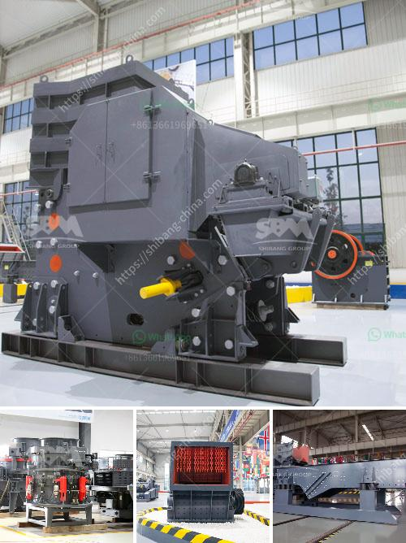

<h3>تصميم كسارة الحجر في الفلبين</h3>
تعتبر صناعة الحجر من أهم الصناعات في الفلبين، حيث يتم استخدام الحجر في العديد من المشاريع الإنشائية والتشييدية وكذلك في صناعة الرخام والجرانيت. ولتلبية الطلب المتزايد على الحجر، يتعين تصميم وتشغيل كسارات الحجر عالية الكفاءة في الفلبين.

تصميم كسارة الحجر هو عملية معقدة تتطلب دراسة دقيقة للظروف المحيطة ومتطلبات المواد الخام المحلية. يجب أيضًا اتخاذ العديد من العوامل الأخرى في الاعتبار مثل قوة الماكينات والاحتياجات التقنية والتكاليف المتوقعة.

أحد العوامل المهمة في تصميم كسارة الحجر هو الحجم المرغوب فيه للمنتج النهائي. قد يواجه المصمم تحديًا في اختيار الحجم الأمثل الذي يلبي احتياجات السوق المحلية والدولية. يجب أيضًا النظر في تكاليف التصنيع والنقل والتخزين للمنتج النهائي.

بعد تحديد الحجم النهائي للمنتج المطلوب، يتعين اختيار الماكينات المناسبة لكسر الحجر إلى حجم المطلوب. يتوفر العديد من أنواع المكابس والكسارات التي يمكن استخدامها لهذا الغرض، منها الكسارات الفكية والكسارات التصادمية ومطاحن الأسطوانات. يتعين اختيار الماكينات التي توفر الكفاءة العالية والأداء الموثوق به والصيانة المنخفضة.

بعد اختيار المكابس المناسبة، يجب تصميم نظام نقل لنقل الحجر من المكابس إلى غرفة الطحن. يتعين أيضًا اختيار ناقلات الحجر المناسبة التي يمكن أن تعمل بكفاءة وتكفي لنقل الحجر بسرعة. يتعين أيضًا حساب الطول المطلوب للناقلة واختيار الأجزاء المناسبة لتلبية متطلبات التشغيل.

تعتبر مسألة السلامة أيضًا عاملًا مهمًا في تصميم كسارة الحجر. يجب توفير تحميع ملائم للموظفين وأنظمة سلامة للحد من وقوع الحوادث. يجب أيضًا اتباع المعايير الصحية والبيئية أثناء تصميم وتشغيل الكسارة.

بالاستفادة من تجارب المصانع الحجرية السابقة والتعاون مع شركات متخصصة في تصميم الكسارات، يمكن تحسين عملية تصميم كسارة الحجر في الفلبين. من خلال اتخاذ العوامل اللازمة في الاعتبار واستخدام تكنولوجيا متطورة، يمكن تحقيق أقصى استفادة من الموارد المحلية وتلبية متطلبات السوق المتغيرة.
<h3>Contact us</h3><ul><li><strong>Whatsapp:&nbsp;<a href="https://wa.me/8613661969651">+8613661969651</a></strong></li><li><a href="https://swt.shibang-china.com/?git&amp;zhl&amp;تصميم كسارة الحجر في الفلبين"><strong>Online Service(chat now)</strong></a></li></ul><h3>Related</h3><ul><li><a href='آلة طحن السليكات في الهند.md'>آلة طحن السليكات في الهند</a></li><li><a href='قائمة الآليات لمصانع تجهيز الرخام.md'>قائمة الآليات لمصانع تجهيز الرخام</a></li><li><a href='آلة فاصلة للرمل والحصى للبيع في الفلبين.md'>آلة فاصلة للرمل والحصى للبيع في الفلبين</a></li><li><a href='جول محطم الحجر.md'>جول محطم الحجر</a></li><li><a href='كسارة الجبس الحجر الجيري.md'>كسارة الجبس الحجر الجيري</a></li></ul>