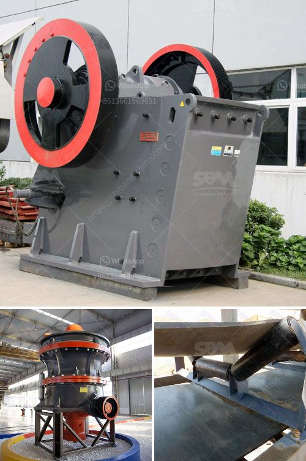

<h3>تصميم كسارة الحجر</h3>
تعد كسارة الحجر آلة هامة في صناعة التعدين والبناء، حيث تستخدم لتكسير الحجارة الكبيرة إلى حجم صغير يمكن استخدامه في الأعمال الإنشائية. وتتوفر كسارات الحجر بمختلف الأحجام والأنواع وفقًا لمتطلبات المشروع المحدد.

يتم تصميم كسارة الحجر بطريقة تهدف إلى زيادة كفاءتها وجعل عملية التكسير أكثر فعالية. واحدة من العوامل الأساسية في تصميمها هي قدرتها على التعامل مع مجموعة متنوعة من المواد الصلبة مثل الحجارة والصخور والخرسانة المهشمة. يتم تحقيق ذلك من خلال استخدام وحدات تكسير معدنية قوية ومتينة تستطيع مقاومة ضغوط التكسير.

بالإضافة إلى ذلك، توفر الكسارة مدخلات كافية للمواد الخام ومجرى مخرج فعال للمنتجات المكسرة. بالإضافة إلى ذلك، تصمم بحيث يمكن تعديل حجم المخرج لتناسب المشروع المحدد، وذلك عن طريق ضبط فتحة الفك أو التأثير.

لا يتم تصميم كسارة الحجر فقط لتنفيذ الوظيفة الأساسية للتكسير، بل أيضًا لتعزيز السلامة والصيانة السهلة. فمثلا، تتوفر بعض الكسارات بجميع المرافق والتجهيزات اللازمة لضمان استخدامها بأمان، مثل أحزمة الأمان وأجهزة الحماية من الحرارة والسقوط وغيرها. وتحتوي بعضها على أنظمة تشحيم تلقائية لتجنب الاحتكاك غير المرغوب.

علاوة على ذلك، يتم تصميم الكسارة بقواعد خرسانية أو إطارات معدنية تساعد في تثبيتها بشكل آمن وثابت. وتتوفر بعضها بعجلات متحركة لسهولة النقل والتركيب في الموقع المحدد.

باختصار، تصميم كسارة الحجر يشمل تجهيزات وميزات تعمل معاً لتحقيق عملية تكسير فعالة وسلسة. وعلى الرغم من تنوع الأحجام والأنواع المتاحة، ينبغي اختيار الكسارة المثلى حسب المشروع المحدد لضمان التشغيل السلس وأقصى استفادة من الجهاز.
<h3>Contact us</h3><ul><li><strong>Whatsapp:&nbsp;<a href="https://wa.me/8613661969651">+8613661969651</a></strong></li><li><a href="https://swt.shibang-china.com/?git&amp;zhl&amp;تصميم كسارة الحجر"><strong>Online Service(chat now)</strong></a></li></ul><h3>Related</h3><ul><li><a href='مستعملة vsi كسارة للبيع في الهند.md'>مستعملة vsi كسارة للبيع في الهند</a></li><li><a href='مصنع تكسير المعادن.md'>مصنع تكسير المعادن</a></li><li><a href='معدات طحن فائقة الدقة.md'>معدات طحن فائقة الدقة</a></li><li><a href='مصنع غسل الذهب msi المستخدم.md'>مصنع غسل الذهب msi المستخدم</a></li><li><a href='مصنع كسارة الصخور بسعة 150 طن.md'>مصنع كسارة الصخور بسعة 150 طن</a></li></ul>