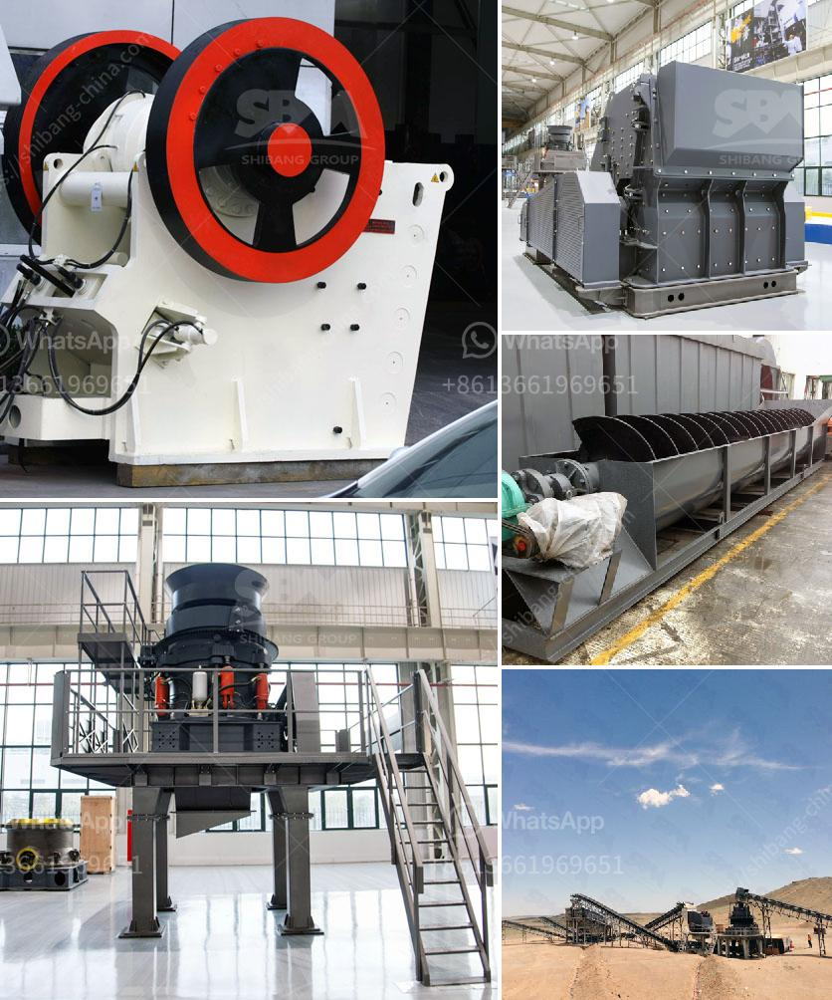

<h3>تصميم مصانع التكسير الصناعية</h3>
يعتبر تصميم مصانع التكسير الصناعية أمرًا حاسمًا في عملية تحويل المواد الخام إلى منتجات نهائية قابلة للاستخدام. يعد التكسير هو العملية التي يتم فيها تحطيم المواد الخام بأحجام كبيرة إلى قطع صغيرة قابلة للاستخدام في عمليات الإنتاج المختلفة. وتتفاوت أنواع المصانع التكسير وفقًا لنوع المواد الخام المعالجة والصناعة التي تخضع لها.

في عملية تصميم مصانع التكسير الصناعية، يتم النظر في العوامل العديدة التي تؤثر في تحقيق الكفاءة والإنتاجية العالية. بدايةً، يجب مراعاة نوع المواد الخام المعالجة، سواء كانت معادن، صخور أو مواد عضوية. يجب أن يتم تحديد أفضل طريقة لتكسير المواد الخام بناءً على خصائصها الفيزيائية والكيميائية.

تتضمن مصانع التكسير الصناعية عادة معدات تكسير رئيسية مثل الكسارات الفكية والكسارات المخروطية وكسارات الصدم والكسارات الأسطوانية. يجب أن يتم اختيار المعدات بعناية لتلبية متطلبات عملية التكسير وتفاصيل المواد الخام المعالجة.

بالإضافة إلى ذلك، يجب النظر في عمليات ما بعد التكسير، مثل عمليات الفرز والتصنيف والغربلة. يتم استخدام هذه العمليات لفصل المواد الصغيرة عن المواد الكبيرة التي لم يتم تكسيرها بشكل صحيح. وتساعد هذه العمليات في تحقيق المواصفات المطلوبة للمنتج النهائي قبل أن يتم توجيهه إلى مراحل التصنيع اللاحقة.

علاوة على ذلك، يجب مراعاة العوامل البيئية والأمنية عند تصميم مصانع التكسير الصناعية. يجب تطبيق التدابير اللازمة للتحكم في انبعاثات الغبار والضوضاء التي ينتجها عملية التكسير. كما يجب توفير إجراءات السلامة الملائمة لحماية عمال المصنع من المخاطر المحتملة أثناء عمليات التشغيل والصيانة.

باختصار، يحتاج تصميم مصانع التكسير الصناعية إلى تفاهم عميق لمتطلبات المواد الخام وعمليات التكسير والمواصفات المطلوبة للمنتج النهائي. يجب مراعاة العوامل البيئية والأمنية في العملية وضمان استخدام المعدات المناسبة وتوفير التدابير المناسبة لتحقيق الإنتاج السلس والفعال.
<h3>Contact us</h3><ul><li><strong>Whatsapp:&nbsp;<a href="https://wa.me/8613661969651">+8613661969651</a></strong></li><li><a href="https://swt.shibang-china.com/?git&amp;zhl&amp;تصميم مصانع التكسير الصناعية"><strong>Online Service(chat now)</strong></a></li></ul><h3>Related</h3><ul><li><a href='تكلفة طاحونة الكوارتز.md'>تكلفة طاحونة الكوارتز</a></li><li><a href='أحزمة ناقلة الشيفرون في الفلبين.md'>أحزمة ناقلة الشيفرون في الفلبين</a></li><li><a href='كسارة الحجر للبيع في بيرو.md'>كسارة الحجر للبيع في بيرو</a></li><li><a href='مورد معدات فصل الوسط الكثيف.md'>مورد معدات فصل الوسط الكثيف</a></li><li><a href='بناء مطحنة الكرة.md'>بناء مطحنة الكرة</a></li></ul>