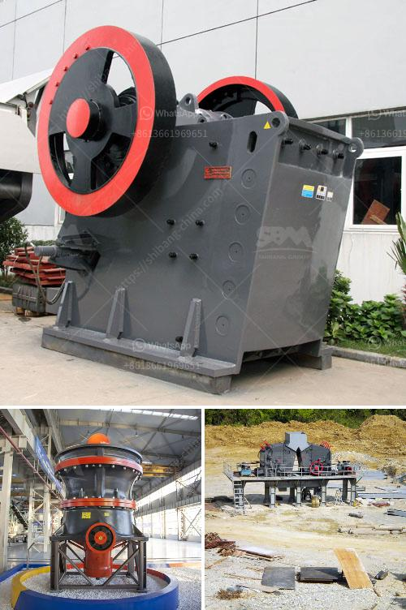

<h3>تصميم مصنع الإسمنت بتنسيق PDF</h3>
يُعد تصميم مصنع الإسمنت أمرًا حاسمًا في عملية إنتاج الإسمنت ذو الجودة العالية. يهدف تصميم المصنع إلى تحقيق أقصى استفادة من الموارد المتاحة وتحقيق أعلى مستويات الإنتاجية بأقل تكلفة ممكنة، بالإضافة إلى حماية البيئة والعاملين والضمانات الصحية والسلامة في مكان العمل.

عند تصميم مصنع الإسمنت، يجب مراعاة عدة عوامل رئيسية. لابد من تحديد الموقع المثالي للمصنع بناءً على عدة عوامل مثل موقع المصنع بالنسبة لمصادر المواد الخام والسوق المحلية والوصول إلى الموارد الحيوية مثل الماء والكهرباء والغاز.

يجب أيضًا أن يتم تصميم المصنع بطريقة تسهم في تقليل تأثيره البيئي على المحيط. يجب أن تتطابق عمليات الإنتاج مع معايير السلامة والصحة المهنية، ويجب توفير أنظمة مراقبة صارمة لضمان جودة الإنتاج والامتثال للمعايير الصناعية.

تشمل التجهيزات والمعدات التي يجب أن توجد في مصنع الإسمنت محفظات صومعة لتخزين المواد الخام ومن ثم إمداد خليط الغاز الحراري أو الوقود الأحفوري للفرن. يجب أن تتميز أفران الإسمنت بمرونة عالية للتعامل مع مختلف الأنواع وتركيبات المواد الخام. بالإضافة إلى ذلك، يجب أن تحتوي المصانع على معامل لطحن الأسمنت للحصول على مسحوق الأسمنت النهائي.

يعتبر تصميم المصنع عملية معقدة تعتمد على تقنيات حديثة واستخدام الحواسيب لتحديد أفضل الحلول التي تحقق الكفاءة والأداء المطلوب. يجب أن يعمل فريق التصميم على تنفيذ مسح مفصل للموقع المقترح للمصنع وتوصيلات النقل المرتبطة، بالإضافة إلى الاهتمام بتنظيم الشبكة الكهربائية وتخطيط الأنظمة الميكانيكية.

في الختام، يُعد تصميم مصنع الإسمنت خطوة أساسية لضمان الإنتاج الفعال والمستدام للإسمنت. يجب أن يتوافق التصميم مع المعايير الصناعية والبيئية والصحية والسلامة. كما تلعب التقنيات الحديثة واستخدام الحواسيب دورًا حاسمًا في تحسين عمليات التصميم والإنتاج في المصانع الحديثة للإسمنت.
<h3>Contact us</h3><ul><li><strong>Whatsapp:&nbsp;<a href="https://wa.me/8613661969651">+8613661969651</a></strong></li><li><a href="https://swt.shibang-china.com/?git&amp;zhl&amp;تصميم مصنع الإسمنت بتنسيق PDF"><strong>Online Service(chat now)</strong></a></li></ul><h3>Related</h3><ul><li><a href='قائمة المعدات التي تستخدم في مناجم الجرانيت.md'>قائمة المعدات التي تستخدم في مناجم الجرانيت</a></li><li><a href='مصنعي كسارات الصدم في ألمانيا.md'>مصنعي كسارات الصدم في ألمانيا</a></li><li><a href='أهداف مطحنة الكرة.md'>أهداف مطحنة الكرة</a></li><li><a href='مصنع معالجة ملح الصخور.md'>مصنع معالجة ملح الصخور</a></li><li><a href='مصنع كسارة للفحم.md'>مصنع كسارة للفحم</a></li></ul>