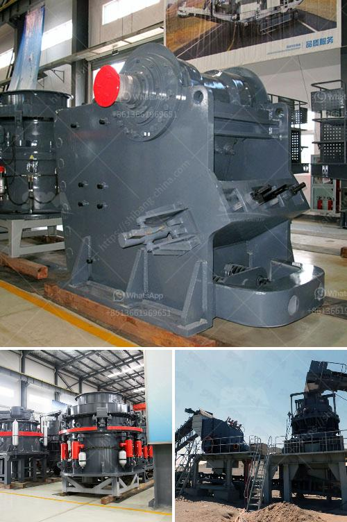

<h3>تصميم مصنع تكسير وتخطيطه</h3>
تصميم وتخطيط مصنع لتكسير، يُعد أحد العوامل الرئيسية في عملية الإنتاج وتصنيع المنتجات. فإن تصميم المصنع المناسب يؤثر بشكل كبير على كفاءة العمليات والإنتاجية والسلامة في المصنع. في هذه المقالة، سنناقش أهمية تصميم وتخطيط مصنع تكسير وعناصره الرئيسية.

أولاً، يجب مراعاة تصميم المصنع بحيث يتناسب مع العمليات المطلوبة. يجب دراسة عملية التكسير التي ستتم في المصنع ومعرفة المعدات المطلوبة والمساحات الضرورية. يجب أن يكون هناك تخطيط دقيق للمكان الذي ستوضع فيه المعدات وكيفية توزيعها بشكل منظم لتعزيز الكفاءة وتحسين السلامة في المصنع.

ثانيًا، يجب أن يتم تصميم المصنع بحيث يكون لها تدفق مرن للمواد الخام والمنتجات النهائية. يجب أن يتم وضع خطة جيدة لنقل المواد في المصنع لتقليل تكاليف النقل والعمليات الزائدة. يجب أن يتم تحقيق توازن مثالي بين المساحة المتاحة وحجم الإنتاج الذي يمكن تحقيقه في المصنع.

ثالثًا، يجب الأخذ في الاعتبار السلامة في تصميم المصنع. يجب ضمان وضع نظام ملائم للحماية والسلامة في المصنع، والتأكد من وجود طرق سلامة وإجراءات مناسبة للتعامل مع المواد الخطرة وتجنب حوادث العمل. يجب أيضًا توفير مساحة كافية للعاملين وتوفير وسائل الوقاية الشخصية اللازمة.

أخيرًا، يجب أخذ الاستدامة والحماية البيئية في الاعتبار عند تصميم المصنع. يجب أن يتم تطبيق ممارسات صديقة للبيئة في جميع جوانب المصنع، بما في ذلك معالجة المياه والهواء والنفايات المتولدة. يجب أيضًا اختيار مواد البناء الصديقة للبيئة واستخدام الطاقة المتجددة في حال كان ذلك ممكنًا.

باختصار، تصميم وتخطيط مصنع تكسير يعتبر عملية معقدة وحساسة تتطلب دراسة واعية لتلبية احتياجات العملية والكفاءة والسلامة والاستدامة. يجب ضمان وجود تدفق مناسب للمواد ومعدات منظمة، إلى جانب توفير بيئة عمل آمنة وصحية. العناية بالتصميم الجيد للمصنع يمكن أن تحقق الكفاءة والإنتاجية العالية لعملية التكسير.
<h3>Contact us</h3><ul><li><strong>Whatsapp:&nbsp;<a href="https://wa.me/8613661969651">+8613661969651</a></strong></li><li><a href="https://swt.shibang-china.com/?git&amp;zhl&amp;تصميم مصنع تكسير وتخطيطه"><strong>Online Service(chat now)</strong></a></li></ul><h3>Related</h3><ul><li><a href='معدات غسيل الباريت.md'>معدات غسيل الباريت</a></li><li><a href='مصنع أسمنت صغير بسعة 100 طن في اليوم.md'>مصنع أسمنت صغير بسعة 100 طن في اليوم</a></li><li><a href='الشركة المصنعة لشاشات الاهتزاز.md'>الشركة المصنعة لشاشات الاهتزاز</a></li><li><a href='معدات تعدين مستعملة للبيع في غانا.md'>معدات تعدين مستعملة للبيع في غانا</a></li><li><a href='آلة طحن الكرات بتقنية ألمانية.md'>آلة طحن الكرات بتقنية ألمانية</a></li></ul>