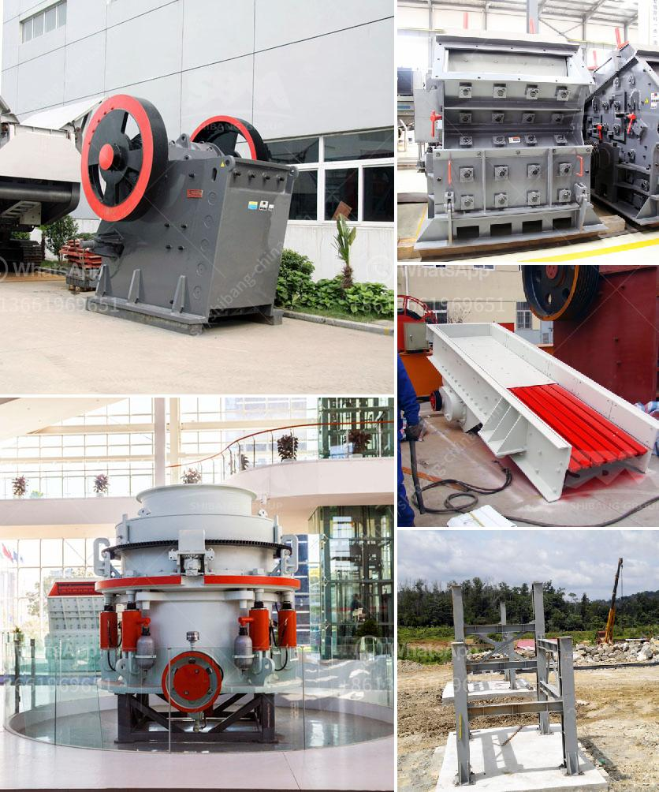

<h3>تصميم مطحنة الهامر</h3>
تعتبر مطحنة الهامر واحدة من الأدوات المهمة في صناعة الأغذية والمواد الكيميائية والأدوية. تستخدم هذه المطاحن لطحن المواد الخام إلى قطع صغيرة أو مسحوق. يعتبر تصميم مطحنة الهامر أمرًا حاسمًا لتحقيق أداء فعال وجودة عالية للمنتج النهائي.

تتألف مطحنة الهامر الأساسية من غرفة الطحن ومطرقة دوارة تدور بسرعة عالية داخل الغرفة. يتم إدخال المواد الخام في الغرفة عن طريق فتحة التغذية على الجزء العلوي من المطحنة. عندما تدخل المواد الخام في الغرفة، يتم تحطيمها وطحنها عن طريق الاصطدام بين المطرقة الدوارة وجدران الغرفة. تتم ضبط حجم الجسيمات المطحونة بواسطة فتحة الشاشة التي يتم تثبيتها في الجزء السفلي من الغرفة.

توفر مطاحن الهامر العديد من المزايا التي تجعلها شائعة الاستخدام في صناعات مختلفة. أولًا، فإنها قادرة على معالجة مجموعة متنوعة من المواد الخام مثل الحبوب، والخضروات، والتوابل، والأعشاب الطبية، وغيرها. ثانيًا، فإنها تقدم أداءًا عاليًا في عمليات الطحن بفضل تأثير الصدمة الكبير الذي تولده المطرقة الدوارة. ثالثًا، فإنها توفر قدرة طحن عالية وتعمل بكفاءة عالية مما يؤدي إلى زيادة إنتاجية المصنع وتوفير التكلفة. 

يحتوي تصميم مطحنة الهامر على عدة عناصر هامة لتحقيق الأداء الأمثل. يجب أن تكون المطرقة الدوارة مصنوعة من مادة متينة وصلبة لتحمل التآكل وضبط الاستهلاك. يجب أن يتم تثبيت الشاشة بدقة معينة لضمان حجم الجسيمات المرغوب فيه. بالإضافة إلى ذلك، يجب أن يتم تصميم الغرفة بشكل مناسب لتجنب حدوث تجمع المواد أو تسرب الغبار. يجب أيضًا ضبط سرعة المطرقة الدوارة وتناسبها مع نوع المواد الخام المطحونة.

باختصار، تصميم مطحنة الهامر يلعب دورًا حاسمًا في تحقيق أداء ممتاز لعملية الطحن. يجب أن يحقق التصميم احتياجات المصنع من حيث الأداء وجودة المنتج النهائي. يجب أن تكون المطاحن ذات جودة عالية ومتينة وسهلة التشغيل والصيانة. تصميم مطحنة الهامر يستفيد من التقنيات المتقدمة والتحسينات المستمرة لتطوير مطاحن أكثر كفاءة واقتصادية وموثوقية.
<h3>Contact us</h3><ul><li><strong>Whatsapp:&nbsp;<a href="https://wa.me/8613661969651">+8613661969651</a></strong></li><li><a href="https://swt.shibang-china.com/?git&amp;zhl&amp;تصميم مطحنة الهامر"><strong>Online Service(chat now)</strong></a></li></ul><h3>Related</h3><ul><li><a href='مصنع كرة متنقل من ألمانيا.md'>مصنع كرة متنقل من ألمانيا</a></li><li><a href='بيع كسارة مخروطية صنعت في الصين.md'>بيع كسارة مخروطية صنعت في الصين</a></li><li><a href='كسارة الحجر الجيري المصنعة في باكستان.md'>كسارة الحجر الجيري المصنعة في باكستان</a></li><li><a href='أعمال التعدين والاستغلال في جنوب أفريقيا.md'>أعمال التعدين والاستغلال في جنوب أفريقيا</a></li><li><a href='قائمة أسعار معدات كسارة الحجر الثقيلة.md'>قائمة أسعار معدات كسارة الحجر الثقيلة</a></li></ul>