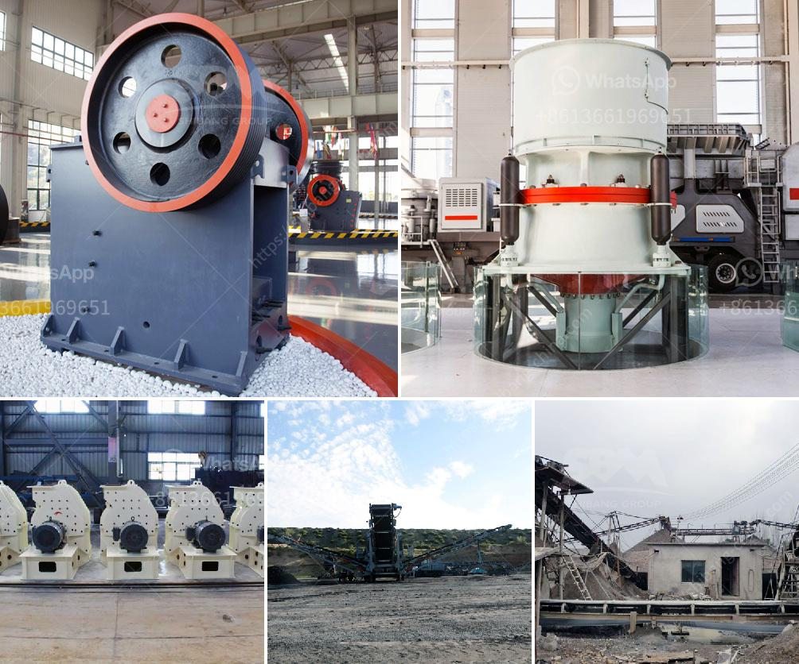

<h3>تصميم وتخطيط محطة تكسير الحجارة pdf</h3>
تعتبر محطات تكسير الحجارة جزءًا أساسيًا من صناعة التعدين والبناء، حيث يتم استخدامها في تحويل الصخور الكبيرة إلى قطع صغيرة قابلة للاستخدام في العديد من التطبيقات المختلفة. يعتبر تصميم وتخطيط محطة تكسير الحجارة من العوامل المهمة التي تؤثر على كفاءة العملية والإنتاجية.

أولاً وقبل كل شيء، يجب أن تكون محطة تكسير الحجارة مصممة بطريقة تتوافق مع الاحتياجات الفنية والبيئية المحددة. يجب أن يتم دراسة الموقع المحتمل للمحطة وتحليل خصائص الصخور الموجودة فيه، ومن ثم تحديد التجهيزات المناسبة التي يجب استخدامها في العملية.

بعد ذلك، يجب أن يتم اختيار أفضل نوع من معدات التكسير المتاحة والتي تتناسب مع المواد الممكن استخدامها. يجب أن يتم التحقق من كفاءة هذه المعدات وقدرتها على التعامل مع الصخور المختلفة وتحقيق الإنتاجية المطلوبة.

علاوة على ذلك، يجب وضع خطة عمل منظمة لعملية التكسير. ينبغي تحديد تسلسل العمليات المختلفة وتوجيه الصخور إلى المعدات المناسبة بناءً على حجمها وأنواعها. يجب أيضًا توفير وسائل سلامة مناسبة للعاملين في المحطة من أجل تفادي أي حوادث أو إصابات.

أما بالنسبة لتخطيط المحطة، فينبغي تجنب أي عوائق تعيق حركة الصخور والمواد داخل المحطة. ينبغي وضع تصميم مناسب يسمح بسير الصخور بشكل متدفق دون أي تراكمات أو تجميعات غير مرغوب فيها. يجب أيضاً توفير فضاء كافٍ لتخزين ومعالجة الصخور المكسورة بشكل مثالي.

وفي النهاية، يجب أن تتوفر في المحطة الأدوات والمعدات اللازمة لصيانة وإصلاح المعدات المستخدمة. ينبغي أن يتم توفير فريق فني ذو خبرة يتمتع بالقدرة على تشخيص وإصلاح أي أعطال قد تحدث في المعدات بأسرع وقت ممكن لتجنب فترات توقف غير مرغوب فيها.

باختصار، يجب أن يتم تصميم وتخطيط محطة تكسير الحجارة بعناية لتلبية الاحتياجات الفنية والعملية. ينبغي أن تكون مصممة بطريقة تدمج بين الكفاءة والسلامة وتحقق أهداف الإنتاجية المطلوبة. يجب أن يتم توفير الاهتمام اللازم لتحقيق هذا الهدف واستخدام أفضل المعدات والأدوات المتاحة للتكسير والصيانة.
<h3>Contact us</h3><ul><li><strong>Whatsapp:&nbsp;<a href="https://wa.me/8613661969651">+8613661969651</a></strong></li><li><a href="https://swt.shibang-china.com/?git&amp;zhl&amp;تصميم وتخطيط محطة تكسير الحجارة pdf"><strong>Online Service(chat now)</strong></a></li></ul><h3>Related</h3><ul><li><a href='مطحنة كرات صغيرة لهنان الصين.md'>مطحنة كرات صغيرة لهنان الصين</a></li><li><a href='تقرير الجدوى لاستفادة من خام النحاس.md'>تقرير الجدوى لاستفادة من خام النحاس</a></li><li><a href='مورد مصنع الكسارة.md'>مورد مصنع الكسارة</a></li><li><a href='طحن معدات الطحن الطحن.md'>طحن معدات الطحن الطحن</a></li><li><a href='معدات تعدين كاثود النحاس.md'>معدات تعدين كاثود النحاس</a></li></ul>