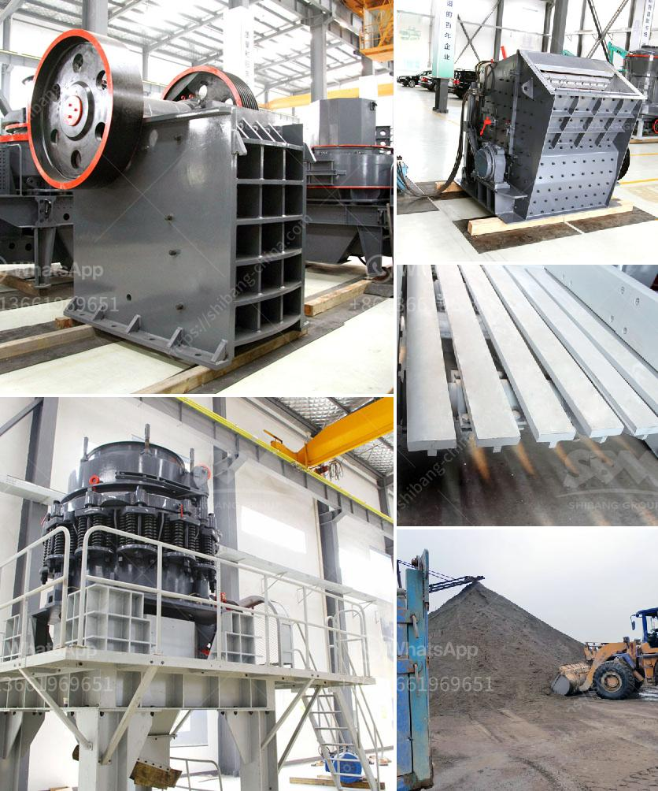

<h3>تصنيع آلات التعدين</h3>
تعتبر آلات التعدين من أهم الأدوات التي تستخدم في صناعة التعدين واستخراج الموارد الطبيعية من باطن الأرض. تتضمن هذه الآلات العديد من الأجزاء المختلفة التي تعمل معًا لتحقيق الهدف المطلوب من خلال تسهيل عمليات التنقيب والاستخراج. في هذه المقالة، سنقدم نظرة عامة على عملية تصنيع آلات التعدين.

تبدأ عملية تصنيع آلات التعدين بتحديد الاحتياجات والمتطلبات الخاصة بكل نوع من أنواع المعادن والصخور المطلوب استخراجها. تعتمد تصميم الآلات على هذه الاحتياجات، حيث يتم اختيار الأجزاء المناسبة وتحديد الوظائف التي يجب أن تؤديها هذه الآلات.

ثم، يتم تصميم وتطوير الآلات باستخدام برامج النمذجة ثلاثية الأبعاد والتصميم المساعد بالحاسوب، حيث يتم رسم واجهات العمل ومكونات الآلات وتجميعها بشكل دقيق. تتم عملية التصنيع باستخدام أحدث التقنيات والآلات القائمة على الحاسوب، مما يضمن تنفيذ عملية الإنتاج بدقة وكفاءة عالية.

تشمل آلات التعدين العديد من الأجزاء المهمة مثل المحركات والأنظمة الهيدروليكية والكهربائية والميكانيكية. تعتبر المحركات الرئيسية قلب هذه الآلات، حيث توفر القوة اللازمة لتشغيلها وتعمل على تحريك مختلف الآليات الأخرى. تستخدم الأنظمة الهيدروليكية في آلات التعدين لتوفير قوة الدفع والسحب، بينما تستخدم الأنظمة الكهربائية لتوجيه وتحكم في حركة الآلات.

علاوة على ذلك، يتم دمج تكنولوجيا الملاحة والتحكم عن بعد في بعض الآلات التي تعمل في ظروف صعبة وخطرة، مما يساعد على زيادة السلامة والكفاءة خلال عمليات التعدين. يجب أن تتوافق هذه الآلات مع معايير السلامة والجودة العالمية، ويتم اختبارها وتفتيشها بشكل دوري للتأكد من أنها تعمل بشكل صحيح وفعال.

في النهاية، تتطلب عملية تصنيع آلات التعدين المهارات الفنية المتخصصة والمعرفة العميقة في التكنولوجيا الحديثة. تلعب هذه الآلات دورًا حاسمًا في صناعة التعدين، حيث تساهم في تحسين الكفاءة وزيادة الإنتاجية وتقليل التكاليف.
<h3>Contact us</h3><ul><li><strong>Whatsapp:&nbsp;<a href="https://wa.me/8613661969651">+8613661969651</a></strong></li><li><a href="https://swt.shibang-china.com/?git&amp;zhl&amp;تصنيع آلات التعدين"><strong>Online Service(chat now)</strong></a></li></ul><h3>Related</h3><ul><li><a href='تكلفة تقديرية لمصنع التعدين.md'>تكلفة تقديرية لمصنع التعدين</a></li><li><a href='إعداد وحدة طحن الأسمنت بسعة 100 طن يوميًا.md'>إعداد وحدة طحن الأسمنت بسعة 100 طن يوميًا</a></li><li><a href='بيع مطحنة في كاليفورنيا.md'>بيع مطحنة في كاليفورنيا</a></li><li><a href='كسارة صناعية.md'>كسارة صناعية</a></li><li><a href='كسارة حجر مستعملة للبيع في أوروبا.md'>كسارة حجر مستعملة للبيع في أوروبا</a></li></ul>