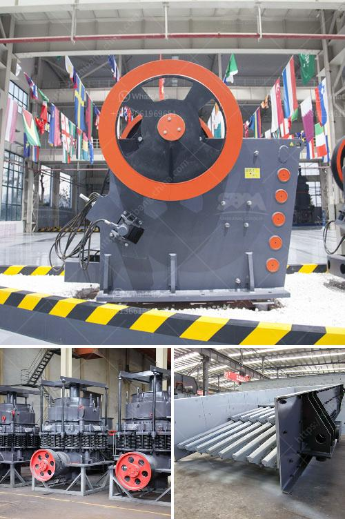

<h3>تصنيع آلات السحق في بوليفيا</h3>
تعتبر آلات السحق من الأدوات الهامة في صناعة التعدين والبناء والتشييد، وتستخدم لسحق المواد الصلبة الكبيرة إلى حجم صغير قابل للاستخدام الآخر. يلعب تصنيع آلات السحق في بوليفيا دوراً رئيسياً في تلبية احتياجات الصناعات المختلفة في البلاد.

تعتبر بوليفيا من أكبر الدول في جنوب أمريكا من حيث احتياطي المعادن الطبيعية، حيث توجد بها كميات هائلة من الزنك والفضة والقصدير والذهب. ولتنقية هذه المعادن واستخلاصها بشكل فعال يلجأ العديد من شركات التعدين في بوليفيا إلى استخدام آلات السحق ذات الفعالية العالية.

تكنولوجيا تصنيع آلات السحق في بوليفيا تتطور باستمرار، حيث تعتمد العديد من الشركات الكبرى في البلاد على التكنولوجيا الحديثة لتلبية المتطلبات الهندسية والبيئية. يتم تصنيع آلات السحق بأحجام وأنواع مختلفة، حسب احتياجات المشروع والمادة المراد سحقها.

تعتبر شركات التصنيع في بوليفيا متخصصة في تصنيع آلات السحق المختلفة، من الكسارات الفكية إلى الكسارات التصادمية والمخروطية. توفر هذه الشركات أيضًا قطع الغيار والصيانة اللازمة للآلات، مما يساعد على استمرارية الإنتاج وتحسين أداء الآلات على المدى الطويل.

تصدر بوليفيا آلات السحق إلى الأسواق المحلية والدولية، حيث تلتزم الشركات المصنعة بمعايير الجودة العالمية والتزامات الصحة والسلامة. كما تعتمد على البحث والتطوير لتحسين أداء الآلات وتقديم حلول مبتكرة لتلبية متطلبات العملاء.

باستمرارية تصنيع آلات السحق في بوليفيا، تساهم الشركات المصنعة في تعزيز قطاع التعدين والبناء في البلاد، وتوفير فرص العمل، وتعزيز النمو الاقتصادي. كما أن هذه الصناعة تسهم في استخدام المواد الخام المحلية وتدعم استدامة البيئة.

في الختام، تعد تصنيع آلات السحق في بوليفيا مجالًا حيويًا وضروريًا لتلبية احتياجات صناعات التعدين والبناء. توفر الشركات المصنعة آلات عالية الجودة وفعالة من حيث التكلفة، مما يساهم في تعزيز الاقتصاد المحلي وتحقيق التنمية المستدامة في البلاد.
<h3>Contact us</h3><ul><li><strong>Whatsapp:&nbsp;<a href="https://wa.me/8613661969651">+8613661969651</a></strong></li><li><a href="https://swt.shibang-china.com/?git&amp;zhl&amp;تصنيع آلات السحق في بوليفيا"><strong>Online Service(chat now)</strong></a></li></ul><h3>Related</h3><ul><li><a href='كسارات محمولة جنوب أفريقيا.md'>كسارات محمولة جنوب أفريقيا</a></li><li><a href='تصميم مصنع الإسمنت بتنسيق PDF.md'>تصميم مصنع الإسمنت بتنسيق PDF</a></li><li><a href='مصانع الكرة المستمرة في جوجرات.md'>مصانع الكرة المستمرة في جوجرات</a></li><li><a href='معدات فحص الصخور.md'>معدات فحص الصخور</a></li><li><a href='مطحنة طحن الحجر الصناعي.md'>مطحنة طحن الحجر الصناعي</a></li></ul>