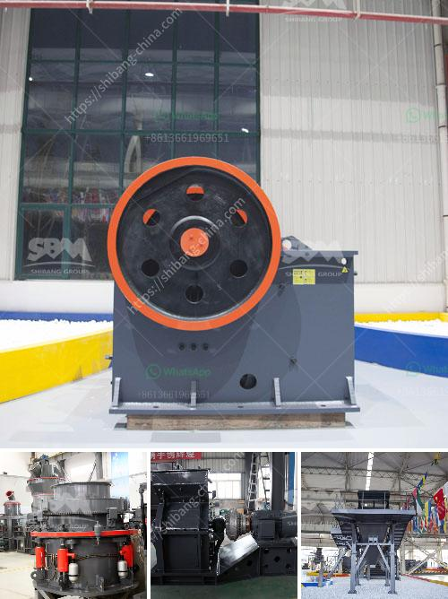

<h3>تصنيع الكالسيت المسحوق في راجستان</h3>
تُعرف راجستان بوجود ثروات طبيعية هائلة، ومن بين هذه الثروات الكالسيت. يُعد الكالسيت معدنًا مهمًا يستخدم في عدة صناعات مثل الزجاج، الأسمدة، والمواد الكيميائية. وبالتالي، لا يُعتبر الكالسيت فحسب ككنز طبيعي لراجستان، بل إن صناعة تصنيع الكالسيت المسحوق في المنطقة تُعد نشاطًا اقتصاديًّا أساسيًّا.

تعتبر مناجم الكالسيت في راجستان مصدرًا رئيسيًا للمادة الخام لإنتاج الكالسيت المسحوق. تقع معظم مناجم الكالسيت في منطقة أجمانير في راجستان، حيث توجد كميات هائلة من المعادن. لنقل هذه المعادن من المناجم إلى مصانع التصنيع، يتم استخدام الوسائل المختلفة مثل الشاحنات الكبيرة ووسائل النقل السككية.

تبدأ عملية تصنيع الكالسيت المسحوق بعدة خطوات رئيسية. يتم سحق الكالسيت الخام بواسطة مطاحن مختلفة للحصول على الحبيبات الأولية. بعد ذلك يتم نقل الكالسيت الخام المسحوق إلى آلات الطحن الأخرى لتحويله إلى مسحوق ناعم. يعتبر تحويل الكالسيت إلى حجم الجسيمات المطلوب هو المرحلة الحاسمة في عملية التصنيع، حيث تعتمد جودة المنتج النهائي على حجم الجسيمات ونسبة الانحراف عن المعايير المحددة.

بعد تحويل الكالسيت إلى مسحوق ناعم، يتم فصله وتصفيته. يتم ضبط حجم الجسيمات المنتجة بواسطة آلات الطحن، ومن ثم يتم فصل الجسيمات المنتجة باستخدام آلات الفصل والتصفية. من المهم أن تتم هذه العمليات بدقة وفقًا لاحتياجات الصناعة المستهدفة، لضمان الجودة والنقاء والانسيابية العالية للكالسيت المسحوق.

بعد فصل الكالسيت وتصفيته، يتم تجفيفه بواسطة آلات المجففة. يتم ضبط ثبات الرطوبة ودرجة الحرارة وفقًا لمواصفات المنتج النهائي. وبعد ذلك، يتم تعبئة الكالسيت المسحوق في أكياس أو حاويات، ويكون جاهزًا للتوزيع والتوجيه للصناعة المستخدمة.

إذاً، يُعد تصنيع الكالسيت المسحوق في راجستان عملية تتطلب العديد من الخطوات والتقنيات المتطورة للحصول على منتج نهائي ذو جودة عالية. توفر راجستان الموارد الطبيعية الهائلة لإنتاج هذا المعدن المهم، وتؤكد على أهمية استخدام التكنولوجيا المتقدمة في عمليات التصنيع، لتوفير منتج نهائي يلبي متطلبات العملاء والاحتياجات الصناعية.
<h3>Contact us</h3><ul><li><strong>Whatsapp:&nbsp;<a href="https://wa.me/8613661969651">+8613661969651</a></strong></li><li><a href="https://swt.shibang-china.com/?git&amp;zhl&amp;تصنيع الكالسيت المسحوق في راجستان"><strong>Online Service(chat now)</strong></a></li></ul><h3>Related</h3><ul><li><a href='كسارة الحجر في ماليزيا.md'>كسارة الحجر في ماليزيا</a></li><li><a href='تكلفة إنشاء مصنع خام الحديد.md'>تكلفة إنشاء مصنع خام الحديد</a></li><li><a href='كسارة تأثير صناعية.md'>كسارة تأثير صناعية</a></li><li><a href='كسارة من الصين السعر.md'>كسارة من الصين السعر</a></li><li><a href='شراء مصنع غسيل الرمل في سريلانكا.md'>شراء مصنع غسيل الرمل في سريلانكا</a></li></ul>