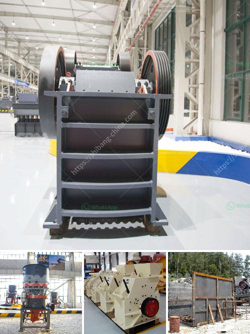

<h3>تصنيع محطم المحمولة في ألمانيا</h3>
تشتهر ألمانيا بصناعتها المتقدمة وتكنولوجيتها المتطورة في مختلف القطاعات ، بما في ذلك صناعة المعدات الثقيلة. واحدة من هذه المعدات هي محطم المحمولة ، الذي يستخدم على نطاق واسع في صناعة التعدين والبناء وإعادة التدوير.

يعتبر تصنيع محطم المحمولة في ألمانيا شاهدًا على قوة الابتكار والتميز التكنولوجي. فبفضل موارد ألمانيا الهندسية المتقدمة والتكنولوجيا المبتكرة ، تم تطوير محطم المحمولة ليكون متعدد الاستخدامات وفعالًا في مجموعة متنوعة من التطبيقات.

تتميز محطم المحمولة بقابليته المتنقلة ، حيث يمكن نقلها بسهولة واستخدامها في مختلف المواقع. كما أنها تأتي بتصميم مدمج وخفيف الوزن ، مما يجعلها سهلة الاستخدام والتنقل في المساحات الضيقة والصعبة الوصول.

تعتمد تقنية تصنيع محطم المحمولة في ألمانيا على المواد والمكونات عالية الجودة ، مع الاهتمام الكبير بالتفاصيل والدقة. وبالتالي ، فإن المنتج النهائي يتمتع بالمتانة والموثوقية ، مما يضمن أداءًا ممتازًا وعمرًا طويلاً.

محطم المحمولة يأتي بمجموعة متنوعة من التجهيزات والميزات لتناسب احتياجات المستخدمين المختلفة. فهو يمكن أن يكون مجهزا بصوامع لتخزين المواد أو الأحزمة الناقلة لنقل المواد. كما يمكن للمحطم أن يكون مجهزًا بشاشة متنقلة لفصل المواد وفقًا للحجم المطلوب أو للعمل في ظروف قاسية مثل الطقس البارد أو الحار.

لا يقتصر استخدام محطم المحمولة على صناعة التعدين والبناء فحسب ، بل يمكن استخدامه أيضًا في إعادة التدوير ومعالجة النفايات. فإن وجود محطم محمول يعني أنه يمكن تركيبه في موقع إعادة التدوير المحدد ، وبالتالي منح الشركات إمكانية معالجة المواد المعاد تدويرها في الموقع وتقليل تكاليف النقل.

لذا ، يمكن القول إن تصنيع محطم المحمولة في ألمانيا هو نموذج للجودة والابتكار في صناعة المعدات الثقيلة. وهو يحقق أداءً فعالًا وفعالية تكلفة عالية في مجالات التعدين والبناء وإعادة التدوير. يمكن الاعتماد على تكنولوجيا ألمانيا المتقدمة في صناعة محطم المحمولة لتلبية متطلبات العملاء وتحسين عملياتهم.
<h3>Contact us</h3><ul><li><strong>Whatsapp:&nbsp;<a href="https://wa.me/8613661969651">+8613661969651</a></strong></li><li><a href="https://swt.shibang-china.com/?git&amp;zhl&amp;تصنيع محطم المحمولة في ألمانيا"><strong>Online Service(chat now)</strong></a></li></ul><h3>Related</h3><ul><li><a href='كتلة الآلات وكسارة في AutoCAD.md'>كتلة الآلات وكسارة في AutoCAD</a></li><li><a href='كسارة من الصين السعر.md'>كسارة من الصين السعر</a></li><li><a href='كسارة مخروطية سلسلة CS.md'>كسارة مخروطية سلسلة CS</a></li><li><a href='كسارة الفك وقطع الغيار.md'>كسارة الفك وقطع الغيار</a></li><li><a href='مصانع VSI في الإمارات.md'>مصانع VSI في الإمارات</a></li></ul>