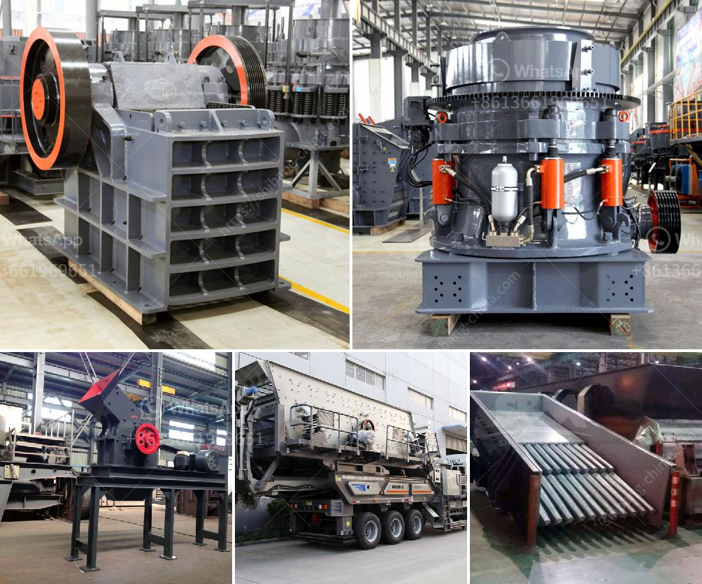

<h3>تصنيع مكره مطحنة الكرة</h3>
مطحنة الكرة هي جهاز ميكانيكي يستخدم في عملية الطحن وتكسير المواد الصلبة. وتتألف من أسطوانة معدنية تحتوي على كرات فولاذية تدور داخلها وتطحن المواد الخام وتقلل حجمها. ويلعب تصنيع مكره مطحنة الكرة دوراً حاسماً في ضمان جودة وكفاءة هذا الجهاز.

يتكون تصنيع مكره مطحنة الكرة من عدة خطوات. في البداية، يجب استخراج الخامات الخام المستخدمة في المطحنة مثل الفلزات والمعادن والمواد الكيميائية وغيرها. تتم عملية استخلاص الخامات بواسطة عملية التعدين أو الحفر.

بعد تجهيز الخامات الخام، تتم عملية الطحن والخلط للمكونات الأساسية لصنع مكره المطحنة. تم تسخين المواد الخام بدرجات حرارة مختلفة في أفران خاصة لتحقيق التركيب الكيميائي المطلوب ومرونة المكره.

ثم، يجب أن يتم تشكيل المكره بواسطة عملية الدلفنة أو اللف. وهي عبارة عن عملية تصنيع تشير إلى تشكيل الخامات الخام في قوالب ضغط عالية لتشكيل شكل الكرة الأمثل وإضافة قوة الضغط اللازمة.

بعد عملية التشكيل، يتم إجراء عدة اختبارات على المكره لضمان جودته. يتم اختبار صلابته وقوته واستدامته للتأكد من قدرته على تحمل ضغط الاستخدام الدائم. تُجرى هذه الاختبارات في مختبرات متخصصة باستخدام معدات دقيقة.

أخيراً، يتم اكتناز وتعبئة المكره في عبوات مناسبة للنقل والتخزين، والاهتمام بتوافر جميع المواصفات المعيارية المطلوبة. ويجب توفير قوة ثورية كافية واستدامة عالية لمكره المطحنة لتحقيق عملية الطحن بكفاءة عالية وتلبية احتياجات الصناعات المختلفة.

بإجراء هذه الخطوات مع اتباع معايير الجودة والكفاءة، يمكن تصنيع مكره مطحنة الكرة ذات الجودة العالية والكفاءة العالية. فتلك الكرات الفولاذية هي الأساس في عملية الطحن وتكسير المواد الصلبة وتعتبر جزءًا حاسمًا في صناعة العديد من المنتجات في الصناعات المختلفة.

من الواضح أن تصنيع مكره مطحنة الكرة يتطلب خبرة وكفاءة عالية لضمان جودة المنتج النهائية. لذا، يجب على الشركات المصنعة أن تستثمر في التكنولوجيا المتقدمة والأدوات الحديثة والفرق الفنية المهرة لضمان إنتاج مكره مطحنة الكرة بأعلى جودة وأعلى كفاءة.
<h3>Contact us</h3><ul><li><strong>Whatsapp:&nbsp;<a href="https://wa.me/8613661969651">+8613661969651</a></strong></li><li><a href="https://swt.shibang-china.com/?git&amp;zhl&amp;تصنيع مكره مطحنة الكرة"><strong>Online Service(chat now)</strong></a></li></ul><h3>Related</h3><ul><li><a href='سعر كسارة الخرسانة.md'>سعر كسارة الخرسانة</a></li><li><a href='شراء كسارة الفك الأولية في نيجيريا.md'>شراء كسارة الفك الأولية في نيجيريا</a></li><li><a href='سعر معدات الطحن 250 طن.md'>سعر معدات الطحن 250 طن</a></li><li><a href='سعر كسارة الزحف المتنقلة.md'>سعر كسارة الزحف المتنقلة</a></li><li><a href='مطحنة حجر نيجيريا.md'>مطحنة حجر نيجيريا</a></li></ul>