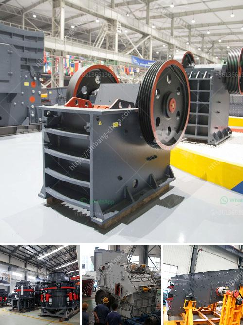

<h3>تطبيق آلة صنع الرمل</h3>
يُعد تطبيق آلة صنع الرمل واحدًا من التقنيات الحديثة والمبتكرة في صناعة البناء والمقاولات. تهدف هذه الآلة إلى إنتاج الرمل الصناعي المستخدم في العديد من التطبيقات المختلفة مثل الإنشاءات والطرق والأعمال المائية وصناعة الزجاج والإسمنت.

يعتمد عمل التطبيق على تحويل المواد الخام مثل الصخور والحجارة إلى رمل صناعي عالي الجودة. يتم ذلك عن طريق سحق المواد الخام في الآلة بواسطة طريقة الصدم، حيث يتم ضرب المواد بقوة عالية بواسطة ذراع متحرك سريع الإيقاع. هذا الاصطدام ينتج عنه تكسير المواد الخام إلى جزيئات صغيرة تشبه الرمل الطبيعي.

تتميز آلة صنع الرمل بعدة مزايا. أولاً وقبل كل شيء، فإنها تنتج رملًا صناعيًا عالي الجودة ومتجانس، مما يضمن استخدامه في مختلف التطبيقات بالطريقة المثلى. تساعد هذه الآلة على توفير الرمل الطبيعي وحفظ الموارد الطبيعية، كما أنها تُعتبر أكثر تجانسًا ونقاءًا من الرمل الطبيعي.

علاوة على ذلك، تساعد آلة صنع الرمل في تقليل نسبة الغبار والشوائب في الرمل المنتج، مما يضمن جودة أفضل وتأثير أقل على البيئة وصحة العاملين. تساهم هذه الآلة أيضًا في زيادة سرعة وكفاءة عمليات البناء، حيث يمكن إنتاج الرمل الصناعي بسرعة وفقًا للطلب ودون الحاجة إلى الاعتماد على مصادر الرمل الطبيعي.

بشكل عام، يشهد استخدام آلة صنع الرمل زيادة مستمرة في صناعة البناء والمقاولات حول العالم. تعتبر هذه الآلة حلاً مستدامًا وفعّالًا لتلبية احتياجات قطاع البناء ، بالإضافة إلى أنها تقدم أداءًا عاليًا بتكلفة منخفضة نسبيًا. يمكن استخدام آلة صنع الرمل في المنشآت الكبيرة والصغيرة على حدٍ سواء، وتجد تطبيقاتها في جميع أنواع العمليات البنائية.

في النهاية، فإن آلة صنع الرمل تمثل تقدمًا هائلًا في صناعة البناء وتدفعها للأمام نحو المزيد من الاستدامة والكفاءة. يتوقع أن تستمر هذه التقنية في التطور والتحسينات المستقبلية، مما يجعلها حلاً مثاليًا للقضايا البيئية والاقتصادية التي تواجه صناعة البناء في القرن الحادي والعشرين.
<h3>Contact us</h3><ul><li><strong>Whatsapp:&nbsp;<a href="https://wa.me/8613661969651">+8613661969651</a></strong></li><li><a href="https://swt.shibang-china.com/?git&amp;zhl&amp;تطبيق آلة صنع الرمل"><strong>Online Service(chat now)</strong></a></li></ul><h3>Related</h3><ul><li><a href='تحجيم هيدروليكي لمصنع كسارة رمل السيليكا.md'>تحجيم هيدروليكي لمصنع كسارة رمل السيليكا</a></li><li><a href='شركة تصنيع كسارات صغيرة في الصين.md'>شركة تصنيع كسارات صغيرة في الصين</a></li><li><a href='خطة عمل عينية لشركة تعدين الذهب الصغيرة.md'>خطة عمل عينية لشركة تعدين الذهب الصغيرة</a></li><li><a href='موردين آلة طحن الجبس.md'>موردين آلة طحن الجبس</a></li><li><a href='شركة كسارة الحجر.md'>شركة كسارة الحجر</a></li></ul>