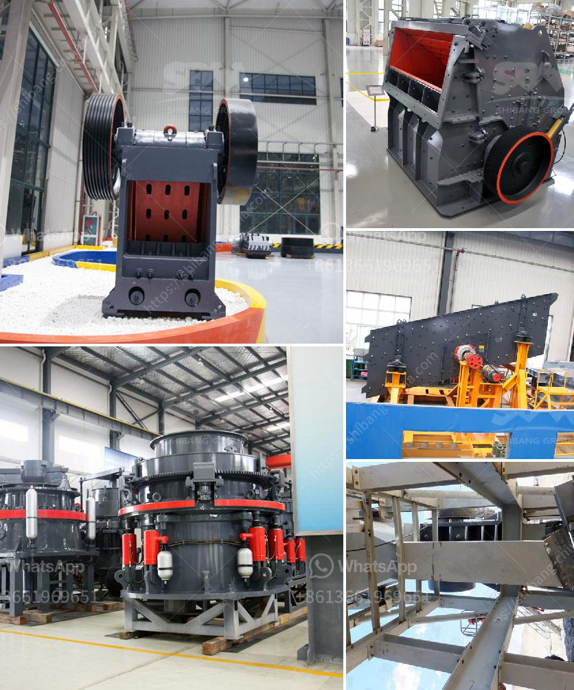

<h3>تطبيق محطة الكسارة</h3>
تطبيق محطة الكسارة هو تطبيق مبتكر يهدف إلى تسهيل وتحسين عملية إدارة محطات الكسارات. يستخدم هذا التطبيق التكنولوجيا الحديثة والذكاء الاصطناعي لتوفير حل شامل لإدارة عمليات الكسارات بكفاءة وبسلاسة.

يعد استخدام محطة الكسارة من الخطوات الرئيسية في عملية تصنيع الركام والحصى للاستخدام في مجالات البناء والبنية التحتية. ومع زيادة الطلب على هذه المواد، يصبح إدارة محطات الكسارات أمرًا حيويًا لضمان استمرارية العملية وتحقيق الكفاءة العالية.

توفر محطة الكسارة التطبيق العديد من المميزات التي تعزز الإنتاجية وتحسن الكفاءة. تتضمن هذه الميزات التحكم في عملية الكسارة، وفحص الجودة، ومتابعة الإنتاج، وتقييم الأداء. عن طريق تتبع ومراقبة العمليات في الوقت الحقيقي وتحليل البيانات، يعمل التطبيق على تحسين عمليات الإنتاج وتحقيق أعلى قدر من الجودة.

باستخدام تطبيق محطة الكسارة، يستطيع المشرفون والعمال إدارة كافة جوانب عملية الكسارة بسهولة وفعالية. يوفر التطبيق معلومات مهمة مثل تحليل كمية الإنتاج والاستهلاك، وأيضًا يساعد في تخطيط الصيانة الروتينية والتحكم في أوقات التشغيل والإيقاف. بالإضافة إلى ذلك، يمكن توفير مراقبة جودة الإنتاج بشكل أسرع وفعال، ويمكن تحديد المشاكل واتخاذ إجراءات تصحيحية فورية.

تعزز محطة الكسارة أيضًا أمان العمل وتقلل من حدوث الحوادث المحتملة. ففي بيئة العمل هذه، يتعامل العمال مع معدات ثقيلة ومخاطر الحفر والتراص، ولذا يعد الحفاظ على سلامتهم أمرًا هامًا. يوفر التطبيق تعليمات سلامة متكاملة وتوفر تذكيرًا دوريًا بأفضل الممارسات وإجراءات السلامة.

باستخدام تطبيق محطة الكسارة، يمكن تحقيق تحسينات جوهرية في إدارة عمليات الكسارات. سيؤدي ذلك بدوره إلى زيادة الإنتاجية وتحسين جودة المنتج النهائي، وتقليل التكاليف التشغيلية وتعزيز الأمان والسلامة في بيئات العمل. إن تطبيق محطة الكسارة هو خطوة نحو تحقيق الابتكار والتطور في صناعة الكسارات، ويتوقع أن يحظى بتقبل واستخدام واسع من قبل المهنيين في هذا المجال.
<h3>Contact us</h3><ul><li><strong>Whatsapp:&nbsp;<a href="https://wa.me/8613661969651">+8613661969651</a></strong></li><li><a href="https://swt.shibang-china.com/?git&amp;zhl&amp;تطبيق محطة الكسارة"><strong>Online Service(chat now)</strong></a></li></ul><h3>Related</h3><ul><li><a href='تكلفة مصنع كسارة خام الحديد.md'>تكلفة مصنع كسارة خام الحديد</a></li><li><a href='مصنع غسيل الذهب الصغير.md'>مصنع غسيل الذهب الصغير</a></li><li><a href='تكلفة آلات الحديد الاسفنجي 300 طن في اليوم.md'>تكلفة آلات الحديد الاسفنجي 300 طن في اليوم</a></li><li><a href='سعر مطحنة ريموند الفائقة الدقة.md'>سعر مطحنة ريموند الفائقة الدقة</a></li><li><a href='سعر مصنع كسارة الحجر في ألمانيا.md'>سعر مصنع كسارة الحجر في ألمانيا</a></li></ul>