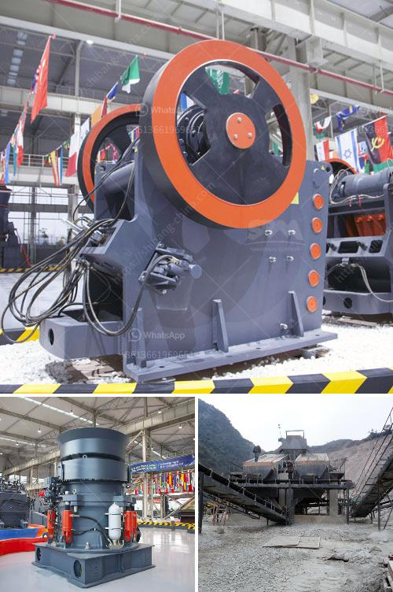

<h3>تعدين البازلت</h3>
تُعد مادة البازلت تنوعًا طبيعيًا يشتهر بصلادته ومتانته، وبالتالي فهو مادة مفضلة في صناعة البناء والطرق. يتم استخراج البازلت من قاع البحار أو البراكين، وتكمن قيمة هذه المادة في تكوينها الصخري الفريد وخواصها الميكانيكية القوية.

يتم تعدين البازلت بعدة طرق مختلفة، بما في ذلك التعدين السطحي والمحاجر البحرية. في التعدين السطحي، يتم حفر الأرض للوصول إلى طبقات البازلت، ويتم بعد ذلك استخراجها ونقلها إلى مواقع المعالجة. يستخدم التعدين السطحي عندما تكون طبقات البازلت قريبة من سطح الأرض ويمكن الوصول إليها بسهولة.

أما التعدين البحري، فهو يعتمد على استخراج البازلت من قاع البحار. يتم ذلك عن طريق تشغيل معدات خاصة مثل الحفارات البحرية والسفن الخاصة بالتعدين البحري. يتم أخذ أعينات للتربة من قاع البحر، ثم يتم معالجة هذه الأعينات لاستخراج البازلت. عند تشغيل التعدين البحري، تحتاج الشركات إلى مراعاة الاستدامة البيئية وضمان عدم تأثير استخراج البازلت على البيئة البحرية.

بعد استخراج البازلت، يتم طحنه وتكسيره للحصول على الحبيبات المطلوبة، ويخضع بعد ذلك لعمليات تصفية وتنقية أخرى. يتم تجفيفه ثم يتم تعبئته وشحنه في حاويات أو شاحنات لنقله إلى مواقع البناء. يتم استخدام البازلت في العديد من التطبيقات مثل الطرق والأساسات والطوب والبلوك والخرسانة الأسفلتية والرصيف والأرصفة وغيرها.

تعتبر صناعة تعدين البازلت مهمة بشكل خاص لمجتمعات معينة، حيث توفر فرص عمل للعديد من العمال وتساهم في تنمية اقتصاد المنطقة. بالإضافة إلى ذلك، يشتهر البازلت بمقاومته للتأكل والتآكل، وبالتالي فإن استخدامه يحمي المباني والطرق من الضرر الطبيعي والاستخدام اليومي الشاق.

في الختام، يمكن القول بأن تعدين البازلت يعتبر صناعة أساسية في قطاع البناء والطرق، حيث توفر مادة قوية ومستدامة للتطبيقات المختلفة في البناء. تعتمد هذه الصناعة على استخراج البازلت بأساليب مختلفة مثل التعدين السطحي والمحاجر البحرية، وتحتاج إلى اهتمام بالاستدامة البيئية.
<h3>Contact us</h3><ul><li><strong>Whatsapp:&nbsp;<a href="https://wa.me/8613661969651">+8613661969651</a></strong></li><li><a href="https://swt.shibang-china.com/?git&amp;zhl&amp;تعدين البازلت"><strong>Online Service(chat now)</strong></a></li></ul><h3>Related</h3><ul><li><a href='كسارات متنقلة مجنزرة.md'>كسارات متنقلة مجنزرة</a></li><li><a href='شركات تكسير الحجر في بيرو.md'>شركات تكسير الحجر في بيرو</a></li><li><a href='آلة سحق الحديد.md'>آلة سحق الحديد</a></li><li><a href='كسارة صخور صغيرة.md'>كسارة صخور صغيرة</a></li><li><a href='قائمة المعدات التي تستخدم في مناجم الجرانيت.md'>قائمة المعدات التي تستخدم في مناجم الجرانيت</a></li></ul>