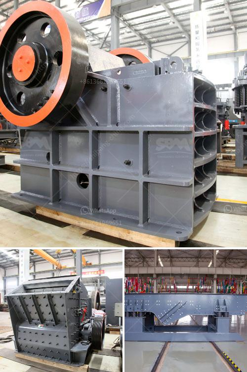

<h3>تعدين الجبس والكروم والحجر الجيري</h3>
تعدين الجبس والكروم والحجر الجيري هي عمليات استخراج الموارد الطبيعية من الأرض لاستخدامها في مجموعة متنوعة من الصناعات. تعد هذه المواد من الموارد المعدنية غير المتجددة، والتي تلعب دورًا هامًا في تطوير الاقتصاد وتلبية احتياجات المجتمع.

بدايةً، نتحدث عن تعدين الجبس. يتم استخراج الجبس من مواقع تواجده الطبيعية والتي غالباً ما تكون تحت الأرض أو قربها. يستخدم الجبس بشكل رئيسي في صناعة البناء والبناء، حيث يتم استخدامه في تكوين الجدران الداخلية والخارجية، وتزيين السقوف وتشطيب الأرضيات. كما يستخدم الجبس في صناعة الجص والجبس القابل للطي. تعتبر عمليات تعدين الجبس ضرورية لتلبية الطلب المتزايد على هذه المادة القيمة.

أما بالنسبة لتعدين الكروم، فإنه يتم استخراجه بشكل رئيسي من الرواسب الكرومية في باطن الأرض. يتم استخدام الكروم في صناعة الفولاذ والسبائك المعدنية. يتم استخدام الكروم في صناعة السيارات والطائرات وصناعة الأدوات المنزلية. كما يتم استخدامه في صناعة الألوان والصباغة والطلاء. يعتبر الكروم مادة قيمة لا غنى عنها في العديد من الصناعات الحديثة.

أخيرًا، نتحدث عن تعدين الحجر الجيري. يستخرج الحجر الجيري من المحاجر والمناجم الكبيرة للاستخدام في صناعة البناء والبناء. يستخدم الحجر الجيري على نطاق واسع في بناء المباني والطرق والجسور. كما يستخدم الحجر الجيري في صناعة الأسمنت والزجاج والسيراميك. يعد الحجر الجيري مادة أساسية للاقتصاد والتنمية المستدامة.

من الواضح أن تعدين الجبس والكروم والحجر الجيري يلعب دورًا هامًا في تلبية الاحتياجات الصناعية والبناء للمجتمع. ومع زيادة الطلب على هذه الموارد، يجب أن يتم الحفاظ على هذه العمليات بطريقة مستدامة للحفاظ على البيئة والحفاظ على هذه الموارد للأجيال القادمة. يجب أن يتم تطبيق معايير الاستدامة والحفاظ على البيئة في عمليات التعدين لتقليل التأثير السلبي على البيئة وتحسين إدارة الموارد المعدنية بشكل عام.
<h3>Contact us</h3><ul><li><strong>Whatsapp:&nbsp;<a href="https://wa.me/8613661969651">+8613661969651</a></strong></li><li><a href="https://swt.shibang-china.com/?git&amp;zhl&amp;تعدين الجبس والكروم والحجر الجيري"><strong>Online Service(chat now)</strong></a></li></ul><h3>Related</h3><ul><li><a href='مطحنة الكرة في الصناعة.md'>مطحنة الكرة في الصناعة</a></li><li><a href='معدات طحن لمسحوق التلك.md'>معدات طحن لمسحوق التلك</a></li><li><a href='معدات استخراج الذهب من الصخور.md'>معدات استخراج الذهب من الصخور</a></li><li><a href='قشارة وكسارة متعددة الوظائف في الصين.md'>قشارة وكسارة متعددة الوظائف في الصين</a></li><li><a href='مصنع المعادن سحق خام البوكسيت.md'>مصنع المعادن سحق خام البوكسيت</a></li></ul>