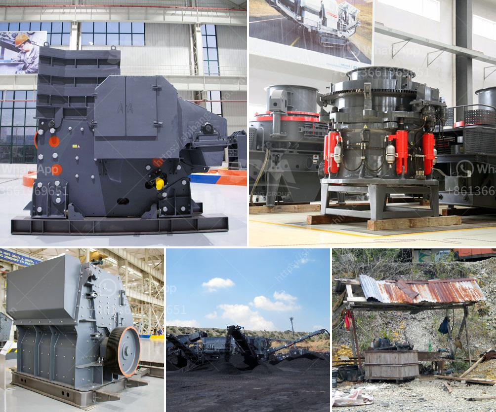

<h3>تعدين المحاجر ومعدات البناء</h3>
يعتبر تعدين المحاجر واستخدام معدات البناء من أهم الصناعات في العالم، حيث يتم استخراج الصخور والمواد الأخرى من المحاجر لاستخدامها في عمليات البناء والتشييد. يعود تاريخ استخدام المحاجر ومعدات البناء إلى آلاف السنين، حيث كانت تستخدم في بناء الأهرامات في مصر القديمة وغيرها من المعابد والقصور العريقة.

تُعد المحاجر بيئة مكتظة بالصخور والأتربة والغبار والقشور، وهي تقدم تحديات كبيرة للعاملين فيها والمعدات المستخدمة. لذلك، يلزم توفير معدات متطورة وآمنة لنجاح عمليات التعدين وتحقيق الإنتاجية المرتفعة بأكبر قدر ممكن.

تشمل معدات التعدين المحاجر الكسارات والمطاحن والناقلات والآلات الثقيلة الأخرى. وتعمل هذه المعدات على فصل الصخور والمواد الصلبة عن الأتربة والشوائب وفرزها وسحقها إلى أحجام مختلفة حسب الاحتياجات. علاوة على ذلك، يتم استخدام المعدات الثقيلة الأخرى مثل الشاحنات والحفارات الهيدروليكية والجرافات لنقل وتحميل وحفر المواد الخام.

تتميز معدات البناء بقوتها ومتانتها، حيث تُستخدم لإقامة المباني والطرق والجسور والمشاريع العمرانية الأخرى. وتشمل هذه المعدات الحفارات والرافعات والأعمدة الخرسانية وآلات الصب وغيرها. تتطلب عمليات البناء خبرة ومهارة عالية لضمان السلامة والتنفيذ الجيد.

تعتبر محاجر التعدين ومعدات البناء مصدرًا هامًا للوظائف والاقتصاد في العديد من البلدان، حيث تدعم هذه الصناعة العديد من القطاعات الأخرى مثل الصناعة العقارية والإنشاءات. بالإضافة إلى ذلك، فإن استخدام المواد البنائية المستخرجة من المحاجر يعد أكثر استدامة بيئيًا من استخدام المواد الاصطناعية.

على الرغم من الفوائد العديدة لتعدين المحاجر ومعدات البناء، يجب أيضًا مراعاة التأثيرات البيئية السلبية التي قد تنتج عنها. ولذلك، ينبغي تنفيذ التدابير الوقائية واتباع الممارسات الصحيحة للحفاظ على البيئة المحيطة وتقليل التأثيرات السلبية على صحة العاملين والمجتمع المحلي.

في الختام، يمكن القول أن تعدين المحاجر ومعدات البناء هما جزء لا يتجزأ من عمليات البناء والتشييد، وتلعب دورًا حاسمًا في تحسين البنية التحتية وتسهيلات الحضر وتوفير الفرص الاقتصادية. ومع استخدام التكنولوجيا والابتكار المستمرين، فإن مستقبل هذه الصناعة يبدو واعدًا ومشرقًا.
<h3>Contact us</h3><ul><li><strong>Whatsapp:&nbsp;<a href="https://wa.me/8613661969651">+8613661969651</a></strong></li><li><a href="https://swt.shibang-china.com/?git&amp;zhl&amp;تعدين المحاجر ومعدات البناء"><strong>Online Service(chat now)</strong></a></li></ul><h3>Related</h3><ul><li><a href='كسارة الحجر 100 طن للبيع.md'>كسارة الحجر 100 طن للبيع</a></li><li><a href='تكسير الحجر المصنوع في ألمانيا.md'>تكسير الحجر المصنوع في ألمانيا</a></li><li><a href='مصنع كسارة السخام في الهند.md'>مصنع كسارة السخام في الهند</a></li><li><a href='آلة مطحنة المعادن.md'>آلة مطحنة المعادن</a></li><li><a href='أنا أبحث عن كسارة في ماليزيا.md'>أنا أبحث عن كسارة في ماليزيا</a></li></ul>