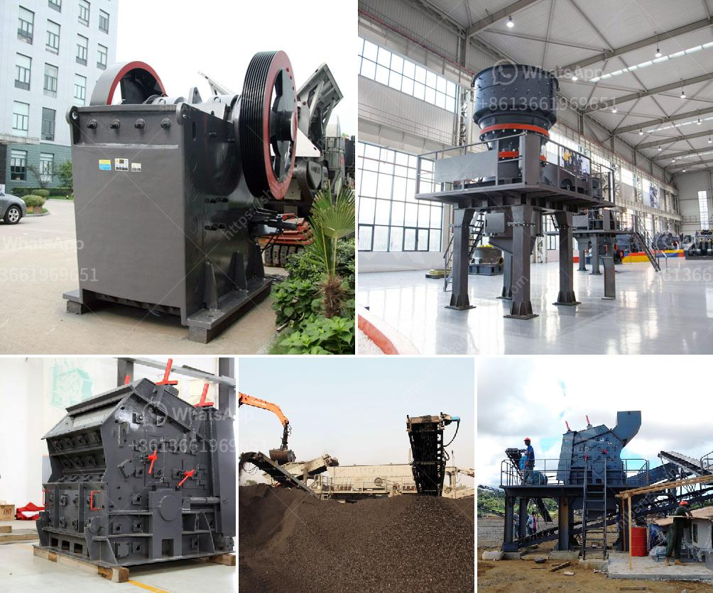

<h3>تعدين رمال النهر والحجر في صباح</h3>
تعدين رمال النهر والحجر في صباح هو عملية تستخرج من خلالها الرمال والحجارة من قاع بحيرات وأنهار الصباح. يتم استخدام هذه الموارد بشكل واسع في البناء والمشاريع الإنشائية المختلفة.

تعدين رمال النهر هو عملية استخراج الرمال الطبيعية من قاع الأنهار وبحيرات الصباح. تتراوح حبيبات الرمل في حجمها من الحبيبات الدقيقة إلى الحبيبات الخشنة حسب خصائص ومكونات التربة في المنطقة المعينة. هذه الرمال تستخدم في البناء والإسفلت وصناعة الزجاج والسيراميك والخرسانة. وتعتبر رمال النهر شائعة الاستخدام بسبب خصائصها الميكانيكية الممتازة وقدرتها على الالتصاق والتماسك.

بالإضافة إلى ذلك، يتم تعدين الحجر في صباح أيضًا بكميات كبيرة. يتم استخدام الحجارة في البناء والأعمال الإنشائية كمواد أساسية للأساسات والجدران. تتراوح حجمات الحجر المعدنية من الكبيرة إلى الصغيرة، ويتم استخراجها من محاجر الصباح.

مع زيادة الطلب على المواد البنائية، يزداد الاعتماد على تعدين رمال النهر والحجر في صباح. ومع ذلك، يجب أن ناخذ في الاعتبار أيضًا الآثار السلبية المحتملة لعمليات التعدين على البيئة. قد يؤدي التعدين غير المنظم إلى تغيير حجم الأنهار والبحيرات وتدمير الموائل الطبيعية للحيوانات والنباتات.

للحد من تأثيرات التعدين السلبية، يجب تطبيق ممارسات التعدين المستدامة واتخاذ إجراءات وقائية. يتضمن ذلك خطط استصلاح الأراضي، والتأكد من إعادة تأهيل المناطق المتضررة، وتطبيق تكنولوجيا حديثة للحد من الأثر على البيئة.

باختصار، تعدين رمال النهر والحجر في صباح هو عملية استخراج المواد الأساسية في صناعة البناء والإنشاءات. بالرغم من المنافع الاقتصادية لهذه العملية، يجب أن يتم تنفيذ التعدين بشكل مستدام ومسؤول للحفاظ على البيئة والحياة البرية.
<h3>Contact us</h3><ul><li><strong>Whatsapp:&nbsp;<a href="https://wa.me/8613661969651">+8613661969651</a></strong></li><li><a href="https://swt.shibang-china.com/?git&amp;zhl&amp;تعدين رمال النهر والحجر في صباح"><strong>Online Service(chat now)</strong></a></li></ul><h3>Related</h3><ul><li><a href='مطحنة طحن الفحم في الصين.md'>مطحنة طحن الفحم في الصين</a></li><li><a href='كسارة الفك للبيع في جنوب أفريقيا.md'>كسارة الفك للبيع في جنوب أفريقيا</a></li><li><a href='عمود المرفق لكسارة الفك.md'>عمود المرفق لكسارة الفك</a></li><li><a href='محرك مطحنة الإسمنت للبيع في المملكة المتحدة.md'>محرك مطحنة الإسمنت للبيع في المملكة المتحدة</a></li><li><a href='كسارة الحجر الجيري في مصنع الأسمنت.md'>كسارة الحجر الجيري في مصنع الأسمنت</a></li></ul>