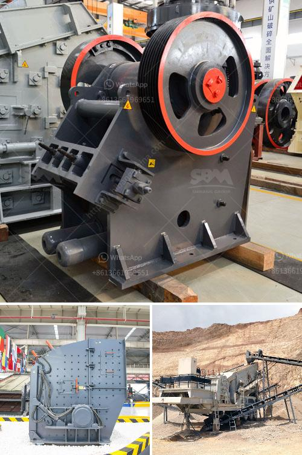

<h3>تعليم مطحنة الكرة</h3>
تعتبر مطحنة الكرة واحدة من أهم وأكثر المعدات استخدامًا في صناعة الطحن. فهي تعتمد على مبدأ الاحتكاك والتصادم بين الكرات الصلبة والمواد الخام المتواجدة داخلها لتتم عملية الطحن وتحويل المواد إلى بودرة ناعمة.

تتألف مطحنة الكرة من برميل دوار يحتوي على كرات صلبة معينة، ويتم تشغيلها عن طريق المحرك الكهربائي. بمجرد تحميل المواد الخام داخل المطحنة، تبدأ الكرات بالدوران بسرعة عالية داخل البرميل الدوار. مع تحرك الكرات، تتحرك المواد الخام أيضا وتتعرض لقوة الاحتكاك والتصادم مع الكرات.

من خلال هذه القوة، تتم عملية الطحن حيث يتم سحق المادة الخام وتفتيتها إلى قطع صغيرة تشبه البودرة. ويحدث ذلك بسبب تأثير القوة الطاردة الناجمة عن دوران البرميل، والتصادمات العنيفة بين الكرات الصلبة والمواد الخام.

تُستخدم مطاحن الكرة في العديد من الصناعات المختلفة، مثل صناعة الأسمنت والزجاج والسيراميك وصناعة مواد البناء الأخرى. وتعتبر عملية التعلم المطلوبة لتشغيل مطحنة الكرة سهلة وبسيطة، حيث يجب على العاملين تحميل المواد الخام وتشغيل المطحنة ومراقبة عملية الطحن.

وفي الختام، فإن تعلم مطحنة الكرة هو إجراء أساسي للعاملين في صناعة الطحن. فمن خلال تطبيق المعرفة والمهارات المناسبة، يتمكن العاملون من إجراء عملية الطحن بفاعلية وجودة عالية، مما يساهم في تحقيق الإنتاجية المطلوبة. وبالتالي، فإن استثمار الوقت والجهد في تعلم مطحنة الكرة يعد استثمارًا مجديًا وضروريًا للعاملين في هذه الصناعة.
<h3>Contact us</h3><ul><li><strong>Whatsapp:&nbsp;<a href="https://wa.me/8613661969651">+8613661969651</a></strong></li><li><a href="https://swt.shibang-china.com/?git&amp;zhl&amp;تعليم مطحنة الكرة"><strong>Online Service(chat now)</strong></a></li></ul><h3>Related</h3><ul><li><a href='أسعار الشاشات الاهتزازية.md'>أسعار الشاشات الاهتزازية</a></li><li><a href='مطاحن الكرة المتواصلة أو الانقطاعية.md'>مطاحن الكرة المتواصلة أو الانقطاعية</a></li><li><a href='تسعير حزام الناقل في ماليزيا.md'>تسعير حزام الناقل في ماليزيا</a></li><li><a href='مطحنة كرات محمولة لتعدين الحجم الصغير.md'>مطحنة كرات محمولة لتعدين الحجم الصغير</a></li><li><a href='قطع غيار آلة المطحنة ووظيفتها.md'>قطع غيار آلة المطحنة ووظيفتها</a></li></ul>