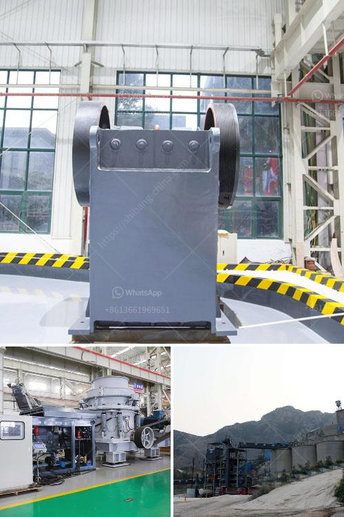

<h3>تقدير تكلفة مصنع الأسمنت في الهند</h3>
تعتبر الهند واحدة من أكبر الدول المنتجة للأسمنت في العالم، حيث تمتلك مختلف الشركات الهندية مصانع للأسمنت في العديد من الولايات. ومن المعروف أن تقدير تكلفة إنشاء مصنع للأسمنت يعتمد على عدة عوامل، مثل الطاقة الإنتاجية المرجوة وتكنولوجيا الإنتاج المستخدمة وموقع المصنع وتكلفة المواد الخام وتكنولوجيا البناء وشروط العمل وتكلفة المعدات والآلات المستخدمة.

عند تقدير تكلفة مصنع للأسمنت في الهند، يجب أخذ بعين الاعتبار العديد من العوامل المحلية. في الهند، يمكن شراء الأراضي بسعر معقول في العديد من الولايات، وهذا يعد عاملًا إيجابيًا يساهم في تقليل التكاليف. وبالإضافة إلى ذلك، يعتبر العمالة في الهند أرخص مقارنة بالعديد من البلدان الأخرى.

تقدير تكلفة بناء مصنع للأسمنت في الهند يشمل أيضًا تكلفة تكنولوجيا الإنتاج المستخدمة. هناك العديد من التقنيات المختلفة المتاحة، مثل تقنية Dry Process و Wet Process. تقنية Dry Process هي الأكثر استخدامًا وتكلفة، في حين تعتبر تقنية Wet Process أحدث وأكثر تقدمًا وأعلى تكلفة.

بالإضافة إلى ذلك، يجب أخذ في الاعتبار تكلفة المواد الخام المستخدمة في إنتاج الأسمنت. تعتبر الهند منتجًا رئيسيًا للإسمنت، وتمتلك مصادر وفيرة من الحجر الجيري والطين والصلصال وغيرها من المواد الأساسية. هذا يعني أن التزود بالمواد الخام يمكن أن يتم بأسعار معقولة ويساهم في تقليل التكلفة الإجمالية للمصنع.

علاوة على ذلك، يتطلب بناء مصنع للأسمنت تكنولوجيا البناء الحديثة والمعدات والآلات المناسبة. عادةً ما يكون لديها تأثير كبير على التكلفة الإجمالية للمشروع. ومع ذلك، يجب الانتباه إلى أن بناء مصنع جديد يشمل تكاليف المشروع نفسه فقط. وفي حالة القيام بتوسعة لمصنع قائم، يمكن توفير بعض التكاليف حيث يتعين تحديث أو استبدال بعض الهياكل والمعدات الموجودة بالفعل.

بشكل عام، يمكن تقدير تكلفة بناء مصنع للأسمنت في الهند بين 200 و 400 كرونة (INR) لكل طن إنتاج يومي. ومع ذلك، يجب الإشارة إلى أن هذه الأرقام تعتمد على العديد من العوامل المحلية وسوق العمل والتكنولوجيا ومكان الموقع والطاقة الإنتاجية والعمالة المستخدمة، ويتعذر تحديد تكلفة بناء دقيقة بدقة دون دراسة مفصلة للمشروع.
<h3>Contact us</h3><ul><li><strong>Whatsapp:&nbsp;<a href="https://wa.me/8613661969651">+8613661969651</a></strong></li><li><a href="https://swt.shibang-china.com/?git&amp;zhl&amp;تقدير تكلفة مصنع الأسمنت في الهند"><strong>Online Service(chat now)</strong></a></li></ul><h3>Related</h3><ul><li><a href='معلمات كسارة 250 طن في الساعة.md'>معلمات كسارة 250 طن في الساعة</a></li><li><a href='مورد آلة طحن التنتالوم على نطاق صغير.md'>مورد آلة طحن التنتالوم على نطاق صغير</a></li><li><a href='تطبيق كسارة الصدم.md'>تطبيق كسارة الصدم</a></li><li><a href='محطة تكسير وفرز مستعملة للبيع.md'>محطة تكسير وفرز مستعملة للبيع</a></li><li><a href='كسارة فك الحجر الجيري للبيع.md'>كسارة فك الحجر الجيري للبيع</a></li></ul>