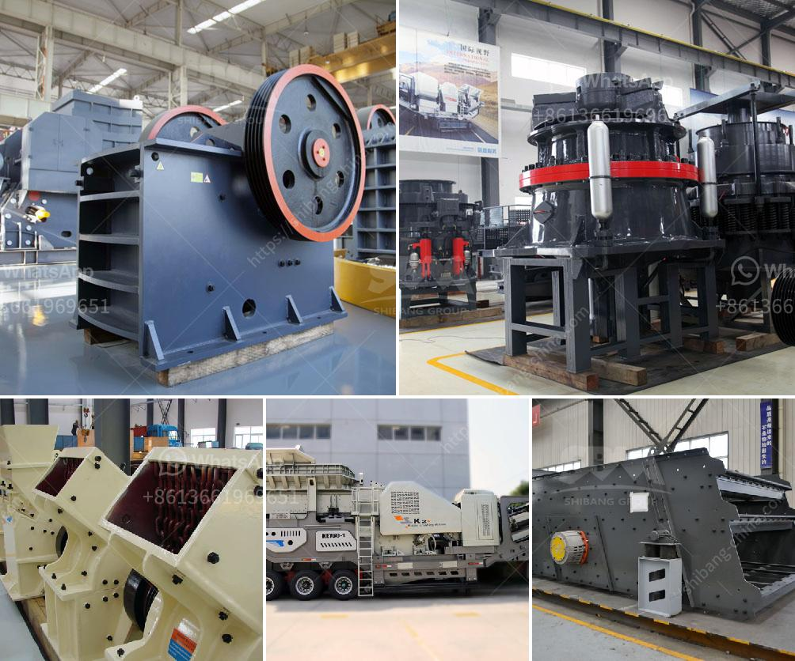

<h3>تقدير تكلفة مصنع تعدين النحاس</h3>
يعد تعدين النحاس من الصناعات الهامة التي تلعب دوراً حيوياً في الاقتصاد العالمي، حيث يستخدم النحاس في إنتاج العديد من المنتجات والتطبيقات مثل الأسلاك الكهربائية والأنابيب والمكونات الإلكترونية. ولذلك، فإن إنشاء مصنع تعدين النحاس يتطلب تحليل دقيق لتكلفة المشروع.

تعتمد تكلفة مصنع تعدين النحاس على العديد من العوامل الرئيسية التي تشمل:

1. الحجم والطاقة الإنتاجية للمصنع: يتأثر الحجم والطاقة الإنتاجية للمصنع بالكمية المتوقعة من النحاس التي سيتم إنتاجها. إذا كان هناك طلب كبير على النحاس في السوق، قد يكون من الضروري بناء مصنع كبير الحجم ليتمكن من تلبية هذا الطلب، وهذا يؤدي إلى زيادة التكلفة.

2. الموقع: يؤثر الموقع الجغرافي للمصنع على التكلفة. يجب أن يكون المصنع بالقرب من مصدر التمويل المركزي ومرافق النقل، وكذلك من مصادر الخام المتوفرة. في حالة عدم وجود مصدر قريب للحجرات، قد يتعين استيراده من مواقع أخرى ما يؤدي إلى زيادة التكلفة.

3. تكنولوجيا المصنع: تعتمد تكلفة المصنع أيضاً على التكنولوجيا المستخدمة في عملية التعدين والتكرير. تقدم التكنولوجيا المتطورة تكاليف أقل ومنافسة أكبر، في حين أن التكنولوجيا القديمة والمتداولة قد تكون أغلى.

4. التكاليف التشغيلية: بالإضافة إلى التكلفة الرأسمالية لإنشاء المصنع، يجب أيضاً مراعاة التكاليف التشغيلية المستمرة مثل تكلفة العمالة والكهرباء والصيانة والمياه. يعتبر هذا النوع من التكاليف عاملاً مهماً في تحديد تكلفة المصنع.

5. الضوابط البيئية: يجب أن يكون المصنع ملتزماً بالضوابط البيئية المحلية والدولية، وهذا قد يؤدي إلى زيادة التكلفة لتنفيذ تلك الضوابط وتكاليف معالجة النفايات وإدارة الآثار البيئية.

بناءً على العوامل المذكورة أعلاه، يمكن تقدير تكلفة بناء مصنع تعدين النحاس بين 200 إلى 400 كلمة تقريبًا. ومع ذلك، يجب مراعاة أن هذه التكلفة قد تختلف من بلد إلى آخر بناءً على العوامل المحلية والتشريعات البيئية والعملة المحلية والظروف الاقتصادية، ولذلك يفضل عمل دراسة اقتصادية شاملة قبل إقدام على إنشاء المصنع.
<h3>Contact us</h3><ul><li><strong>Whatsapp:&nbsp;<a href="https://wa.me/8613661969651">+8613661969651</a></strong></li><li><a href="https://swt.shibang-china.com/?git&amp;zhl&amp;تقدير تكلفة مصنع تعدين النحاس"><strong>Online Service(chat now)</strong></a></li></ul><h3>Related</h3><ul><li><a href='خط إنتاج الكوارتز.md'>خط إنتاج الكوارتز</a></li><li><a href='معدات تحميل وسائط مطحنة الكرة.md'>معدات تحميل وسائط مطحنة الكرة</a></li><li><a href='مصانع طحن الأحجار في تايلاند.md'>مصانع طحن الأحجار في تايلاند</a></li><li><a href='سعر كسارة الصخور في منجم بيرو.md'>سعر كسارة الصخور في منجم بيرو</a></li><li><a href='مصانع الكسارات للبيع.md'>مصانع الكسارات للبيع</a></li></ul>